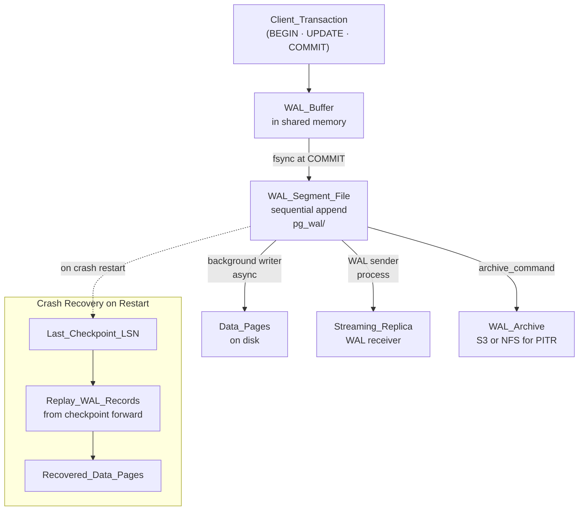

# 📋 Write-Ahead Log (WAL)

> [!abstract] TL;DR
> Before modifying any data page on disk, the database first appends the change to a sequential log. This makes crash recovery fast (replay the log from the last checkpoint), enables streaming replication (ship the log to standbys), and powers change-data-capture pipelines (stream the log to Kafka). Sequential disk writes are the key insight — they are orders of magnitude faster than random I/O to data pages.

## Intuition — analogy FIRST

Think of a chef's **ticket rail**. Before the chef modifies anything on a plate, the order ticket goes on the rail first. If chaos erupts mid-service (crash), the chef can scan the rail and reconstruct exactly what was in progress and what was finished. Other cooks (read replicas) watch the rail to track every dish going out and replicate the kitchen's state.

WAL is that ticket rail for your database: every change is recorded in the log before it touches the actual data pages. If the server crashes, the log is the source of truth for recovery. If you want a replica, send it the log.

---

## How It Works

### The "Write-Ahead" Guarantee

The protocol has one inviolable rule: **the WAL record describing a change must be flushed to durable storage before the transaction is reported committed to the client**. The data page containing the actual changed bytes can be written later (asynchronously in the background). This delivers:

1. **Durability** without `fsync` on every data page — sequential writes to the WAL file are fast
2. **Crash recovery** — on restart, replay WAL records from the last checkpoint to restore any lost data pages
3. **Replication** — stream WAL records to standby servers in real time

---

### WAL Anatomy in PostgreSQL

| Component | Description |
|-----------|-------------|
| **WAL Record** | Describes one atomic change: relation OID, block number, old/new tuple data |
| **LSN** (Log Sequence Number) | Monotonically increasing byte offset into the WAL byte stream; uniquely identifies a log position |
| **WAL Segment File** | 16 MB file in `$PGDATA/pg_wal/`; old segments recycled or archived once replicas have consumed them |
| **WAL Buffer** | Ring buffer in shared memory; WAL records accumulate here before being flushed on commit |
| **Checkpoint** | A point where all dirty data pages have been flushed to disk; recovery only needs WAL from the last checkpoint forward |

---

### Write Path and Recovery Path



---

### MySQL Equivalent: InnoDB Redo Log

MySQL InnoDB uses the same concept under the name **redo log**:
- Fixed-size circular files (`ib_logfile0`, `ib_logfile1`) — write wraps around
- Combined with the **undo log** (for rollback and MVCC), InnoDB achieves full ACID
- MySQL 8.0 made the redo log dynamically resizable

---

### WAL for Change Data Capture (CDC)

PostgreSQL's **logical decoding** feature parses the WAL stream and emits **row-level change events** (INSERT/UPDATE/DELETE with before/after values):

```
PostgreSQL WAL → logical replication slot → Debezium connector → Kafka topic
```

Every committed row change becomes a structured event consumable by downstream systems. Use cases:
- Sync OLTP data to an OLAP warehouse (Snowflake, BigQuery)
- Invalidate application caches exactly when data changes
- Maintain Elasticsearch/OpenSearch indices in sync with Postgres
- Full audit trail with zero application-layer instrumentation

---

## Real-World Systems

- **PostgreSQL streaming replication** — Primary continuously ships WAL segments to standbys; standbys replay them in LSN order. `synchronous_commit = on` waits for the standby to acknowledge WAL receipt before responding to the client — zero data loss
- **Debezium** — Open-source CDC platform reading WAL from Postgres and MySQL; produces Kafka events; used at LinkedIn, Airbnb, Zalando
- **Patroni** — High-availability Postgres manager using WAL streaming + replication slots to elect a new primary during failover, ensuring no data loss
- **AWS Aurora** — Architectural extreme: the storage layer is the WAL. Only WAL records are written to the 6-way-replicated distributed storage; data pages are materialized on demand. No checkpoint overhead, instant failover
- **Confluent / Debezium at Airbnb** — MySQL binlog (equivalent of WAL) streamed via Kafka to Hive for analytics; the OLAP pipeline runs entirely from the CDC stream

---

## Trade-offs

| Aspect | Benefit | Cost |
|--------|---------|------|
| Sequential writes | Much faster than random data-page writes on spinning or NVMe disks | Extra disk space for WAL files (often 1–2× DB size for active systems) |
| Crash recovery | Replay only from last checkpoint, not entire dataset | Recovery time is proportional to WAL volume since last checkpoint |
| Streaming replication | Replica stays current with low lag (~milliseconds) | Replicas are tightly coupled to WAL format; major version upgrades require care |
| PITR | Restore the database to any second in history | Must archive every WAL segment to durable storage continuously |
| CDC | Change stream for free from existing infrastructure | WAL retention must outlast the slowest consumer; dead replication slots fill disk |

---

## When to Use vs Avoid

WAL is always on in PostgreSQL and MySQL — it cannot be disabled. It is fundamental to ACID Durability. What you control is how you tune it:

**For maximum durability (financial systems):**
```ini
synchronous_commit = on          # wait for WAL to reach replica before ACK
wal_level = replica              # minimum for streaming replication
```

**For maximum throughput (analytics ingest, batch jobs):**
```ini
synchronous_commit = off         # 200ms data-loss window on crash; ~3× throughput
wal_buffers = 64MB               # larger buffer reduces fsync frequency
```

**For CDC pipelines:**
```ini
wal_level = logical              # enables logical decoding; ~15% more WAL volume
```

**Replication slot hygiene — always:**
```sql
-- Drop slots for consumers that are gone
SELECT slot_name, pg_wal_lsn_diff(pg_current_wal_lsn(), restart_lsn) AS lag_bytes
FROM pg_replication_slots;
```

---

## Common Pitfalls

1. **Abandoned replication slot** — A dead CDC consumer with an active slot forces Postgres to retain all WAL since the slot's restart LSN; disk fills and the database stops accepting writes
2. **Checkpoint too infrequent** — Very large `max_wal_size` means long recovery time after a crash; balance durability vs restart time
3. **`synchronous_commit = off` misunderstood** — This is NOT unsafe for normal operation; only the last ~200ms of committed transactions may be lost on a sudden OS crash; it is a valid latency trade-off
4. **WAL archive destination unreachable** — If `archive_command` fails, Postgres retains WAL segments locally; disk fills silently until the database refuses new connections
5. **Logical decoding slot lag** — A slow Kafka connector holds the replication slot; old WAL accumulates; monitor `pg_replication_slots.confirmed_flush_lsn` lag

---

## Related Concepts

- [[_MOC_Databases|↑ Section MOC]]
- [[ACID_and_Transactions]] — WAL implements the **D** (Durability) property of ACID
- [[Database_Replication]] — Streaming replication is built entirely on shipping WAL records to standbys
- [[MVCC]] — WAL provides Durability; MVCC provides Isolation — they work in parallel on the same transaction

---

## Review Questions

1. Why does PostgreSQL write to the WAL log **before** writing to data pages? What specific failure scenario does this ordering protect against?
2. What is an LSN (Log Sequence Number) and what role does it play in both streaming replication and crash recovery?
3. A team sets up Debezium CDC to stream PostgreSQL changes to Kafka, then the Kafka connector process crashes and stays down for 3 days. What PostgreSQL resource accumulates during this outage, how would you detect the problem, and what is the worst-case consequence?

---

## Sources

- PostgreSQL Documentation: Write-Ahead Logging — https://www.postgresql.org/docs/current/wal-intro.html
- The Internals of PostgreSQL — Chapter 9: WAL — https://www.interdb.jp/pg/pgsql09.html
- Martin Kleppmann, *Designing Data-Intensive Applications*, Chapter 3 — Storage and Retrieval

#SystemDesign #Databases #WAL #WriteAheadLog #Durability #Replication #CDC #CrashRecovery
