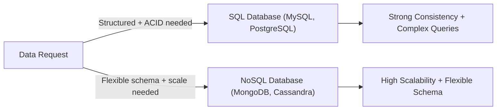

# ⚖️ SQL vs NoSQL

> [!abstract] TL;DR
> **SQL** databases offer structured schemas, ACID transactions, and strong consistency. **NoSQL** databases offer flexible schemas and horizontal scalability. Most modern systems use both.

## 🧠 Core Idea

**SQL** and **NoSQL** databases see data storage in fundamentally different ways.

> SQL → Structured, relational, fixed schema  
> NoSQL → Flexible, non-relational, scalable schema

Choosing between them depends on **data structure, scalability needs, and query complexity**.

---

## 📖 SQL Databases

### 🧩 Definition

**SQL (Relational) databases** store data in structured tables with rows and columns, using a fixed schema.

### 🏗️ Examples
- MySQL  
- PostgreSQL  
- Oracle  
- SQL Server  

### ⚙️ Key Characteristics

- Fixed schema  
- Relational tables  
- Supports JOIN operations  
- ACID-compliant transactions  
- Strong data integrity  

### 🎯 Best Suited For

- Structured relational data  
- Complex queries and joins  
- Financial and transactional systems  
- Applications needing strong consistency  

---

## 📖 NoSQL Databases

### 🧩 Definition

**NoSQL databases** store data in flexible, non-relational formats such as:

- Key-Value  
- Document  
- Wide Column  
- Graph  

### 🏗️ Examples
- MongoDB  
- Cassandra  
- Redis  
- DynamoDB  
- Neo4j  

### ⚙️ Key Characteristics

- Flexible schema  
- Horizontal scalability  
- High performance at large scale  
- Handles unstructured or semi-structured data  
- Often eventual consistency  

### 🎯 Best Suited For

- Big data applications  
- Real-time web apps  
- Rapidly changing data models  
- Globally distributed systems  

---

## ⚖️ SQL vs NoSQL Comparison

| Aspect | SQL | NoSQL |
|--------|-----|-------|
| Schema | Fixed | Flexible |
| Data Model | Relational | Non-relational |
| Query Language | SQL | API / Query DSL |
| Transactions | ACID | Often BASE |
| Joins | Native support | Handled in application |
| Scalability | Vertical | Horizontal |
| Consistency | Strong | Eventual (often) |
| Best For | Structured data | Unstructured / large-scale data |

---

## 🧠 How to Choose

```
Need strong consistency + complex queries → SQL
Need massive scale + flexible data → NoSQL
```

Many modern systems use **hybrid architectures** combining both.

---

## 🖼️ Diagram



---

## 🔗 Related Topics

[[Databases]]  
[[Key-Value Store]]  
[[Document Store]]  
[[Wide Column Store]]  
[[Graph Databases]]  
[[Database Sharding]]  
[[Consistency Patterns]]

---

## 📚 Sources

- SitePoint — SQL vs NoSQL  
  https://www.sitepoint.com/sql-vs-nosql-differences/

- IBM — SQL vs NoSQL  
  https://www.ibm.com/think/topics/sql-vs-nosql

- MongoDB — NoSQL vs SQL  
  https://www.mongodb.com/resources/basics/databases/nosql-explained/nosql-vs-sql

---

## Related Concepts

- [[_MOC_Databases|↑ Section MOC]]
- [[Databases]]
- [[Document Store]]
- [[Key-Value Store]]
- [[Wide Column Store]]
- [[Database Replication]]

---

## Review Questions

1. What four properties does ACID guarantee in relational databases?
2. What does BASE stand for in the context of NoSQL systems?
3. Give one example each of a workload best suited for SQL and one best suited for NoSQL.

---

## 🏷️ Tags

#SystemDesign #SQL #NoSQL #Databases #DataModeling
