# 🗄 Databases — Map of Content

> [!abstract] What This Section Covers
> Databases are the persistence layer of every system. This section covers the foundational SQL vs NoSQL decision, the four NoSQL storage models (key-value, document, wide-column, graph), and the RDBMS scaling patterns engineers reach for when a single database is no longer enough — replication, federation, sharding, denormalisation, and SQL tuning.

## Concept Map

```mermaid
graph TD
    CENTER["🗄 Databases"]

    CENTER --> FOUNDATIONS["Foundations"]
    CENTER --> NOSQL_TYPES["NoSQL Types"]
    CENTER --> SCALING["Scaling Patterns"]

    FOUNDATIONS --> DBIntro["[[Databases]]\nRelational model, ACID,\nwhen to use SQL vs NoSQL"]
    FOUNDATIONS --> SQLNoSQL["[[SQL_vs_NoSQL]]\nSchema rigidity, CAP position,\nquery flexibility trade-offs"]

    NOSQL_TYPES --> KV["[[Key_Value_Store]]\nRedis, DynamoDB\nO(1) lookups by key"]
    NOSQL_TYPES --> Doc["[[Document_Store]]\nMongoDB, CouchDB\nJSON/BSON documents"]
    NOSQL_TYPES --> WC["[[Wide_Column_Store]]\nCassandra, HBase\nSparse rows, time-series"]
    NOSQL_TYPES --> Graph["[[Graph_Databases]]\nNeo4j\nNodes, edges, relationships"]

    SCALING --> Replication["[[Database_Replication]]\nMaster-slave read scaling\n& fault tolerance"]
    SCALING --> Federation["[[Database_Federation]]\nSplit by function:\nusers DB / orders DB"]
    SCALING --> Sharding["[[Database_Sharding]]\nHorizontal partitioning\nby shard key"]
    SCALING --> Denorm["[[Denormalization]]\nReduce JOINs at the cost\nof write complexity"]
    SCALING --> SQLTuning["[[SQL_Tuning]]\nIndexes, query plans,\nEXPLAIN, partitioning"]

    CENTER --> INTERNALS["Internals & Ops"]
    INTERNALS --> ACID["[[ACID_and_Transactions]]\nAtomicity, isolation levels,\nconcurrency anomalies"]
    INTERNALS --> Indexes["[[Database_Indexes]]\nB-tree, composite, covering,\nleftmost prefix rule"]
    INTERNALS --> MVCC["[[MVCC]]\nMulti-version concurrency\nreaders never block writers"]
    INTERNALS --> WAL["[[Write_Ahead_Log]]\nDurability, replication,\nCDC via logical decoding"]
    INTERNALS --> ConnPool["[[Connection_Pooling]]\nPgBouncer, HikariCP,\ntransaction mode"]
    INTERNALS --> OLTPvsOLAP["[[OLTP_vs_OLAP]]\nRow store vs columnar,\ndata warehouse pipeline"]

    style INTERNALS fill:#e64980,color:#fff

    style CENTER fill:#7c3aed,color:#fff
    style FOUNDATIONS fill:#4a9eff,color:#fff
    style NOSQL_TYPES fill:#7ed321,color:#fff
    style SCALING fill:#f5a623,color:#fff
```

## Learning Path

1. [[Databases]] — What databases are, the relational model, ACID properties, and when to reach for NoSQL
2. [[SQL_vs_NoSQL]] — The core decision framework: schema flexibility, CAP positioning, query patterns, and consistency needs
3. [[Key_Value_Store]] — Simplest NoSQL model; Redis and DynamoDB use cases, eviction, and O(1) access patterns
4. [[Document_Store]] — JSON/BSON document model; MongoDB and CouchDB; flexible schema and rich queries
5. [[Wide_Column_Store]] — Column-family model for sparse, wide rows; Cassandra and HBase for time-series and IoT
6. [[Graph_Databases]] — Graph model for relationship-heavy data; Neo4j, traversal queries, and social/recommendation use cases
7. [[Database_Replication]] — Master-slave and master-master replication; read scaling, failover, and lag
8. [[Database_Federation]] — Functional partitioning: splitting one big DB into domain-specific databases
9. [[Database_Sharding]] — Horizontal partitioning by shard key; consistent hashing, hot shards, and cross-shard queries
10. [[Denormalization]] — Trading write complexity for read performance by eliminating JOINs
11. [[SQL_Tuning]] — Indexing strategies, query plan analysis with EXPLAIN, partitioning, and common bottlenecks
12. [[ACID_and_Transactions]] — Atomicity, Consistency, Isolation, Durability; isolation levels and concurrency anomalies
13. [[Database_Indexes]] — B-tree, hash, composite, covering, and partial indexes; leftmost prefix rule; selectivity
14. [[MVCC]] — Multi-version concurrency control; how Postgres achieves lock-free reads via row versioning
15. [[Write_Ahead_Log]] — Sequential durability log; crash recovery, streaming replication, and CDC
16. [[Connection_Pooling]] — PgBouncer and HikariCP; transaction mode; pool sizing formulas
17. [[OLTP_vs_OLAP]] — Row store vs columnar storage; star schema; data warehouse pipeline patterns

## All Notes at a Glance

| Note | Summary | Difficulty |
| ---- | ------- | ---------- |
| [[Databases]] | Foundational overview: relational model, ACID, and the SQL vs NoSQL decision context | Beginner |
| [[SQL_vs_NoSQL]] | Decision framework for choosing between relational and non-relational storage | Intermediate |
| [[Key_Value_Store]] | Hash-map abstraction for O(1) reads/writes; Redis, DynamoDB, Memcached | Beginner |
| [[Document_Store]] | Flexible JSON/BSON document model; MongoDB, CouchDB — good for semi-structured data | Intermediate |
| [[Wide_Column_Store]] | Sparse column-family model optimised for writes and time-series; Cassandra, HBase | Intermediate |
| [[Graph_Databases]] | Graph model for relationship traversal; Neo4j, Cypher queries, social and fraud detection | Intermediate |
| [[Database_Replication]] | Master-slave and master-master replication for read scaling and HA | Intermediate |
| [[Database_Federation]] | Functional decomposition of a monolithic DB into domain-specific stores | Intermediate |
| [[Database_Sharding]] | Horizontal partitioning across multiple nodes by shard key | Intermediate |
| [[Denormalization]] | Pre-computing redundant data to avoid expensive JOINs at read time | Intermediate |
| [[SQL_Tuning]] | Index types, query plan analysis, partitioning, and common RDBMS performance fixes | Advanced |
| [[ACID_and_Transactions]] | Atomicity, isolation levels (Read Committed → Serializable), dirty/phantom reads, 2PL | Intermediate |
| [[Database_Indexes]] | B-tree, hash, composite (leftmost prefix), covering, partial; selectivity; EXPLAIN ANALYZE | Intermediate |
| [[MVCC]] | Row versioning (xmin/xmax), snapshot isolation, VACUUM, XID wraparound | Advanced |
| [[Write_Ahead_Log]] | WAL anatomy, LSN, crash recovery, streaming replication, CDC via logical decoding | Intermediate |
| [[Connection_Pooling]] | PgBouncer transaction mode, HikariCP pool sizing, session vs proxy pooling | Intermediate |
| [[OLTP_vs_OLAP]] | Row vs columnar storage, star schema, ETL/CDC pipeline, HTAP systems | Intermediate |

## Key Questions This Section Answers

- When should you choose SQL over NoSQL (and vice versa)?
- What are the ACID properties and why do they matter for data integrity?
- What is the difference between a key-value store, document store, wide-column store, and graph database?
- How does database replication scale reads, and what replication lag means for consistency?
- How does sharding differ from federation — and when does each apply?
- What is a hot shard problem and how do you mitigate it?
- What is denormalisation and when is the write-complexity trade-off worth it?
- How do you use EXPLAIN to diagnose a slow query?
- Why is schema-on-read (NoSQL) advantageous in some contexts and risky in others?
- What is the difference between Read Committed and Repeatable Read isolation? Which does Postgres default to?
- Why does MVCC allow readers and writers to proceed simultaneously without locking?
- What is a WAL replication slot and what happens when a consumer stops reading it?
- How many database connections should a typical connection pool maintain?
- When should you move analytical queries off your OLTP database into a columnar warehouse?

## Related Sections

- [[_MOC_SystemDesign_Master|↑ System Design Master MOC]]
- [[_MOC_AvailabilityVsConsistency|← Availability vs Consistency]]
- [[_MOC_AvailabilityPatterns|← Availability Patterns]]
- [[_MOC_Caching|→ Caching]]
- [[_MOC_SearchAlgorithms|→ Search & Algorithms]]

#MOC #SystemDesign #Databases
