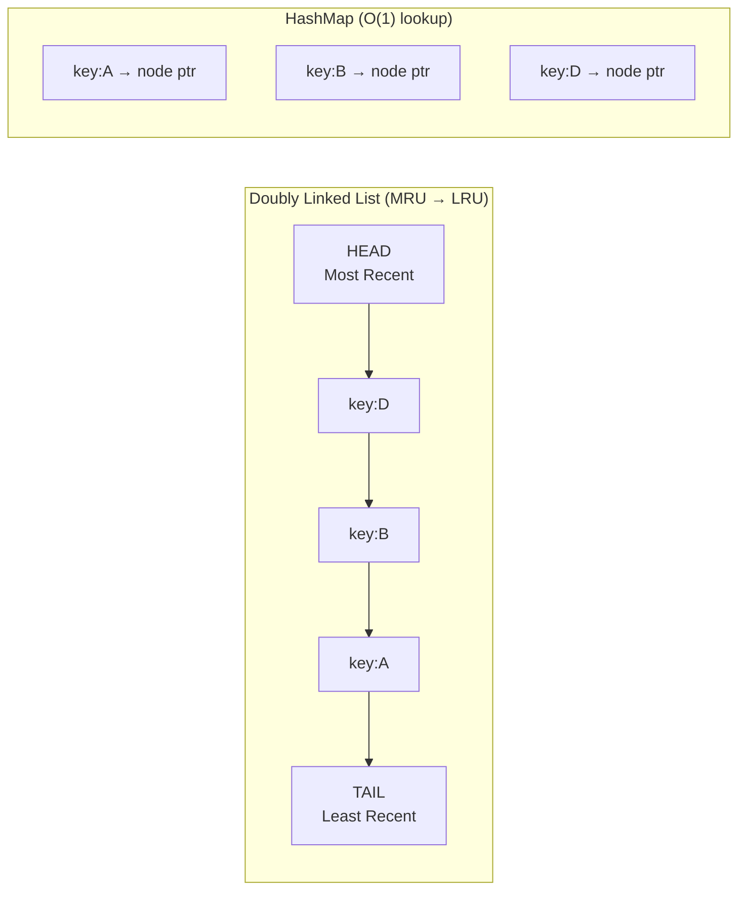

# 🗑️ Cache Eviction Policies

> [!abstract] TL;DR
> When the cache is full, eviction policies decide which item to remove to make room for new data. LRU (Least Recently Used) is the default and works well for most workloads. LFU is better when access patterns are highly skewed (hot items dominate). Redis supports LRU, LFU, random, and TTL-based eviction — configurable via `maxmemory-policy`.

## Intuition — analogy FIRST

Imagine your desk has space for 10 folders. When you need an 11th, you must remove one.

- **LRU** — remove the folder you haven't touched in the longest time. Assumes "recently used = likely to be used again."
- **LFU** — remove the folder you've opened the fewest times. Assumes "frequently accessed = valuable."
- **FIFO** — remove the oldest folder you put on the desk, regardless of how often you use it.
- **Random** — pick any folder and toss it. Surprisingly not terrible, and very cheap.

Real desks use LRU or LFU. Random is fine when you have no usage info. FIFO is the most naive.

## How It Works

### LRU — Least Recently Used

**Evict the item that was accessed least recently.**

Implementation: doubly linked list + hashmap for O(1) get and O(1) eviction.



- **Cache hit:** move accessed node to HEAD. O(1).
- **Cache miss (full):** evict node at TAIL, insert new node at HEAD. O(1).

```python
from collections import OrderedDict

class LRUCache:
    def __init__(self, capacity: int):
        self.cap = capacity
        self.cache = OrderedDict()   # maintains insertion/access order

    def get(self, key: int) -> int:
        if key not in self.cache:
            return -1
        self.cache.move_to_end(key)  # mark as most recently used
        return self.cache[key]

    def put(self, key: int, value: int) -> None:
        if key in self.cache:
            self.cache.move_to_end(key)
        self.cache[key] = value
        if len(self.cache) > self.cap:
            self.cache.popitem(last=False)  # evict LRU (front)
```

**Redis LRU:** Redis uses **approximated LRU** — samples 5 random keys (configurable via `maxmemory-samples`) and evicts the least recently used among them. O(1) without tracking a full linked list across potentially billions of keys.

---

### LFU — Least Frequently Used

**Evict the item that has been accessed the fewest times.**

Maintains a frequency counter per key. On eviction, removes item with lowest count (ties broken by recency).

**Problem — frequency pollution:** An item accessed 1000 times last month but never touched this month has a high count and will not be evicted, even though it's cold. Solutions: frequency decay over time (Redis 4+ uses a logarithmic counter with decay).

**Redis LFU** uses a Morris counter (logarithmic approximation of frequency) with a decay factor, so frequency slowly decreases if a key is not accessed.

---

### FIFO — First In, First Out

**Evict the oldest inserted item regardless of access frequency or recency.**

Simple queue. No usage tracking. Poor cache hit rate in most access patterns because it ignores whether an item is still "hot."

Used in: OS page replacement (clock algorithm is FIFO variant), some CDN edge tiers.

---

### Random

**Evict a random item.**

Surprisingly effective: studies show random eviction achieves 60-80% of LRU's hit rate with near-zero overhead. Useful when access patterns are uniform or when you cannot afford the memory overhead of LRU tracking.

Redis supports `allkeys-random` and `volatile-random` (among volatile/TTL-expiring keys only).

---

### TTL-Based Expiry

Not strictly an eviction policy — keys expire independently after their TTL regardless of cache fullness. Works alongside LRU/LFU.

```
SET session:abc123 "{...user data...}" EX 3600   # expires in 1 hour
```

Redis uses a lazy expiry + periodic sampling approach:
1. **Lazy expiry:** check TTL when key is accessed; delete if expired.
2. **Active expiry:** every 100ms, sample 20 random volatile keys; delete expired ones; repeat if > 25% of sampled were expired.

---

### ARC — Adaptive Replacement Cache

**Self-tuning between LRU and LFU.** Maintains four lists: recently used once, recently used more than once, recently evicted once, recently evicted more than once. Dynamically adjusts the balance between recency and frequency.

Used in: ZFS filesystem, IBM storage. Not available in Redis (too complex for a cache).

---

### Redis `maxmemory-policy` Configuration

| Policy | Evicts from | Algorithm |
|---|---|---|
| `noeviction` | — | Return error on write when full |
| `allkeys-lru` | All keys | Approximated LRU |
| `volatile-lru` | Keys with TTL | Approximated LRU |
| `allkeys-lfu` | All keys | Approximated LFU |
| `volatile-lfu` | Keys with TTL | Approximated LFU |
| `allkeys-random` | All keys | Random |
| `volatile-random` | Keys with TTL | Random |
| `volatile-ttl` | Keys with TTL | Evict soonest-expiring first |

> [!tip] Recommended defaults
> - Pure cache (all keys are evictable): `allkeys-lru`
> - Mix of persistent + cached keys: `volatile-lru` (only evicts TTL-tagged keys)
> - Skewed access patterns (few hot keys): `allkeys-lfu`

## Real-World Systems

| System | Policy | Reason |
|---|---|---|
| **Redis** (default recommendation) | `allkeys-lru` | Works well for most web caches |
| **Redis** (news/trending) | `allkeys-lfu` | Hot articles dominate; LFU retains them |
| **ZFS filesystem** | ARC | Self-tuning for mixed workloads |
| **CPU L1/L2 cache** | Pseudo-LRU (PLRU) | Hardware-efficient approximation |
| **Browser HTTP cache** | LRU + max-age TTL | Recency + time-bounded freshness |
| **Memcached** | LRU + slab allocator | Fixed-size slab classes, LRU per slab |

## Trade-offs

| Policy | Hit Rate | Overhead | Best For |
|---|---|---|---|
| LRU | High | Medium (linked list) | General workloads, temporal locality |
| LFU | High (skewed patterns) | Higher (frequency counters) | News, trending, hot content |
| FIFO | Low | Very low | Simplicity, streaming scans |
| Random | Medium | Very low | Uniform access, no usage data |
| ARC | Highest | High | Mixed workloads (storage systems) |
| TTL | Depends on TTL | Low | Time-bounded data (sessions, tokens) |

## When to Use vs Avoid

**LRU:** Default choice. Works for session caches, API response caches, database query caches.

**LFU:** Use when access patterns are highly skewed and stale-but-historically-popular items are a problem. E.g., viral content platforms, recommendation caches.

**Random:** Use when memory is extremely constrained and you cannot afford LRU's pointer overhead, or when access patterns are truly random.

**TTL-only (noeviction):** Use when cache size is provisioned to hold all data and you only need time-based freshness (e.g., small config caches).

## Common Pitfalls

1. **No maxmemory set in Redis** — Redis will consume all available RAM and the OS will OOM-kill it.
2. **Using LRU for scan workloads** — sequential scans (report queries, backfills) poison the LRU cache by evicting hot keys. Use `volatile-lru` so scanned keys (which have no TTL) cannot evict your hot TTL-tagged cache entries.
3. **Ignoring frequency pollution in LFU** — without decay, old high-frequency keys can starve new popular items. Redis's logarithmic counter with decay mitigates this.
4. **Wrong policy for mixed workloads** — if some keys are permanent (config) and others are ephemeral (user sessions), use `volatile-lru/lfu` to protect permanent keys from eviction.
5. **Over-relying on eviction instead of capacity planning** — eviction is a safety valve, not a strategy. If eviction rate is > 1%, your cache is undersized.

## Related Concepts

- [[_MOC_Caching|↑ Section MOC]]
- [[Caching]] — eviction is one dimension of cache design
- [[Redis_vs_Memcached]] — Redis's rich eviction policy support is a key advantage
- [[Cache_Stampede]] — eviction of a popular key can trigger a stampede
- [[Design_Distributed_Cache]] — eviction policies apply to distributed caches too

## Review Questions

1. Implement an LRU cache from scratch in Python supporting O(1) `get` and `put`. Walk through what data structures you use and why.
2. Your Redis cache is running `allkeys-lru`. You notice that a batch job doing a full table scan every hour is degrading cache hit rates significantly. Explain what is happening and how you would fix it with a policy change.
3. A leaderboard service caches the top 1000 players. Player rankings are accessed thousands of times per day, but the cache keeps evicting mid-tier players that haven't been accessed in a few hours. The access pattern is highly skewed (top 100 players get 90% of traffic). Which eviction policy would you switch to, and why?

## Sources

- [Redis maxmemory-policy documentation](https://redis.io/docs/reference/eviction/)
- [LRU Cache — LeetCode 146 discussion](https://leetcode.com/problems/lru-cache/)
- [Antirez on Redis LFU implementation](http://antirez.com/news/109)
- Berger, D.S. et al. — "Practical Bounds on Optimal Caching with Variable Object Sizes" (SIGMETRICS 2018)

#SystemDesign #Caching #LRU #LFU #Redis #EvictionPolicy #Algorithm
