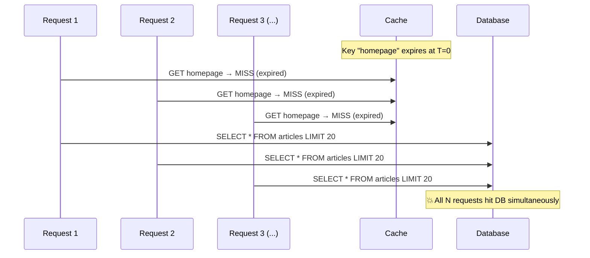

# 🐘 Cache Stampede

> [!abstract] TL;DR
> A cache stampede (thundering herd) occurs when a popular cached item expires and many concurrent requests all miss simultaneously, flooding the database. Solutions: mutex/lock (only one thread fetches), probabilistic early expiration (refresh before actual expiry), stale-while-revalidate (return stale, refresh async). Cache avalanche is the related problem of many *different* keys expiring at once — solved by TTL jitter.

## Intuition — analogy FIRST

Imagine a popular concert's ticket page is cached. At exactly 3:00 PM the cache entry expires. Simultaneously, 10,000 fans hit the page. All 10,000 requests miss the cache at the same instant and all hit the database simultaneously — the database gets DDOSed by its own users.

This is a stampede: many animals (requests) charging through one gate (database) at the same moment because the fence (cache) just fell.

The solutions:
1. **Mutex:** only one animal goes through the gate; others wait in line.
2. **Early expiration:** rebuild the fence a few seconds before it falls (before the TTL hits zero).
3. **Stale-while-revalidate:** let animals pass through the old gate while you quietly build a new one.

## How It Works

### The Problem Illustrated



---

### Solution 1: Mutex / Distributed Lock

Only the first request fetches from the DB. Others wait and then read from the freshly populated cache.

```python
import redis, time

r = redis.Redis()

def get_with_mutex(key: str, ttl: int):
    value = r.get(key)
    if value:
        return value

    lock_key = f"lock:{key}"
    # Try to acquire lock (NX = only set if not exists, EX = lock TTL)
    acquired = r.set(lock_key, "1", nx=True, ex=10)

    if acquired:
        try:
            value = fetch_from_db(key)
            r.setex(key, ttl, value)
            return value
        finally:
            r.delete(lock_key)
    else:
        # Wait and retry — another thread is populating the cache
        time.sleep(0.05)
        return r.get(key) or fetch_from_db(key)   # fallback if lock holder failed
```

**Trade-off:** Lock contention under very high load. The waiting threads add latency.

---

### Solution 2: Probabilistic Early Expiration (PER)

Refresh the cache *before* it actually expires, probabilistically. No lock needed.

**Formula:** A request should trigger a refresh if:

```
rand() < beta * log(ttl_remaining / ttl_total)
```

As `ttl_remaining` → 0, the probability approaches 1.0 — ensuring the cache is refreshed before it expires.

```python
import random, math, time

def get_with_per(key: str, beta: float = 1.0):
    stored = r.hgetall(key)           # stores {"value": ..., "ttl_set": ..., "ttl_total": ...}
    if not stored:
        return fetch_and_cache(key)

    ttl_remaining = r.ttl(key)
    ttl_total = float(stored["ttl_total"])
    
    # Probabilistic check: refresh early?
    if random.random() < beta * math.log(max(ttl_remaining, 1) / ttl_total):
        # Proactively refresh — this one request pays the DB cost
        return fetch_and_cache(key)
    
    return stored["value"]
```

**Trade-off:** Slightly wasteful (may refresh a bit early), but no lock contention and no hard stampede.

---

### Solution 3: Stale-While-Revalidate

Return the stale (expired but still present) value immediately; kick off an async background refresh.

```python
def get_stale_while_revalidate(key: str, stale_ttl: int = 60):
    value = r.get(f"value:{key}")
    is_stale = not r.get(f"fresh:{key}")   # short TTL "freshness" marker

    if value and is_stale:
        # Return stale immediately, refresh in background
        asyncio.create_task(refresh_cache(key, stale_ttl))
        return value
    elif value:
        return value
    else:
        # Cold miss — must fetch synchronously
        return fetch_and_cache(key, stale_ttl)
```

HTTP equivalent — `Cache-Control: max-age=60, stale-while-revalidate=120`:
- Browser serves cached response for up to 60s (fresh).
- Between 60–120s, serves stale and revalidates in background.
- After 120s, blocks and waits for fresh response.

**Trade-off:** Clients may see slightly stale data for a brief window. Usually acceptable.

---

### Cache Avalanche (Related Problem)

**Stampede:** one popular key expires → N requests hit DB simultaneously.
**Avalanche:** many *different* keys expire at the same time (e.g., all keys were set with the same TTL at startup) → entire DB is flooded.

**Solution: TTL Jitter**

```python
import random

BASE_TTL = 3600   # 1 hour

def set_with_jitter(key: str, value: str):
    # Add ±10% randomness to spread expirations
    jitter = random.uniform(-0.1, 0.1) * BASE_TTL
    ttl = int(BASE_TTL + jitter)
    r.setex(key, ttl, value)
```

This spreads cache expirations across a window instead of a single moment.

## Real-World Systems

| Company | Problem | Solution |
|---|---|---|
| **Facebook** | Homepage cache stampede at cache warm-up | Probabilistic early expiration, mutex with lease tokens |
| **Pinterest** | Trending pin cache expiry | Probabilistic early expiration |
| **Cloudflare CDN** | Cache avalanche at TTL boundary | Stale-while-revalidate (built into HTTP caching layer) |
| **Amazon** | DynamoDB DAX cache warm-up | Mutex (conditional writes) |
| **Twitter** | Timeline cache expiry | Stale-while-revalidate + background refresh workers |

## Trade-offs

| Solution | Latency | DB Load | Stale Data Risk | Complexity |
|---|---|---|---|---|
| Mutex / lock | Higher (waiters block) | Very low (1 DB call) | None | Medium |
| Probabilistic early expiration | Low (no waiting) | Low (occasional early refresh) | None | Medium |
| Stale-while-revalidate | Lowest (instant stale) | Low (background) | Brief window | Low |
| Background refresh worker | Lowest | Low (proactive) | Possible if worker dies | Medium |
| No solution | Low (until stampede) | 💥 Catastrophic spike | None | None |

## When to Use vs Avoid

**Mutex:** Use when data consistency is critical and you cannot serve stale data (financial data, inventory counts). Accept latency hit.

**Probabilistic early expiration:** Use for high-traffic read-heavy caches (homepages, product listings) where you want zero stale data and no lock contention.

**Stale-while-revalidate:** Use when brief staleness is acceptable (news feeds, leaderboards, social counts). Best user experience (no wait).

**TTL jitter:** Always use when bulk-loading cache (startup, warm-up, periodic refresh). Nearly free to implement.

## Common Pitfalls

1. **No mutex timeout** — if the lock holder crashes, lock is never released. Always set a lock TTL.
2. **Serving expired keys as stale** — Redis by default deletes expired keys. For stale-while-revalidate you need two keys (value + freshness marker) or a custom expiry wrapper.
3. **Thundering herd on lock expiry** — if lock TTL is too short, multiple threads acquire it. Make lock TTL > expected DB fetch time.
4. **Ignoring avalanche** — fixing stampede for individual keys but missing that 10,000 keys all expire at the same second because they were loaded together.
5. **Stampede on cold start** — deploying a new instance with empty cache: all requests miss simultaneously. Use cache warming or circuit breakers to limit DB load during warm-up.

## Related Concepts

- [[_MOC_Caching|↑ Section MOC]]
- [[Caching]] — stampede is a fundamental failure mode of caching
- [[Cache_Eviction_Policies]] — eviction is the trigger for stampedes; TTL expiry is a form of eviction
- [[Redis_vs_Memcached]] — Redis distributed locks (SETNX) are the standard stampede mutex tool
- [[Circuit_Breaker]] — a circuit breaker can limit DB load during a stampede if other solutions fail

## Review Questions

1. Your homepage cache key expires every 5 minutes. You have 50,000 concurrent users. Walk through exactly what happens at the expiry moment without any protection, and then explain how you would implement the mutex solution using Redis `SETNX`.
2. Explain the difference between a cache stampede and a cache avalanche. Your team just deployed a new service that pre-warms the cache by loading 100,000 keys all with TTL=3600. What failure will occur in 1 hour, and how do you prevent it?
3. A product page cache must never show stale pricing data (prices change in real time). Which stampede solution can you NOT use, and which would you recommend? Justify your choice.

## Sources

- [Facebook's solution to thundering herd](https://engineering.fb.com/2015/12/03/ios/under-the-hood-broadcasting-live-video-to-millions/)
- [Varnish stale-while-revalidate](https://www.varnish-cache.org/docs/trunk/users-guide/vcl-grace.html)
- [Probabilistic Early Expiration paper — Vattani, Chierichetti, Lowenstein (2015)](https://cseweb.ucsd.edu/~avattani/papers/cache_stampede.pdf)
- [Redis SETNX documentation](https://redis.io/commands/setnx/)

#SystemDesign #Caching #ThunderingHerd #CacheStampede #Redis #Reliability #CacheAvalanche
