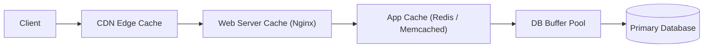

# ⚡ Caching

> [!abstract] TL;DR
> **Caching** stores frequently accessed data in a fast temporary layer to reduce database load, lower latency, and improve system throughput — with multiple placement strategies (CDN, app, DB, client).

## 🧠 Core Idea

**Caching** is the process of storing **frequently accessed data** in a **temporary fast storage layer (cache)** so it can be retrieved quickly without repeatedly querying the original data source.

> Goal: **Reduce latency, lower load on databases, and improve overall system performance.**

---

## 📖 Definition

When an application requests data:

```
Application → Cache → (Hit) → Return Data
              ↓ (Miss)
         Primary Data Store → Cache → Application
```

If the data exists in cache (**cache hit**), it is returned instantly.  
If not (**cache miss**), it is fetched from the original source and stored in cache.

---

## 🎯 Why Caching Matters

- Reduces database load  
- Improves response time  
- Handles traffic spikes  
- Increases system scalability  
- Enhances user experience  

---

## 🧩 Common Cache Placement Layers

### 🖥️ Client Caching
- Browser or mobile app stores responses  
- Reduces repeated network calls  

### 🌍 CDN Caching
- Edge servers cache static assets  
- Improves global content delivery  

### 🌐 Web Server Caching
- Reverse proxies cache HTTP responses  
- Examples: NGINX, Varnish  

### 🗄️ Database Caching
- Query results cached in memory  
- Examples: Redis, Memcached  

### ⚙️ Application Caching
- In-memory objects cached inside services  
- Reduces repeated computations  

---

## 🔄 Cache Update Strategies

### 🔹 Cache Aside (Lazy Loading)
- Application checks cache first  
- On miss → fetch from DB → update cache  
- Most commonly used pattern  

---

### 🔹 Write Through
- Writes go to cache and database simultaneously  
- Cache always stays consistent  

---

### 🔹 Write Behind (Write Back)
- Writes go to cache first  
- Database updated asynchronously later  
- Improves write performance  

---

### 🔹 Refresh Ahead
- Cache proactively refreshes data before expiry  
- Prevents cache misses for popular data  

---

## ⚖️ Strategy Comparison

| Strategy | Read Performance | Write Performance | Consistency |
|----------|------------------|-------------------|-------------|
| Cache Aside | High | Medium | Eventual |
| Write Through | High | Medium | Strong |
| Write Behind | Very High | High | Eventual |
| Refresh Ahead | Very High | Medium | Eventual |

---

## ⚠️ Cache Challenges

- Cache invalidation complexity  
- Stale data risks  
- Memory limitations  
- Eviction policies (LRU, LFU, FIFO)  

---

## 🧠 Design Insight

```
Read-heavy systems → Aggressive caching
Write-heavy systems → Selective caching
Global users → CDN caching
Database bottleneck → Distributed cache
```

---

## 🖼️ Diagram



---

## 🔗 Related Topics

[[Load Balancers]]  
[[CDN]]  
[[Key-Value Store]]  
[[Databases]]  
[[SQL Tuning]]  
[[Latency vs Throughput]]

---

## 📚 Source

- Cache Strategies — Medium  
  https://medium.com/@mmoshikoo/cache-strategies-996e91c80303

---

## Related Concepts

- [[_MOC_Caching|↑ Section MOC]]
- [[Application Caching]]
- [[CDN Caching]]
- [[Client-Side Caching]]
- [[Database Caching]]
- [[Web Server Caching]]

---

## Review Questions

1. What is the difference between a cache hit and a cache miss?
2. Name three common cache eviction policies and briefly describe each.
3. What are two trade-offs you accept when introducing a caching layer?

---

## 🏷️ Tags

#SystemDesign #Caching #Performance #Scalability #Databases
