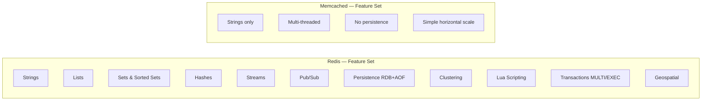

# ⚡ Redis vs Memcached

> [!abstract] TL;DR
> Both are in-memory key-value stores for caching. Redis is a superset: richer data structures, optional persistence, clustering, pub/sub, transactions, and Lua scripting. Memcached is simpler, multi-threaded, and slightly lower overhead for pure string caching. In practice, Redis has won — choose it for any new system. Memcached is legacy.

## Intuition — analogy FIRST

Memcached is a vending machine — fast, simple, you put something in (a string), you get something back (a string). One slot, one item, done.

Redis is a Swiss Army knife — it can still be a vending machine, but it can also be a sorted leaderboard, a message bus, a rate limiter, a job queue, a geospatial index, and a persistent database. You pay a small complexity premium, but the tool does far more.

## How It Works

### Feature Comparison



### Redis Data Structures and Their Use Cases

| Data Structure | Commands | Use Case |
|---|---|---|
| String | `GET`, `SET`, `INCR` | Session cache, counters, simple KV |
| List | `LPUSH`, `RPOP`, `LRANGE` | Job queues, activity feeds (append/prepend) |
| Set | `SADD`, `SMEMBERS`, `SINTER` | Unique visitors, tag systems, set operations |
| Sorted Set | `ZADD`, `ZRANGE`, `ZRANK` | Leaderboards, rate limiting, timeline |
| Hash | `HSET`, `HGET`, `HMGET` | User profile objects, config maps |
| Stream | `XADD`, `XREAD` | Event log, message queue with consumer groups |
| HyperLogLog | `PFADD`, `PFCOUNT` | Approximate unique count (1% error, 12KB) |
| Geo | `GEOADD`, `GEODIST`, `GEORADIUS` | Nearby drivers, store locator |

### Persistence in Redis

**RDB (Redis Database Backup):** Point-in-time snapshots. Compact, fast to restore. Risk: data loss between snapshots.

```
save 900 1      # snapshot if 1 write in 900 seconds
save 300 10     # snapshot if 10 writes in 300 seconds
```

**AOF (Append-Only File):** Logs every write command. More durable. Larger files, slower restore. Can be compacted (`BGREWRITEAOF`).

```
appendonly yes
appendfsync everysec    # fsync every second (balance of durability/performance)
```

**Use both:** RDB for fast restores, AOF for durability. Redis recommends this in production.

### Redis Clustering

- **Redis Sentinel** — High availability for single-primary setup. Monitors primary, promotes replica on failure. For < 50 GB datasets.
- **Redis Cluster** — Sharded across multiple nodes. Data partitioned into 16,384 hash slots. Horizontal scaling. For very large datasets.

### Memcached Multi-Threading

Memcached uses a multi-threaded event loop — each core gets a thread. Under extremely high concurrency for pure string GET/SET workloads, Memcached can slightly outperform Redis (which was single-threaded until v6).

Redis 6+ added **I/O threads** for network processing, closing most of this gap while keeping command execution single-threaded (which preserves atomicity).

### Transactions

Redis supports atomic command batches:
```
MULTI
INCR views:post:123
EXPIRE views:post:123 86400
EXEC
```

`MULTI/EXEC` blocks execute atomically — no other client commands interleave. Memcached has no transaction support.

### Pub/Sub in Redis

```
# Publisher
PUBLISH news:sports "Lakers win again"

# Subscriber
SUBSCRIBE news:sports
```

> [!warning] Redis Pub/Sub has no persistence
> Messages are fire-and-forget. If no subscriber is connected, the message is lost. For durable messaging, use Redis Streams or [[Kafka]].

## Real-World Systems

| Company | Tool | Use Case |
|---|---|---|
| **Instagram** | Redis | Follower/following lists (sorted sets), feed assembly |
| **Twitter/X** | Memcached + Redis | Timeline caching (Memcached), rate limiting (Redis) |
| **GitHub** | Redis | Session store, job queues (Resque) |
| **Stack Overflow** | Redis | Tag rankings (sorted sets), question view counts |
| **Pinterest** | Redis | Social graph, analytics counters |
| **Airbnb** | Redis | Rate limiting, feature flags |

## Trade-offs

| Dimension | Redis | Memcached |
|---|---|---|
| Data structures | Rich (7+ types) | Strings only |
| Persistence | Yes (RDB + AOF) | No |
| Clustering | Built-in (Sentinel + Cluster) | Client-side sharding only |
| Threading | Single-threaded commands (I/O threads in v6+) | Multi-threaded |
| Memory efficiency | Slightly higher overhead | Slightly lower overhead |
| Pub/Sub | Yes (fire-and-forget) | No |
| Lua scripting | Yes | No |
| Transactions | Yes (MULTI/EXEC) | No |
| Community/ecosystem | Very active | Declining |
| Learning curve | Higher | Lower |

## When to Use vs Avoid

**Use Redis when:**
- You need any data structure beyond simple strings.
- You need persistence (cache + durable store hybrid).
- You need pub/sub, sorted leaderboards, or rate limiting.
- You want Lua scripting for atomic multi-step operations.
- Starting a new project (it covers everything Memcached does, and more).

**Use Memcached when:**
- You are maintaining an existing Memcached deployment that works.
- You need pure string caching with maximum simplicity and multi-threaded throughput.
- You want zero persistence (explicit requirement to lose all cache on restart).

**TL;DR:** Choose Redis for all new systems.

## Common Pitfalls

1. **Using Redis Pub/Sub for reliable messaging** — messages are lost if no subscriber is connected. Use Redis Streams or Kafka instead.
2. **No maxmemory policy set** — Redis will run out of memory and start failing writes. Always set `maxmemory` and `maxmemory-policy`.
3. **Treating Redis as a primary database** — Redis is memory-bound. Use it as a cache layer, not as source of truth (unless using Redis with AOF + RDB for specific use cases).
4. **Large values in Redis** — values > 1MB cause latency spikes. Store large blobs in object storage; cache only IDs/metadata.
5. **N+1 cache misses** — fetching 100 user IDs one at a time → 100 round trips. Use `MGET` or pipelines.
6. **No TTL on keys** — keys accumulate forever, exhausting memory. Always set TTLs on cached data.

## Related Concepts

- [[_MOC_Caching|↑ Section MOC]]
- [[Caching]] — Redis and Memcached are the primary tools for the caching layer
- [[Cache_Eviction_Policies]] — Redis supports LRU, LFU, random, TTL eviction policies
- [[Cache_Stampede]] — cache stampede solutions often leverage Redis distributed locks
- [[Rate_Limiting]] — Redis sorted sets / INCR+EXPIRE are the standard rate limiter implementation
- [[Kafka]] — for durable pub/sub with replay, Kafka replaces Redis Pub/Sub

## Review Questions

1. Instagram wants to build a "top 10 most liked posts this week" feature with real-time updates as likes come in. Which Redis data structure would you use? Write the key operations (ZADD, ZRANGE) needed.
2. Your Redis instance is running at 90% memory. The `maxmemory-policy` is not set. What happens? What policy would you configure for a session cache where recent sessions are more valuable than old ones?
3. A teammate proposes using Redis Pub/Sub to send order confirmation notifications to a downstream service. What is the reliability risk, and what alternative would you recommend?

## Sources

- [Redis Documentation](https://redis.io/docs/)
- [Redis vs Memcached — AWS ElastiCache docs](https://docs.aws.amazon.com/AmazonElastiCache/latest/red-ug/SelectEngine.html)
- [Redis persistence guide](https://redis.io/docs/management/persistence/)
- [Redis Cluster Specification](https://redis.io/docs/reference/cluster-spec/)

#SystemDesign #Redis #Memcached #Caching #InMemory #DataStructures
