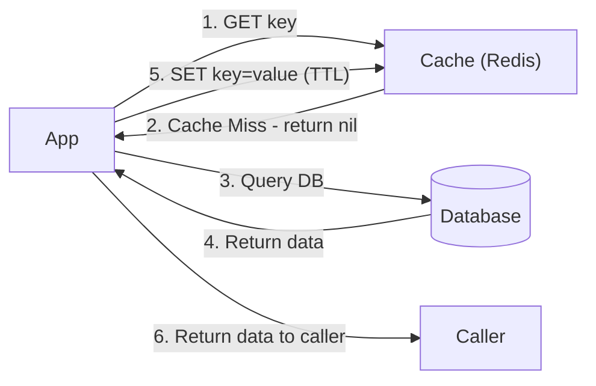

# 💤 Cache-Aside (Lazy Loading)

> [!abstract] TL;DR
> In **Cache-Aside**, the application checks the cache first and fetches from the database only on a miss, then populates the cache — caching only data that is actually requested.

## 🧠 Core Idea

**Cache-Aside**, also known as **Lazy Loading**, is a caching strategy where the **application is fully responsible** for reading and writing data from the database, while the cache acts as a **fast lookup layer**.

> Goal: **Cache only data that is actually requested**, avoiding unnecessary cache usage.

In this pattern, the **cache never talks directly to the database** — only the application does.

---

## 📖 How It Works

### Read Flow

```
Application → Cache → (Miss)
          ↓
      Database → Application → Cache → Return Data
```

### Step-by-step

1. Application looks for entry in cache  
2. If **cache hit** → return data immediately  
3. If **cache miss** → query database  
4. Store result in cache  
5. Return data to application  

---

## 💻 Example Code

```python
def get_user(self, user_id):
    user = cache.get("user.{0}".format(user_id))

    if user is None:
        user = db.query("SELECT * FROM users WHERE user_id = {0}", user_id)
        if user is not None:
            key = "user.{0}".format(user_id)
            cache.set(key, json.dumps(user))

    return user
```

---

## 🎯 Why Cache-Aside Matters

- Only requested data is cached  
- Avoids filling cache with unused data  
- Simple and widely adopted pattern  
- Easy to implement and reason about  

---

## 🌍 Common Implementations

- **Memcached**  
- **Redis**  
- In-memory application caches  

---

## ⚡ Performance Characteristics

- **First read** → Slower (cache miss)  
- **Subsequent reads** → Very fast (cache hit)  
- Reduces repeated database queries  

---

## 🚀 Advantages

- Simple architecture  
- Cache contains only useful data  
- No stale data if TTL handled correctly  
- Works well with distributed caches  

---

## ⚠️ Disadvantages

- Cache miss penalty on first request  
- Cache invalidation must be handled carefully  
- Cold-start latency when cache restarts  

---

## 🧠 Design Insight

```
Unknown access patterns → Cache-Aside
Predictable hot data → Refresh-Ahead
Strong consistency → Write-Through
Fast writes → Write-Behind
```

---

## 🖼️ Diagram



---

## 🔗 Related Topics

[[Caching]]  
[[Write-Through Cache]]  
[[Write-Behind Cache]]  
[[Refresh-Ahead Cache]]  
[[Database Replication]]

---

## 📚 Source

- Hazelcast — From Cache to In-Memory Data Grid  
  https://www.slideshare.net/slideshow/from-cache-to-in-memory-data-grid-introduction-to-hazelcast/34802471

---

## Related Concepts

- [[_MOC_Caching|↑ Section MOC]]
- [[Caching]]
- [[Write-Through Cache]]
- [[Write-Behind Cache]]
- [[Application Caching]]
- [[Database Caching]]

---

## Review Questions

1. Describe the cache-aside pattern step by step on a cache miss.
2. What is the main disadvantage of cache-aside on a cold start?
3. Why is cache-aside also called "lazy loading"?

---

## 🏷️ Tags

#SystemDesign #Caching #CacheAside #Performance #Scalability
