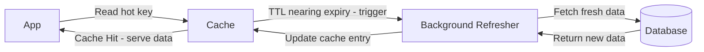

# 🔄 Refresh-Ahead Cache Strategy

> [!abstract] TL;DR
> **Refresh-Ahead** proactively refreshes cache entries before they expire based on predicted access patterns, eliminating cache-miss latency for predictably hot data.

## 🧠 Core Idea

**Refresh-Ahead** is a caching strategy where the cache **automatically refreshes frequently accessed entries before they expire**.

> Goal: **Prevent cache misses for popular data and reduce latency.**

Instead of waiting for cached data to expire and then fetching it again (as in Cache-Aside), refresh-ahead proactively keeps hot data fresh.

---

## 📖 How It Works

```
Application → Cache (Hit)
          ↓
 Cache detects entry nearing expiration
          ↓
 Cache refreshes data from Primary Store in background
```

The user continues receiving cached data while the refresh happens asynchronously.

---

## 🎯 Why Refresh-Ahead Matters

- Reduces latency for frequently accessed data  
- Prevents sudden cache misses  
- Improves user experience in read-heavy systems  

---

## ⚙️ Typical Use Case

- Trending content feeds  
- Product catalogs  
- Popular social media posts  
- Frequently accessed configuration data  

---

## ⚖️ Comparison with Read-Through (Cache-Aside)

| Aspect | Cache-Aside | Refresh-Ahead |
|--------|-------------|---------------|
| Cache Misses | Possible | Rare |
| Latency | Higher on miss | Consistently low |
| Refresh Timing | After expiry | Before expiry |
| Predictive Behavior | ❌ | ✅ |

---

## ❌ Disadvantages

- Requires accurate prediction of “hot” data  
- Incorrect predictions waste resources  
- May reduce performance if rarely used data is refreshed unnecessarily  

---

## 🧠 Design Insight

```
Highly predictable access patterns → Refresh-Ahead
Unpredictable access patterns → Cache-Aside
```

Many real systems combine refresh-ahead for **hot keys** and cache-aside for **cold data**.

---

## 🖼️ Diagram



---

## 🔗 Related Topics

[[Caching]]  
[[Cache Aside]]  
[[Write-Through Cache]]  
[[Write-Behind Cache]]  
[[Performance Optimization]]

---

## 📚 Source

- Hazelcast — From Cache to In-Memory Data Grid  
  https://www.slideshare.net/slideshow/from-cache-to-in-memory-data-grid-introduction-to-hazelcast/34802471

---

## Related Concepts

- [[_MOC_Caching|↑ Section MOC]]
- [[Caching]]
- [[Cache Aside]]
- [[Write-Through Cache]]
- [[Write-Behind Cache]]
- [[CDN Caching]]

---

## Review Questions

1. What distinguishes refresh-ahead from cache-aside in terms of when data is loaded?
2. What is the risk of inaccurate TTL prediction in refresh-ahead caching?
3. Name a workload where refresh-ahead caching is most effective.

---

## 🏷️ Tags

#SystemDesign #Caching #Performance #Scalability
