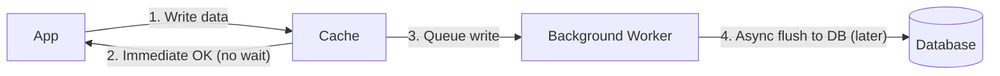

# 📝 Write-Behind Cache Strategy

> [!abstract] TL;DR
> In **Write-Behind** caching, writes go to cache immediately with database persistence handled asynchronously later, maximizing write throughput at the cost of potential data loss on cache failure.

## 🧠 Core Idea

**Write-Behind (Write-Back) Caching** is a strategy where the application **writes data to the cache first**, and the cache **asynchronously writes the data to the primary data store later**.

> Goal: **Improve write performance by decoupling application writes from database writes.**

---

## 📖 How It Works

```
Application → Cache (Write)
          ↓
   Immediate Response to App
          ↓
Cache → Asynchronous Write → Primary Data Store
```

The application does **not wait** for the database write to complete, resulting in faster write operations.

---

## ⚙️ Step-by-Step Flow

1. Application adds or updates entry in cache  
2. Cache immediately returns success to application  
3. Cache asynchronously persists data to data store  
4. Data store is eventually consistent with cache  

---

## 🎯 Why Write-Behind Matters

- Significantly improves write performance  
- Reduces direct load on databases  
- Smooths write traffic spikes  
- Useful in high-throughput systems  

---

## 🚀 Common Use Cases

- Activity logging systems  
- Analytics event collection  
- Social media interactions (likes, comments)  
- IoT sensor data ingestion  

---

## ⚠️ Disadvantages

### ❌ Risk of Data Loss
- If cache fails before async write completes  
- Requires durability mechanisms to mitigate risk  

### ❌ Increased Complexity
- Requires background workers or queues  
- Harder to reason about consistency  

---

## 🧠 Reliability Improvements

To reduce data loss risks:

- Persist cache to disk  
- Use replicated cache clusters  
- Add write-ahead logs  
- Ensure retry mechanisms  

---

## ⚖️ Comparison with Other Write Strategies

| Strategy | Write Path | Consistency | Write Latency | Risk |
|----------|------------|-------------|---------------|------|
| Write-Through | Cache → DB (sync) | Strong | Medium | Low |
| Write-Behind | Cache → DB (async) | Eventual | Very Low | Medium |
| Cache-Aside | DB → Cache | Strong | High | Low |

---

## 🧠 Design Insight

```
Need ultra-fast writes → Write-Behind
Need strong consistency → Write-Through
Simple pattern → Cache-Aside
```

---

## 🖼️ Diagram



---

## 🔗 Related Topics

[[Caching]]  
[[Write-Through Cache]]  
[[Cache Aside]]  
[[Refresh-Ahead Cache]]  
[[Scalability]]  
[[Availability]]

---

## 📚 Source

- Scalability, Availability, Stability Patterns  
  https://www.slideshare.net/slideshow/scalability-availability-stability-patterns/4062682

---

## Related Concepts

- [[_MOC_Caching|↑ Section MOC]]
- [[Caching]]
- [[Cache Aside]]
- [[Write-Through Cache]]
- [[Refresh-Ahead Cache]]
- [[Application Caching]]

---

## Review Questions

1. How does write-behind caching differ from write-through in terms of database write timing?
2. What is the risk of data loss in write-behind caching, and how is it mitigated?
3. Name one use case where write-behind caching provides a significant performance advantage.

---

## 🏷️ Tags

#SystemDesign #Caching #Performance #Scalability #Availability
