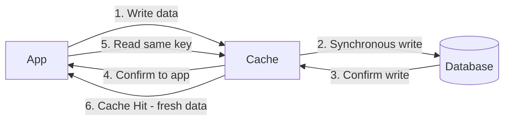

# ✍️ Write-Through Cache Strategy

> [!abstract] TL;DR
> In **Write-Through** caching, every write goes to both cache and database synchronously, ensuring strong consistency between them at the cost of added write latency.

## 🧠 Core Idea

**Write-Through** is a caching strategy where the **application reads and writes directly to the cache**, and the **cache synchronously writes data to the primary data store**.

> Goal: **Ensure strong consistency between cache and database while still accelerating reads.**

---

## 📖 How It Works

```
Application → Cache (Write)
          ↓
 Cache → Synchronous Write → Primary Data Store
          ↓
 Application receives response
```

The write is **not acknowledged** until the data is successfully stored in both the cache and the database.

---

## ⚙️ Step-by-Step Flow

1. Application adds/updates entry in cache  
2. Cache synchronously writes entry to database  
3. Operation returns success to application  
4. Cache now holds fresh data for fast reads  

---

## 💻 Example Flow

### Application Code
```python
set_user(12345, {"foo": "bar"})
```

### Cache Logic
```python
def set_user(user_id, values):
    user = db.query("UPDATE Users WHERE id = {0}", user_id, values)
    cache.set(user_id, user)
```

---

## 🎯 Why Write-Through Matters

- Cache and database always stay consistent  
- Subsequent reads are extremely fast  
- Prevents stale cache data  
- Simpler consistency model than write-behind  

---

## ⚡ Performance Characteristics

- **Writes:** Slower (must hit database)  
- **Reads after write:** Very fast (cache hit)  

Users generally tolerate higher latency on **writes** more than on **reads**, making this tradeoff acceptable.

---

## 🚀 Common Use Cases

- User profile updates  
- Account settings  
- Financial or transactional updates  
- Any system needing strong consistency  

---

## ⚠️ Disadvantages

### ❌ Slower Write Performance
- Every write hits the database synchronously  

### ❌ Cold Cache on New Nodes
- New cache nodes start empty  
- Entries appear only after updates  
- Can be mitigated by combining with **Cache-Aside**

### ❌ Unnecessary Writes
- Some written data may never be read  
- Mitigated by applying a **TTL** on cache entries  

---

## ⚖️ Comparison with Other Strategies

| Strategy | Write Latency | Read Latency | Consistency | Risk of Data Loss |
|----------|--------------|-------------|-------------|-------------------|
| Cache-Aside | High | Medium | Strong | Low |
| Write-Through | Medium | Very Low | Strong | Low |
| Write-Behind | Very Low | Very Low | Eventual | Medium |
| Refresh-Ahead | Medium | Very Low | Eventual | Low |

---

## 🧠 Design Insight

```
Need strong consistency → Write-Through
Need ultra-fast writes → Write-Behind
Need simple pattern → Cache-Aside
```

Many real-world systems combine **Write-Through + Cache-Aside** for best results.

---

## 🖼️ Diagram



---

## 🔗 Related Topics

[[Caching]]  
[[Cache Aside]]  
[[Write-Behind Cache]]  
[[Refresh-Ahead Cache]]  
[[Consistency Patterns]]

---

## 📚 Source

- Scalability, Availability, Stability Patterns  
  https://www.slideshare.net/slideshow/scalability-availability-stability-patterns/4062682

---

## Related Concepts

- [[_MOC_Caching|↑ Section MOC]]
- [[Caching]]
- [[Cache Aside]]
- [[Write-Behind Cache]]
- [[Refresh-Ahead Cache]]
- [[Database Caching]]

---

## Review Questions

1. In write-through caching, when is data written to the database relative to the cache write?
2. What is the main advantage of write-through caching for subsequent read performance?
3. What is the downside of write-through when dealing with write-heavy workloads?

---

## 🏷️ Tags

#SystemDesign #Caching #WriteThrough #Performance #Consistency
