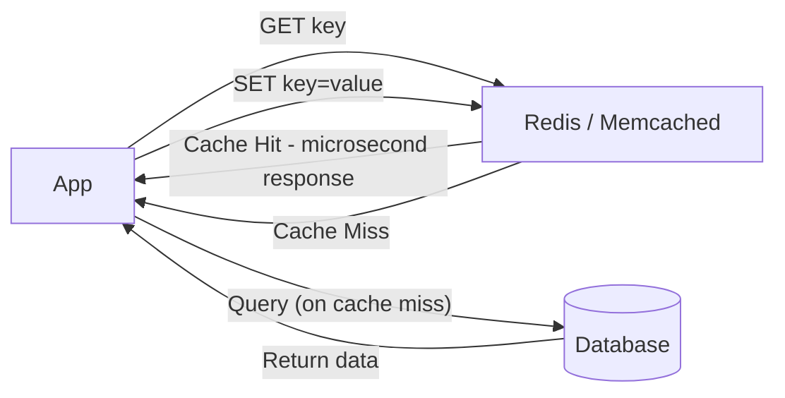

# ⚙️ Application Caching

> [!abstract] TL;DR
> **Application caching** uses in-memory stores like Redis or Memcached between the application and database, delivering microsecond-level access for frequently read data stored in RAM.

## 🧠 Core Idea

**Application Caching** uses **in-memory key-value stores** such as **Redis** or **Memcached** between the application and the database to store frequently accessed data in RAM.

> Goal: **Reduce database load and dramatically improve response time.**

Since RAM is much faster than disk-based storage, application caching is one of the most effective performance optimizations in system design.

---

## 📖 Definition

```
Application → In-Memory Cache → (Hit) → Return Data
                      ↓ (Miss)
                 Database → Cache → Application
```

The cache acts as a **fast-access layer** sitting directly inside the application stack.

---

## 🎯 Why Application Caching Matters

- Reduces database queries  
- Improves latency  
- Handles high request throughput  
- Enables horizontal scaling  
- Absorbs traffic spikes  

---

## 🗄️ Popular In-Memory Caches

### 🔹 Memcached
- Simple key-value store  
- Extremely fast  
- Commonly used for distributed caching  

### 🔹 Redis
- Key-value store with advanced features  
- Built-in data structures (lists, sets, sorted sets, hashes)  
- Supports persistence  
- Pub/Sub messaging  
- Lua scripting  

---

## ⚡ Why RAM-Based Caching is Fast

- Data stored in memory, not disk  
- No expensive I/O operations  
- Microsecond-level access times  

---

## 🔥 Cache Eviction Policies

RAM is limited, so caches remove "cold" data automatically:

- **LRU** (Least Recently Used)  
- LFU (Least Frequently Used)  
- FIFO (First In First Out)  

LRU is the most commonly used eviction strategy.

---

## ⚠️ Cache Invalidation Challenges

- Stale data risk  
- Need TTL (Time-To-Live) policies  
- Synchronization with database updates  

---

## 🚀 Redis Additional Advantages

- Optional disk persistence  
- Replication for high availability  
- Atomic operations  
- Built-in data structures  
- Distributed cluster support  

---

## ❌ Avoid File-Based Caching

File-based caching makes:
- Cloning servers harder  
- Auto-scaling slower  
- State management complex  

Modern systems prefer **distributed in-memory caches** instead.

---

## 🧠 Design Insight

```
Database under heavy read load → Add Application Cache
Need complex cached structures → Use Redis
Need simple fast cache → Use Memcached
```

---

## 🖼️ Diagram



---

## 🔗 Related Topics

[[Caching]]  
[[Database Caching]]  
[[Cache Aside]]  
[[Write-Through Cache]]  
[[Write-Behind Cache]]  
[[Scalability]]

---

## 📚 Source

- System Design Primer — Application Caching  
  https://github.com/donnemartin/system-design-primer#application-caching

---

## Related Concepts

- [[_MOC_Caching|↑ Section MOC]]
- [[Caching]]
- [[Database Caching]]
- [[Cache Aside]]
- [[Write-Through Cache]]
- [[Write-Behind Cache]]

---

## Review Questions

1. What is the key difference between Redis and Memcached for application caching?
2. What cache eviction policy does Redis use most commonly, and what does it evict first?
3. Why is file-based caching discouraged in horizontally scaled systems?

---

## 🏷️ Tags

#SystemDesign #ApplicationCaching #Caching #Performance #Scalability
