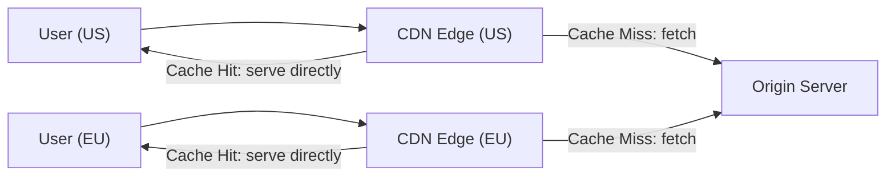

# 🌍 CDN Caching

> [!abstract] TL;DR
> **CDN caching** serves content from edge servers geographically close to users, reducing latency, offloading origin servers, and improving global availability for static and dynamic assets.

## 🧠 Core Idea

**CDN Caching** uses a **Content Delivery Network (CDN)** to store frequently accessed content on **edge servers located close to end-users**.

> Goal: **Deliver content faster, reduce latency, and decrease load on origin servers.**

---

## 📖 Definition

A **Content Delivery Network (CDN)** is a globally distributed network of servers that cache content near users.

When a user requests content:

```
User → Nearby CDN Edge Server → (Cache Hit) → Content Returned
                      ↓ (Cache Miss)
              Origin Server → CDN Edge → User
```

If the content is not cached, the CDN fetches it from the **origin server**, returns it to the user, and stores it for future requests.

---

## 🎯 Why CDN Caching Matters

- Reduces latency by serving content closer to users  
- Decreases load on origin servers  
- Handles traffic spikes efficiently  
- Improves global availability  
- Enhances user experience  

---

## ⚙️ What Gets Cached

- Static assets (images, CSS, JS)  
- Videos and media files  
- API responses (in advanced CDNs)  
- Downloadable files  

---

## 🌍 Popular CDN Providers

- Cloudflare  
- AWS CloudFront  
- Akamai  
- Fastly  
- Google Cloud CDN  

---

## 🚀 Performance Benefits

- Faster page load times  
- Lower bandwidth costs  
- Better SEO ranking  
- Higher system scalability  

---

## ⚠️ CDN Cache Considerations

- Cache invalidation strategy required  
- TTL configuration for freshness  
- Origin fallback on cache miss  
- Security (DDoS protection, TLS termination)  

---

## 🧠 Design Insight

```
Global user base → Use CDN caching
Media-heavy content → CDN is mandatory
High traffic spikes → CDN protects origin servers
```

---

## 🖼️ Diagram



---

## 🔗 Related Topics

[[Caching]]  
[[Client-Side Caching]]  
[[Web Server Caching]]  
[[Load Balancers]]  
[[DNS]]

---

## Related Concepts

- [[_MOC_Caching|↑ Section MOC]]
- [[Caching]]
- [[Client-Side Caching]]
- [[Web Server Caching]]
- [[Load Balancers]]
- [[Application Caching]]

---

## Review Questions

1. What is the difference between an edge server and an origin server in a CDN?
2. How does TTL configuration affect CDN cache freshness?
3. Name two types of content that benefit most from CDN caching.

---

## 🏷️ Tags

#SystemDesign #CDN #Caching #Performance #Scalability
