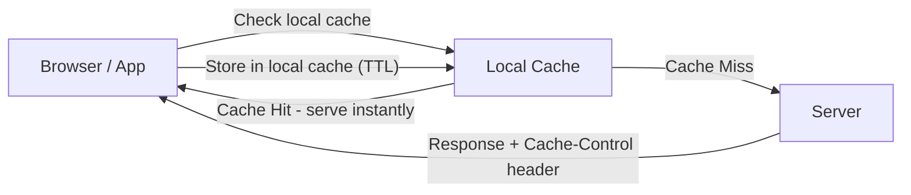

# 💻 Client-Side Caching

> [!abstract] TL;DR
> **Client-side caching** stores data on the user's device (browser or app), eliminating server round-trips for repeated requests, reducing network load, and enabling offline access.

## 🧠 Core Idea

**Client-side caching** is the practice of storing frequently accessed data **on the client’s device** rather than repeatedly fetching it from the server.

> Goal: **Reduce network requests, decrease latency, and improve user experience.**

This shifts some load from servers to client devices.

---

## 📖 Definition

When a client (browser or app) requests data:

```
Client → Local Cache → (Hit) → Return Data
              ↓ (Miss)
         Server → Client → Store in Cache
```

If the data exists locally, the client avoids contacting the server.

---

## 🌍 Common Examples

### 🌐 Browser Caching
- HTML pages  
- Images  
- CSS & JavaScript files  
- API responses  

Browsers store these in local cache using HTTP caching headers like:
- `Cache-Control`
- `ETag`
- `Expires`

---

### 📱 Application-Level Caching
- Mobile apps caching user data  
- Offline-first applications  
- Desktop applications storing session data  

---

## 🎯 Why Client Caching Matters

- Faster page/app load times  
- Reduced server load  
- Lower network traffic  
- Better user experience, especially on slow networks  

---

## ⚙️ Typical Use Cases

- Static web assets  
- User profile data  
- Configuration data  
- Offline-capable applications  

---

## ✅ Advantages

- Reduced latency  
- Lower backend costs  
- Improved scalability  
- Enables offline access  

---

## ⚠️ Disadvantages

- Risk of stale data  
- Client storage limitations  
- Harder cache invalidation  
- Potential security considerations  

---

## 🧠 Cache Invalidation Methods

- Time-To-Live (TTL)  
- ETag validation  
- Versioned asset URLs  
- Manual refresh triggers  

---

## 🖼️ Diagram



---

## 🔗 Related Topics

[[Caching]]  
[[CDN]]  
[[Web Server Caching]]  
[[Cache Aside]]  
[[Performance Optimization]]

---

## 📚 Source

- MDN Web Docs — HTTP Caching  
  https://developer.mozilla.org/en-US/docs/Web/HTTP/Guides/Caching

---

## Related Concepts

- [[_MOC_Caching|↑ Section MOC]]
- [[Caching]]
- [[CDN Caching]]
- [[Web Server Caching]]
- [[Cache Aside]]
- [[Application Caching]]

---

## Review Questions

1. What HTTP headers control client-side browser caching?
2. How does ETag-based validation work to confirm whether cached content is still fresh?
3. What is the main security concern with storing sensitive data in client-side caches?

---

## 🏷️ Tags

#SystemDesign #ClientCaching #Caching #WebPerformance
