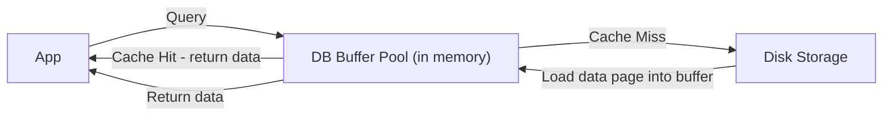

# 🗄️ Database Caching

> [!abstract] TL;DR
> **Database caching** stores frequently accessed query results or data objects in fast memory, reducing disk reads and lowering database load for read-heavy workloads.

## 🧠 Core Idea

**Database Caching** is the practice of storing frequently accessed database data in **fast-access memory** to reduce repeated disk or network reads.

> Goal: **Improve query performance and reduce load on the database.**

Think of it like keeping your most-used books on your desk instead of walking to the library every time.

---

## 📖 Simplified Analogy

### 📚 Library = Database  
### 🖥️ Desk = Cache  

- First time you need a book → go to library (database)  
- You keep a copy on your desk (cache)  
- Next time → instant access from desk (cache hit)  
- If not on desk → fetch again (cache miss), then store  

---

## ⚙️ How It Works

```
Application → Database Cache → (Hit) → Return Data
                     ↓ (Miss)
                Database → Cache → Application
```

---

## 🎯 Why Database Caching Matters

- Faster query responses  
- Reduced database load  
- Higher system throughput  
- Better scalability  
- Lower infrastructure costs  

---

## 🧩 Common Types of Database Caching

### 🔹 Query Result Cache
- Stores results of frequent queries  
- Example: MySQL Query Cache (deprecated but concept lives on)

### 🔹 Object Cache
- Stores full objects/rows  
- Example: Redis or Memcached  

### 🔹 Page Cache
- Stores disk pages in memory  
- Built into most database engines  

---

## 🏗️ Built-in Database Caches

Most databases include default caching layers:

- **PostgreSQL**: Shared Buffers  
- **MySQL/InnoDB**: Buffer Pool  
- **Oracle**: Database Buffer Cache  

These can be tuned based on workload.

---

## ⚡ Performance Boosting

By tuning cache size and eviction policies:
- More cache hits  
- Fewer disk reads  
- Faster overall system  

---

## ⚠️ Cache Challenges

- Stale data risk  
- Memory usage constraints  
- Cache invalidation complexity  
- Consistency management  

---

## 🧠 Design Insight

```
Read-heavy workload → Increase DB cache size
Frequent same queries → Add external cache (Redis)
Massive scale → Combine DB cache + Application cache
```

---

## 🖼️ Diagram



---

## 🔗 Related Topics

[[Caching]]  
[[Application Caching]]  
[[SQL Tuning]]  
[[Database Replication]]  
[[Database Sharding]]

---

## Related Concepts

- [[_MOC_Caching|↑ Section MOC]]
- [[Caching]]
- [[Application Caching]]
- [[SQL Tuning]]
- [[Database Replication]]
- [[Database Sharding]]

---

## Review Questions

1. What is a database buffer pool, and what data does it cache?
2. How does increasing the buffer pool size improve database read performance?
3. What is the difference between database-internal caching and application-level caching with Redis?

---

## 🏷️ Tags

#SystemDesign #DatabaseCaching #Performance #Scalability #Databases
