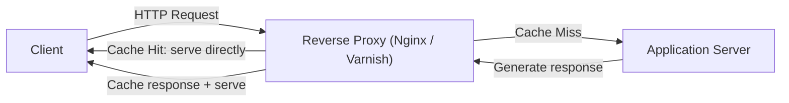

# 🌐 Web Server Caching

> [!abstract] TL;DR
> **Web server caching** uses reverse proxies like Nginx or Varnish to serve cached responses without contacting application servers, reducing backend load and cutting response times.

## 🧠 Core Idea

**Web Server Caching** involves caching content at the **web server or reverse proxy layer** so that requests can be served **without always reaching the application servers**.

> Goal: **Reduce application server load and improve response times.**

---

## 📖 Definition

Reverse proxies and caching servers such as **Varnish**, **NGINX**, or **Apache** can:

- Serve **static content** directly  
- Cache **dynamic responses**  
- Return cached responses without contacting application servers  

```
Client → Web Server / Reverse Proxy → (Cache Hit) → Response
                               ↓ (Cache Miss)
                       Application Server → Web Server → Client
```

---

## 🎯 Why Web Server Caching Matters

- Offloads application servers  
- Reduces response latency  
- Improves scalability  
- Handles traffic bursts efficiently  

---

## ⚙️ What Gets Cached

- Static assets (images, CSS, JS)  
- Rendered HTML pages  
- API responses  
- Frequently requested dynamic content  

---

## 🌍 Common Tools

- **Varnish Cache**  
- **NGINX reverse proxy caching**  
- **Apache mod_cache**  

---

## 🚀 Advantages

- Faster page loads  
- Lower backend workload  
- Simple to integrate  
- Works well with CDN and client caching  

---

## ⚠️ Disadvantages

- Cache invalidation complexity  
- Risk of serving stale content  
- Extra infrastructure layer  

---

## 🧠 Design Insight

```
Dynamic web apps → Add Web Server Cache
High backend load → Cache at reverse proxy
Global traffic → Combine with CDN
```

---

## 🖼️ Diagram



---

## 🔗 Related Topics

[[Caching]]  
[[CDN Caching]]  
[[Client-Side Caching]]  
[[Load Balancers]]  
[[Reverse Proxy]]

---

## Related Concepts

- [[_MOC_Caching|↑ Section MOC]]
- [[Caching]]
- [[CDN Caching]]
- [[Client-Side Caching]]
- [[Load Balancers]]
- [[Application Caching]]

---

## Review Questions

1. At which layer of the stack does web server caching operate?
2. Name two tools used for web server caching and the role they play.
3. What type of content benefits most from web server caching, and why?

---

## 🏷️ Tags

#SystemDesign #WebServerCaching #Caching #ReverseProxy #Performance
