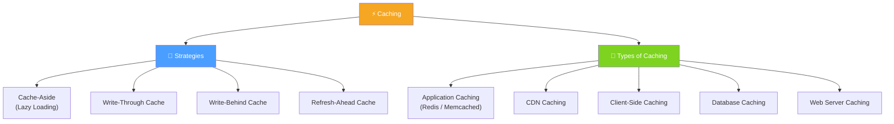

# ⚡ Caching — Map of Content

This MOC maps every note in the Caching cluster. Use it as a home base for navigation, review, and interview prep.

---

## Cluster Map

---

## Recommended Learning Path

Work through these in order — each note builds on the previous one.

1. [[Caching]] — What caching is, why it matters, and how the layers fit together
2. [[Cache_Aside]] — The most common read pattern; learn this first before the write strategies
3. [[Write_Through_Cache]] — Synchronous write strategy; strong consistency baseline
4. [[Write_Behind_Cache]] — Async write strategy; understand the data-loss risk trade-off
5. [[Refresh_Ahead_Cache]] — Proactive expiry strategy; contrast with Cache-Aside
6. [[Database_Caching]] — How databases cache internally; foundational before app-layer caching
7. [[Application_Caching]] — Redis and Memcached in the application stack
8. [[Web_Server_Caching]] — Reverse proxy caching with Varnish and NGINX
9. [[CDN_Caching]] — Edge caching for global distribution
10. [[Client_Side_Caching]] — Browser and app-level caching; the outer edge of the stack

---

## All Notes at a Glance

| Note | One-Line Summary | Difficulty |
|------|-----------------|------------|
| [[Caching]] | Overview of caching concepts, layers, strategies, and challenges | Beginner |
| [[Cache_Aside]] | App fetches from DB on cache miss and populates cache itself | Beginner |
| [[Write_Through_Cache]] | Writes go to cache and DB synchronously — strong consistency, slower writes | Beginner |
| [[Write_Behind_Cache]] | Writes go to cache immediately, DB updated asynchronously — fast writes, data-loss risk | Intermediate |
| [[Refresh_Ahead_Cache]] | Cache proactively refreshes hot data before expiry to avoid misses | Intermediate |
| [[Application_Caching]] | In-memory caches (Redis/Memcached) between app and DB for sub-millisecond reads | Beginner |
| [[CDN_Caching]] | Edge servers cache static and dynamic content close to global users | Beginner |
| [[Client_Side_Caching]] | Browser and mobile app caching via HTTP headers (Cache-Control, ETag) | Beginner |
| [[Database_Caching]] | DB-internal buffer pools plus external caches to cut disk I/O | Beginner |
| [[Web_Server_Caching]] | Reverse proxies (Varnish, NGINX) cache responses before hitting app servers | Beginner |

---

## Key Questions This Cluster Answers

- What is the difference between a cache hit and a cache miss, and why does it matter for performance?
- When should you use Cache-Aside vs Write-Through vs Write-Behind?
- How do you choose between Redis and Memcached?
- What are LRU, LFU, and FIFO eviction policies, and when does each apply?
- How does CDN caching differ from application-layer caching?
- What is cache invalidation and why is it considered one of the hardest problems in computer science?
- How does client-side caching interact with server-side caching in a full web stack?
- What are the data durability risks of Write-Behind caching and how do you mitigate them?
- When is Refresh-Ahead preferable to Cache-Aside?
- How do you cache at multiple layers simultaneously (client → CDN → reverse proxy → app → DB)?

---

## Related Topic MOCs

- [[Load Balancers]] — Load balancing and caching are often co-located at the reverse proxy layer
- [[CDNs]] — CDN Caching is a subset of the broader CDN topic
- [[Databases]] — Database Caching and Application Caching reduce direct database pressure

---

#MOC #SystemDesign #Caching
