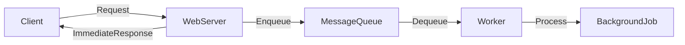

# ⏳ Asynchronism

> [!abstract] TL;DR
> Asynchronism offloads time-consuming tasks to background workers or queues, keeping user-facing services fast and responsive while heavy processing happens independently.

## 🧠 Core Idea

**Asynchronism** in system design refers to executing tasks **outside the main request-response flow**.

> Goal: **Reduce request latency, improve throughput, and handle long-running tasks efficiently.**

Instead of making users wait for expensive operations, systems process them **in the background**.

---

## 📖 Definition

In synchronous processing:

```
Client → Request → Server → Process Everything → Response
```

In asynchronous processing:

```
Client → Request → Server → Immediate Response
                   ↓
            Background Processing
```

This keeps user-facing services fast and responsive.

---

## 🎯 Why Asynchronism Matters

- Reduces request/response time  
- Improves user experience  
- Enables background computation  
- Helps handle high traffic loads  
- Prevents system overload  

---

## ⚙️ Common Asynchronous Patterns

### 🔹 Background Jobs
- Time-consuming tasks run separately  
- Example: Report generation, data aggregation  

### 🔹 Message Queues
- Services communicate via queues  
- Example: RabbitMQ, Kafka, Redis Streams  

### 🔹 Task Queues
- Specialized queues for distributing jobs  
- Example: Celery, Sidekiq  

### 🔹 Event-Driven Processing
- Services react to emitted events  
- Example: Order placed → Trigger email service  

---

## 🚀 Common Use Cases

- Sending emails or notifications  
- Video or image processing  
- Payment processing  
- Log aggregation  
- Analytics pipelines  

---

## ⚖️ Message Queue vs Task Queue

| Aspect | Message Queue | Task Queue |
|--------|---------------|------------|
| Purpose | Pass messages between services | Distribute jobs to workers |
| Example Tools | Kafka, RabbitMQ | Celery, Sidekiq |
| Execution | Consumer decides action | Worker executes assigned job |
| Usage | Service communication | Background job processing |

---

## 🧠 Back Pressure Concept

If producers send messages faster than consumers can process:

- Queues grow  
- Memory pressure increases  
- System may crash  

**Back pressure** mechanisms slow producers when the system is overloaded.

---

## 📐 Little’s Law Insight

```
L = λ × W
```
Where:
- **L** = Number of items in system  
- **λ** = Arrival rate  
- **W** = Processing time  

Reducing **W** (via async processing) reduces system load.

---

## ⚠️ Challenges

- Debugging complexity  
- Eventual consistency  
- Ordering guarantees  
- Monitoring async pipelines  

---

## 🧠 Design Insight

```
User-facing latency sensitive tasks → Async
Long-running computations → Background Jobs
Service communication → Message Queues
```

---

## 📊 Architecture Diagram



---

## Related Concepts

- [[_MOC_Asynchronism|↑ Section MOC]]
- [[Back_Pressure]]
- [[Message_Queues]]
- [[Task_Queues]]
- [[Idempotent_Operations]]
- [[Synchronous_IO_Antipattern]]

---

## Review Questions

1. What is the main benefit of asynchronism in system design, and what latency/consistency trade-off does it introduce?
2. How do message queues differ from task queues in purpose and typical tooling?
3. What is back pressure and why is it necessary in systems where producers can outpace consumers?

---

## 🔗 Related Topics

[[Background Jobs]]  
[[Event Driven]]  
[[Schedule Driven]]  
[[Returning Results]]  
[[Microservices]]  
[[Scalability]]

---

## 📚 Sources

- Patterns for Microservices  
  https://medium.com/inspiredbrilliance/patterns-for-microservices-e57a2d71ff9e  

- Back Pressure When Overloaded  
  https://mechanical-sympathy.blogspot.com/2012/05/apply-back-pressure-when-overloaded.html  

- Little’s Law  
  https://en.wikipedia.org/wiki/Little%27s_law  

- Message Queue vs Task Queue  
  https://www.quora.com/What-is-the-difference-between-a-message-queue-and-a-task-queue-Why-would-a-task-queue-require-a-message-broker-like-RabbitMQ-Redis-Celery-or-IronMQ-to-function

---

## 🏷️ Tags

#SystemDesign #Asynchronous #Microservices #Scalability #Performance
