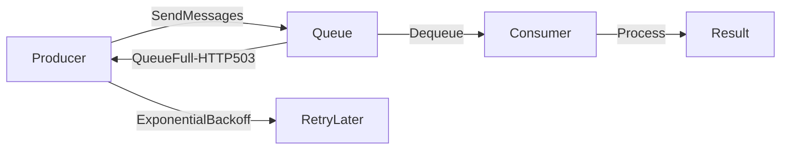

# 🚦 Back Pressure

> [!abstract] TL;DR
> Back pressure prevents system overload by throttling producers when queues fill up, signaling clients to slow down or retry with exponential backoff to maintain stable throughput.

## 🧠 Core Idea

**Back Pressure** is a mechanism used to **prevent system overload** by controlling the rate at which requests or jobs enter a system.

> Goal: **Maintain high throughput and stable response times by limiting queue growth.**

Without back pressure, queues can grow uncontrollably, leading to memory exhaustion, disk I/O, and cascading failures.

---

## 📖 Problem Without Back Pressure

```
Producers → Queue → Consumers
```

If **producers send faster** than consumers can process:

- Queue grows infinitely  
- Memory fills up  
- Disk swapping occurs  
- Latency increases  
- System may crash  

---

## ⚙️ How Back Pressure Works

When queue size exceeds a safe threshold:

```
Client → Server → Queue (Full)
              ↓
        Return HTTP 503 / Server Busy
```

Clients are told to **slow down** or **retry later**.

---

## 🔁 Client Retry Strategy

Clients typically retry using:

- **Exponential backoff**
- **Jitter (randomized delay)**

This prevents retry storms.

Example:
```
Retry after: 1s → 2s → 4s → 8s ...
```

---

## 🎯 Why Back Pressure Matters

- Prevents memory exhaustion  
- Maintains stable throughput  
- Avoids cascading system failures  
- Protects downstream services  
- Improves overall system reliability  

---

## 🚀 Common Use Cases

- Message queues (Kafka, RabbitMQ)  
- Background job systems  
- API gateways  
- Streaming pipelines  

---

## ⚠️ Without Back Pressure

- Increased cache misses  
- Disk reads due to paging  
- Higher latency  
- Eventual service outage  

---

## 🧠 Design Insight

```
Async systems + Queues → Always implement Back Pressure
High traffic APIs → Return 503 when overloaded
Streaming systems → Control producer rate
```

---

## 📊 Architecture Diagram



---

## Related Concepts

- [[_MOC_Asynchronism|↑ Section MOC]]
- [[Asynchronism]]
- [[Message_Queues]]
- [[Task_Queues]]
- [[Retry_Storm]]
- [[Monitoring]]

---

## Review Questions

1. What happens to a system without back pressure when producers are faster than consumers?
2. How does exponential backoff with jitter help prevent retry storms during back pressure events?
3. In what HTTP status code is back pressure typically signaled and why?

---

## 🔗 Related Topics

[[Asynchronism]]  
[[Message Queues]]  
[[Task Queues]]  
[[Scalability]]  
[[Performance Optimization]]

---

## 🏷️ Tags

#SystemDesign #BackPressure #Scalability #Performance #DistributedSystems
