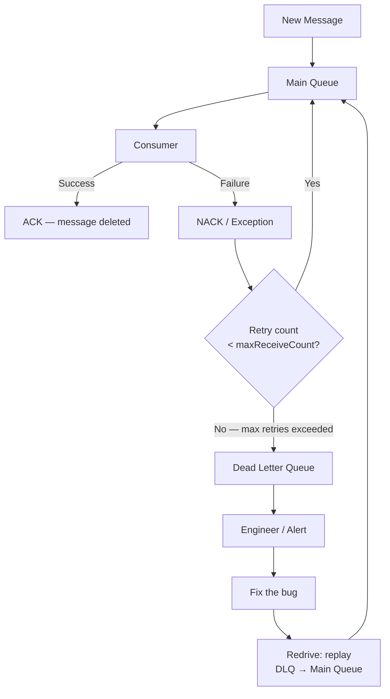

# ☠️ Dead Letter Queue

> [!abstract] TL;DR
> A Dead Letter Queue (DLQ) is where messages go after failing to process N times — a quarantine for "poison pill" messages. Without a DLQ, one bad message can block an entire queue forever. DLQs enable debugging, alerting, and safe reprocessing after fixing the bug. Available natively in AWS SQS and RabbitMQ; must be implemented manually in Kafka via error topics.

## Intuition — analogy FIRST

Imagine a post office conveyor belt (your message queue). One package has a corrupted address — the delivery driver (consumer) tries to deliver it, fails, puts it back on the belt, tries again, fails again. This package now blocks every package behind it forever.

The Dead Letter Queue is the "undeliverable mail" bin at the post office. After 3 failed attempts, the package is moved off the main belt into this special bin. The belt keeps moving. A supervisor (engineer) periodically inspects the bin, figures out what went wrong (corrupted address = bug in the consumer), fixes it, and sends the packages through again (redrive).

## How It Works

### Core Flow



### AWS SQS DLQ Configuration

SQS DLQ is configured via a **redrive policy** on the source queue:

```json
{
  "deadLetterTargetArn": "arn:aws:sqs:us-east-1:123456789:my-service-dlq",
  "maxReceiveCount": 5
}
```

- `maxReceiveCount`: number of times a message can be received (attempted) before moving to DLQ.
- The DLQ is just another SQS queue — you can subscribe to it, poll it, or set up a CloudWatch alarm on `ApproximateNumberOfMessagesVisible > 0`.

**Redrive (replay):** AWS SQS console / API supports "DLQ Redrive" — moves all DLQ messages back to the source queue for reprocessing after fixing the bug.

---

### RabbitMQ DLQ

RabbitMQ uses a **Dead Letter Exchange (DLX)**:

```python
# Queue with DLX configured
channel.queue_declare(
    queue="orders",
    arguments={
        "x-dead-letter-exchange": "orders.dlx",
        "x-message-ttl": 30000,         # also sent to DLQ after 30s TTL
        "x-max-retries": 5
    }
)

# Bind DLX to the DLQ
channel.queue_declare(queue="orders.dlq")
channel.queue_bind(queue="orders.dlq", exchange="orders.dlx", routing_key="orders")
```

Messages are dead-lettered when:
1. Consumer NACKs with `requeue=False`.
2. Message TTL expires.
3. Queue length limit exceeded.

---

### Kafka: Error Topics (No Built-in DLQ)

Kafka has no native DLQ concept. The standard pattern is:

1. Consumer catches processing exception.
2. Producer publishes to a separate **error topic** (e.g., `orders.error`).
3. A separate error consumer processes the error topic: logs, alerts, stores for replay.
4. After fixing the bug, replay the error topic messages back to `orders`.

```python
from kafka import KafkaConsumer, KafkaProducer

consumer = KafkaConsumer("orders")
producer = KafkaProducer()

for msg in consumer:
    try:
        process_order(msg.value)
        consumer.commit()
    except Exception as e:
        # Publish to error topic instead of crashing
        producer.send("orders.error", value={
            "original_message": msg.value,
            "error": str(e),
            "timestamp": time.time(),
            "topic": msg.topic,
            "partition": msg.partition,
            "offset": msg.offset
        })
        consumer.commit()   # Don't re-consume — send to error topic
```

> [!note] Uber's pattern
> Uber uses a hierarchy: `topic` → retry 1 topic (delay 1s) → retry 2 topic (delay 30s) → retry 3 topic (delay 5m) → DLQ. Each retry topic has a separate consumer that republishes with backoff. This implements exponential backoff at the Kafka level.

---

### What to Store in DLQ Messages

Always enrich the DLQ message with diagnostic metadata:

```json
{
  "original_payload": { ... },
  "error_type": "NullPointerException",
  "error_message": "user_id cannot be null",
  "stack_trace": "...",
  "failed_at": "2026-07-26T12:34:56Z",
  "attempt_count": 5,
  "source_queue": "orders",
  "message_id": "msg_abc123"
}
```

This makes debugging significantly faster — you don't need to correlate logs to understand why a message failed.

---

### Alerting on DLQ

**Always** set up an alert on DLQ depth > 0:

```yaml
# CloudWatch Alarm example
Metric: ApproximateNumberOfMessagesVisible
Queue: my-service-dlq
Threshold: > 0
Period: 60 seconds
Action: PagerDuty alert → on-call engineer
```

A non-empty DLQ means messages are failing silently. This is always an incident.

## Real-World Systems

| Company | System | DLQ Pattern |
|---|---|---|
| **Amazon** | SQS at every service boundary | Native SQS DLQ with maxReceiveCount=5, CloudWatch alarm |
| **Netflix** | Kafka-based streaming | Error topic per main topic; separate error consumer |
| **Uber** | Kafka order processing | Multi-tier retry topics + final DLQ topic |
| **Shopify** | Job queues (Sidekiq/Redis) | Sidekiq dead set; retry 25 times over 21 days |
| **Stripe** | Webhook delivery | After N retries, event moves to "failed events" list for manual replay |

## Trade-offs

| Dimension | With DLQ | Without DLQ |
|---|---|---|
| Poison pill isolation | Isolated in DLQ | Blocks entire queue |
| Debugging | Easy (inspect DLQ messages) | Hard (must correlate logs) |
| Message loss | None (preserved in DLQ) | Possible (infinite retry = never makes progress) |
| Queue throughput | Unaffected by failures | Degraded or halted |
| Operational overhead | DLQ monitoring needed | Simpler config |
| Recovery from bug | Redrive after fix | Manual message reconstruction |

## When to Use vs Avoid

**Always use a DLQ when:**
- Processing messages from an external queue (SQS, RabbitMQ, Kafka).
- Consumer code can fail due to bugs, schema changes, or dependency outages.
- Message loss is unacceptable (financial transactions, order processing).
- You need auditability of failures.

**Consider skipping DLQ when:**
- Messages are truly ephemeral and loss is acceptable (real-time metrics, live event telemetry).
- Consumer failures are always retriable and will eventually succeed (transient network errors).
- You have idempotent consumers and infinite retries are safe.

## Common Pitfalls

1. **No alert on DLQ depth** — DLQ silently fills up; nobody notices for days. Always alert on DLQ > 0.
2. **DLQ never redriven** — messages accumulate in DLQ forever. DLQ is not a permanent storage; it's a quarantine. Fix bugs, redrive.
3. **Infinite retry without DLQ** — consumer retries forever on a poison pill message, burning CPU and blocking the queue. Set `maxReceiveCount`.
4. **DLQ retention too short** — AWS SQS default retention is 4 days. If the bug takes 5 days to fix, messages expire. Set retention to 14 days (max).
5. **Not enriching DLQ messages** — storing only the original payload without error metadata makes debugging difficult.
6. **Redriving before fixing the bug** — messages from DLQ will just fail again and return to DLQ. Fix first, redrive second.
7. **Processing DLQ with the same buggy consumer** — the DLQ consumer should either be different code or re-processed only after deploying the fix.

## Related Concepts

- [[_MOC_Asynchronism|↑ Section MOC]]
- [[Message_Queues]] — DLQ is a first-class feature of message queue systems
- [[Task_Queues]] — task queues (Celery, Sidekiq) have built-in retry + DLQ ("dead set") support
- [[Kafka]] — Kafka requires manual error topic implementation
- [[RabbitMQ]] — RabbitMQ has native Dead Letter Exchange support
- [[Webhooks]] — webhook providers implement DLQ-like behavior for failed deliveries

## Review Questions

1. A consumer is processing SQS messages to send emails. A bug in the email template causes NullPointerException on every message. `maxReceiveCount` is not set (default is not configured). What happens to the queue? How does setting a DLQ with `maxReceiveCount=5` change the behavior?
2. You use Kafka for order processing. Explain how you would implement DLQ semantics in Kafka, since it has no built-in DLQ. Describe the full flow from failed processing to redrive after bug fix.
3. Your DLQ has accumulated 50,000 messages over the weekend due to a bug in order processing. You have fixed the bug and deployed it. Walk through the steps to safely redrive these messages without overwhelming the downstream database.

## Sources

- [AWS SQS Dead-Letter Queues documentation](https://docs.aws.amazon.com/AWSSimpleQueueService/latest/SQSDeveloperGuide/sqs-dead-letter-queues.html)
- [RabbitMQ Dead Letter Exchanges](https://www.rabbitmq.com/dlx.html)
- [Uber Engineering — Reliable Reprocessing with Kafka](https://eng.uber.com/reliable-reprocessing/)
- [Shopify — Handling Delayed Jobs Failures](https://shopify.engineering/building-resilient-payment-systems)

#SystemDesign #DLQ #DeadLetterQueue #Messaging #Reliability #Kafka #SQS #RabbitMQ
