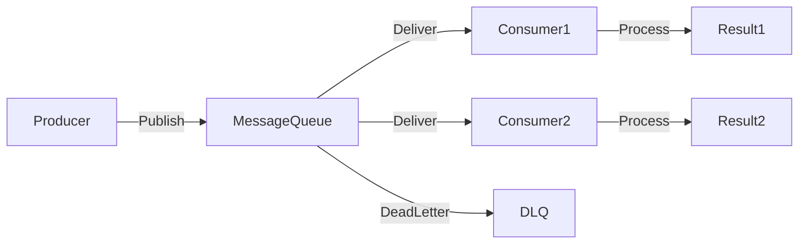

# 📬 Message Queues

> [!abstract] TL;DR
> Message queues decouple producers from consumers, enabling async communication where services publish messages independently and workers process them in the background at their own pace.

## 🧠 Core Idea

**Message Queues** receive, hold, and deliver messages between services or components.

> Goal: **Enable asynchronous communication so slow operations don’t block user requests.**

They decouple producers (senders) from consumers (workers), allowing systems to scale independently.

---

## 📖 How It Works

```
Producer → Message Queue → Consumer / Worker → Process Message
```

---

## ⚙️ Typical Workflow

1. Application publishes a job/message to the queue  
2. User is immediately notified that the job is accepted  
3. Worker picks up the job from the queue  
4. Worker processes it and marks it complete  
5. User sees final result later  

---

## 🎯 Why Message Queues Matter

- Prevent blocking user requests  
- Enable background processing  
- Decouple services  
- Smooth traffic spikes  
- Improve system reliability  

---

## 🚀 Real-World Example (Tweet Posting)

- User posts a tweet  
- UI immediately shows tweet in timeline  
- Message queue delivers tweet to follower feeds in background  
- Followers receive tweet shortly after  

---

## 🧩 Popular Message Queue Systems

### 🔹 Redis
- Simple and fast message broker  
- Lightweight setup  
- ⚠️ Messages can be lost if not persisted  

Official Site: https://redis.io/

---

### 🔹 RabbitMQ
- Popular enterprise-grade broker  
- Uses AMQP protocol  
- Requires managing broker nodes  

Official Site: https://www.rabbitmq.com/

---

### 🔹 AWS SQS
- Fully managed cloud queue  
- Highly scalable  
- ⚠️ Possible duplicate message delivery  
- Higher latency than in-memory brokers  

Official Site: https://aws.amazon.com/sqs/

---

### 🔹 Apache Kafka
- Distributed event store & stream-processing platform  
- High throughput and durability  
- Used for real-time data pipelines  

Official Site: https://kafka.apache.org/

---

## ⚖️ Comparison

| System | Type | Strength | Trade-off |
|--------|------|----------|-----------|
| Redis | In-memory broker | Ultra-fast | Possible message loss |
| RabbitMQ | AMQP broker | Reliable messaging | Requires node management |
| AWS SQS | Managed queue | No infrastructure to manage | Higher latency |
| Kafka | Event streaming platform | Massive throughput | More complex setup |

---

## 🚦 Reliability Features

- Message acknowledgments  
- Retry mechanisms  
- Dead-letter queues  
- Back pressure integration  

---

## 🧠 Message Queue vs Task Queue

| Aspect | Message Queue | Task Queue |
|--------|---------------|------------|
| Purpose | Service-to-service messaging | Execute background jobs |
| Consumers | Services | Worker processes |
| Examples | Kafka, RabbitMQ | Celery, Sidekiq |

---

## 📊 Architecture Diagram



---

## Related Concepts

- [[_MOC_Asynchronism|↑ Section MOC]]
- [[Asynchronism]]
- [[Task_Queues]]
- [[Back_Pressure]]
- [[Idempotent_Operations]]
- [[Retry_Storm]]

---

## Review Questions

1. How do message queues decouple producers from consumers and why does this improve scalability?
2. What is the difference between Redis, RabbitMQ, and Kafka as message brokers, and when would you choose each?
3. Why must workers consuming from a queue be designed as idempotent operations?

---

## 🔗 Related Topics

[[Asynchronism]]  
[[Task Queues]]  
[[Background Jobs]]  
[[Event Driven]]  
[[Back Pressure]]

---

## 📚 Sources

- Redis: https://redis.io/  
- RabbitMQ: https://www.rabbitmq.com/  
- AWS SQS: https://aws.amazon.com/sqs/  
- Apache Kafka: https://kafka.apache.org/  
- RabbitMQ Beginner Guide: https://www.cloudamqp.com/blog/part1-rabbitmq-for-beginners-what-is-rabbitmq.html  

---

## 🏷️ Tags

#SystemDesign #MessageQueues #Asynchronous #DistributedSystems #Scalability
