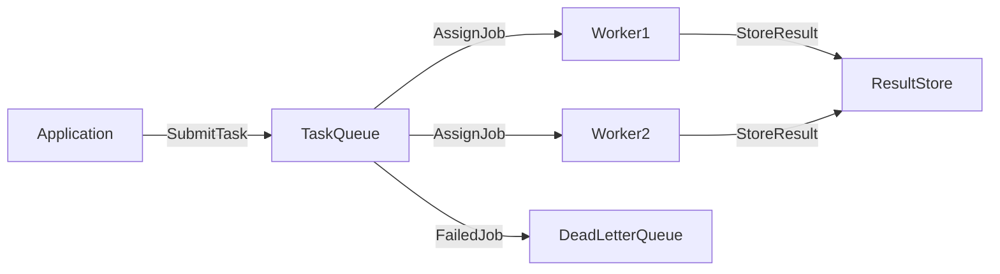

# 🧰 Task Queues

> [!abstract] TL;DR
> Task queues receive jobs with their data, store them reliably, and distribute them to worker processes for background execution — keeping APIs fast while heavy computations run separately.

## 🧠 Core Idea

**Task Queues** receive tasks along with their related data, execute them asynchronously, and optionally return results once completed.

> Goal: **Run long-running or computationally intensive jobs in the background without blocking user requests.**

Task queues are a key building block in **asynchronous and scalable system design**.

---

## 📖 Definition

In a task queue system:

```
Application → Task Queue → Worker Processes → Execute Task → Store Result
```

The application submits a task, and **worker processes** consume and execute tasks independently.

---

## 🎯 Why Task Queues Matter

- Offload heavy computations  
- Improve API responsiveness  
- Enable background processing  
- Support scheduling and retries  
- Increase system scalability  

---

## ⚙️ How It Works

1. Application sends a task to the queue  
2. Queue stores the task reliably  
3. Worker picks up the task  
4. Worker executes the job  
5. Result is stored or callback triggered  

---

## 🧩 Common Use Cases

- Sending emails and notifications  
- Image/video processing  
- Data aggregation and reporting  
- Machine learning jobs  
- Payment processing  

---

## ⏰ Scheduling Support

Many task queues support:

- Delayed execution  
- Periodic scheduled tasks  
- Cron-like job scheduling  

This allows **time-based background workflows**.

---

## 🌍 Popular Task Queue Tools

### 🐍 Celery
- Python-based distributed task queue  
- Built-in scheduling support  
- Works with Redis, RabbitMQ, etc.  
- Automatic retries and monitoring  

Official Docs:  
https://docs.celeryq.dev/en/stable/

---

## ⚖️ Task Queue vs Message Queue

| Aspect | Task Queue | Message Queue |
|--------|------------|---------------|
| Purpose | Execute background jobs | Exchange messages between services |
| Execution | Workers perform tasks | Consumers interpret messages |
| Examples | Celery, Sidekiq | Kafka, RabbitMQ |
| Scheduling | Built-in | Usually external |

---

## 🚦 Reliability Features

- Acknowledgements  
- Retries on failure  
- Dead-letter queues  
- Back pressure handling  

---

## 🧠 Design Insight

```
Long-running jobs → Task Queue
Service-to-service events → Message Queue
Scheduled background work → Task Queue + Scheduler
```

---

## 📊 Architecture Diagram



---

## Related Concepts

- [[_MOC_Asynchronism|↑ Section MOC]]
- [[Asynchronism]]
- [[Message_Queues]]
- [[Back_Pressure]]
- [[Idempotent_Operations]]
- [[Synchronous_IO_Antipattern]]

---

## Review Questions

1. How does a task queue differ from a message queue in terms of execution model and typical use cases?
2. What reliability mechanisms (acknowledgements, retries, dead-letter queues) does a task queue provide and why are they important?
3. How does Celery use a message broker like Redis or RabbitMQ to implement task queue functionality?

---

## 🔗 Related Topics

[[Asynchronism]]  
[[Background Jobs]]  
[[Event Driven]]  
[[Back Pressure]]  
[[Scalability]]

---

## 🏷️ Tags

#SystemDesign #TaskQueues #Asynchronous #BackgroundJobs #Scalability
