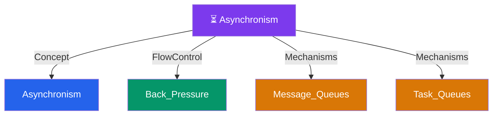

# ⏳ Asynchronism — Map of Content

> [!abstract] What This Section Covers
> How systems offload work from the request-response path using queues, workers, and flow-control mechanisms. Covers message queues, task queues, back pressure, and the core asynchronism concept — the foundation for any high-throughput, non-blocking architecture.

## Concept Map

## Learning Path

1. [[Asynchronism]] — The core concept: why blocking requests is a scalability killer and how async execution fixes it
2. [[Message_Queues]] — Service-to-service async communication via brokers (Kafka, RabbitMQ, SQS)
3. [[Task_Queues]] — Background job distribution to workers (Celery, Sidekiq)
4. [[Back_Pressure]] — Flow control that prevents queue overload and cascading failures

## All Notes at a Glance

| Note | Summary | Difficulty |
|------|---------|------------|
| [[Asynchronism]] | Offloads long-running tasks to background workers so user-facing requests stay fast | Intermediate |
| [[Back_Pressure]] | Throttles producers when queues fill up, signaling clients to slow down via HTTP 503 + exponential backoff | Intermediate |
| [[Message_Queues]] | Decouples producers from consumers enabling async, independently-scalable service communication | Beginner |
| [[Task_Queues]] | Distributes discrete background jobs to a pool of workers for parallel execution | Beginner |

## Key Questions This Section Answers

- Message queues vs task queues — what is the difference and when do you choose each?
- How does back pressure prevent cascade failures when consumers fall behind?
- When does async processing hurt more than it helps (consistency, ordering guarantees)?
- What happens to a system with no flow control when a traffic spike arrives?
- How do you monitor an async pipeline to detect consumer lag before it becomes an outage?

## Related Sections

- [[_MOC_SystemDesign_Master|↑ System Design Master MOC]]
- [[_MOC_BackgroundJobs]] — Background jobs are the execution layer that async patterns feed into
- [[_MOC_EventDriven]] — Event-driven architecture extends async patterns to full event sourcing and CQRS
- [[_MOC_Communication]] — Synchronous communication protocols contrast directly with async messaging

#MOC #SystemDesign
