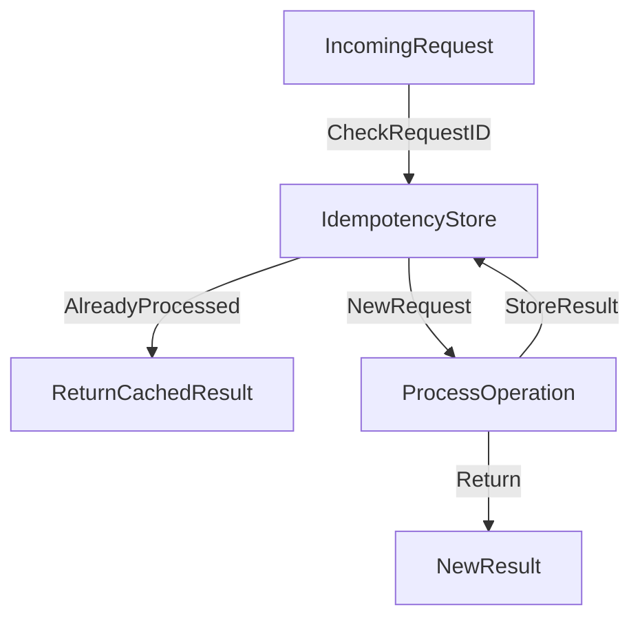

# 🔁 Idempotent Operations

> [!abstract] TL;DR
> An idempotent operation produces the same result regardless of how many times it is executed, making retries and at-least-once delivery safe in distributed and queue-based systems.

## 🧠 Core Idea

An **idempotent operation** is an operation that can be executed **multiple times** without changing the result beyond the first successful execution.

> Goal: **Ensure repeated requests or retries do not cause unintended side effects.**

If an operation is idempotent:

```
Operation(x) = Operation(Operation(x))
```

---

## 📖 Definition

An operation is **idempotent** if:

- Executing it **once or multiple times** produces the **same final state**
- Safe to retry without corrupting data

---

## 🎯 Why Idempotency Matters

Idempotency is crucial in **distributed systems**, especially when using:

- [[Message Queues]]
- [[Task Queues]]
- [[Asynchronism]]

Many queue systems guarantee **at-least-once delivery**, meaning:
- Messages **may be delivered more than once**
- Operations **must tolerate duplicates**

Idempotent design ensures duplicates **do not cause errors**.

---

## ⚙️ Real-World Examples

### ✅ Idempotent
- `GET /users/123` → Always returns same data
- `PUT /users/123 {name: "Karan"}` → Same update applied repeatedly
- Mark order as "PAID" → Setting same state repeatedly

### ❌ Non-Idempotent
- `POST /payments` → Creates new payment each time
- Increment counter `views = views + 1`

---

## 📬 Idempotency in Queues

Queue systems often provide:
- **At-least-once delivery**
- Possible **duplicate task execution**

Designing workers to be idempotent allows:
- Safe retries
- Simpler queue guarantees
- Better fault tolerance

---

## 🧠 How to Achieve Idempotency

- Use unique request IDs
- Store operation state before executing
- Check if operation already applied
- Use UPSERT instead of INSERT
- Avoid blind increments

---

## 🚀 Benefits

- Safe retries
- Fault-tolerant processing
- Simplifies distributed design
- Works well with back pressure & async systems

---

## ⚠️ Common Use Cases

- Payment processing
- Order fulfillment
- Email sending
- Background job execution
- API request retries

---

## 📊 Architecture Diagram



---

## Related Concepts

- [[_MOC_IdempotentOperations|↑ Section MOC]]
- [[Message_Queues]]
- [[Task_Queues]]
- [[Asynchronism]]
- [[Back_Pressure]]
- [[HTTP]]

---

## Review Questions

1. Why does at-least-once delivery in message queues require consumers to implement idempotent operations?
2. What is the difference between a safe HTTP method and an idempotent HTTP method? Give an example of each.
3. How would you implement idempotency for a payment processing endpoint that must not charge a user twice?

---

## 🔗 Related Topics

[[Message Queues]]  
[[Task Queues]]  
[[Back Pressure]]  
[[Asynchronism]]  
[[Consistency Patterns]]

---

## 📚 Sources

- Baeldung — Idempotent Operations  
  https://www.baeldung.com/cs/idempotent-operations

- StackOverflow — What is an Idempotent Operation  
  https://stackoverflow.com/questions/1077412/what-is-an-idempotent-operation

---

## 🏷️ Tags

#SystemDesign #Idempotency #DistributedSystems #Reliability #Messaging
