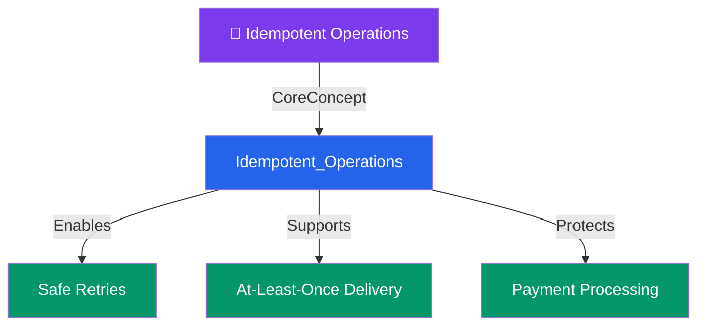

# 🔁 Idempotent Operations — Map of Content

> [!abstract] What This Section Covers
> Idempotency ensures that repeating an operation multiple times has the same effect as performing it once — critical for retry-safe distributed systems. This section has a single deep-dive note covering how to design idempotent APIs, queue consumers, and payment flows.

## Concept Map

## Learning Path

1. [[Idempotent_Operations]] — Definition, HTTP method idempotency, unique request IDs, and UPSERT patterns

## All Notes at a Glance

| Note | Summary | Difficulty |
|------|---------|------------|
| [[Idempotent_Operations]] | An operation that can be executed multiple times without changing the result beyond the first execution — essential for retry safety in distributed systems | Intermediate |

## Key Questions This Section Answers

- How do you make a POST endpoint idempotent using a request ID?
- Why is idempotency critical for at-least-once delivery semantics?
- What is the difference between a safe HTTP method and an idempotent HTTP method?
- How would you implement idempotency for a payment endpoint that must never double-charge?
- Which HTTP verbs are idempotent by spec (GET, PUT, DELETE) vs not (POST, PATCH)?

## Related Sections

- [[_MOC_SystemDesign_Master|↑ System Design Master MOC]]
- [[_MOC_Asynchronism]] — Queue systems use at-least-once delivery, requiring idempotent consumers
- [[_MOC_API_Gateway]] — API gateways can enforce idempotency keys at the entry point

#MOC #SystemDesign
