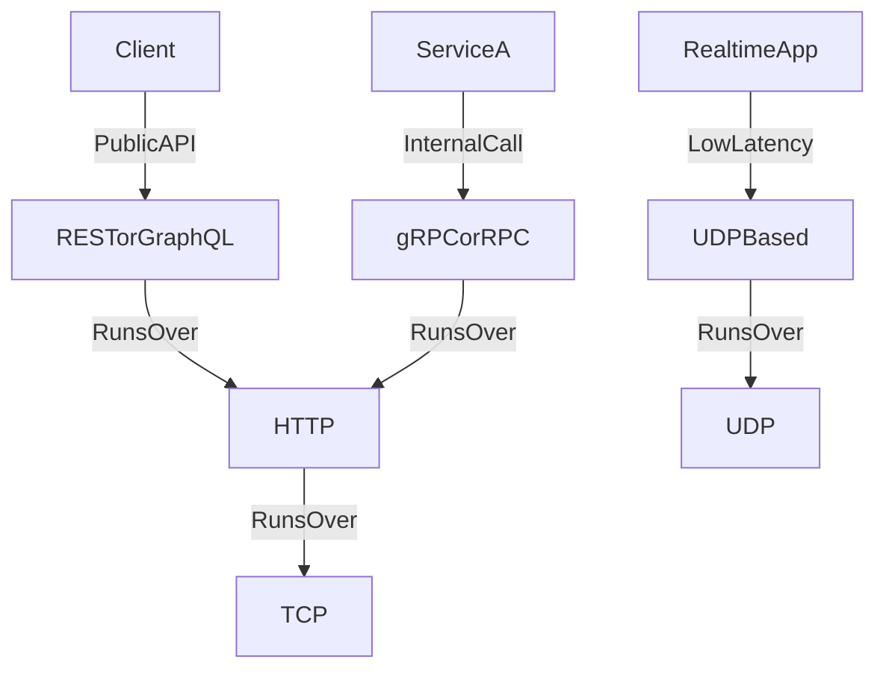

# 📡 Communication in Distributed Systems

> [!abstract] TL;DR
> Distributed systems communicate via network protocols (HTTP, TCP, UDP) and architectural styles (REST, RPC, GraphQL, gRPC) — each offering different trade-offs between performance, simplicity, and flexibility.

## 🧠 Core Idea

No modern system exists in isolation. **Services must communicate** with each other over networks using well-defined **protocols** and **architectural communication styles**.

> Goal: **Enable reliable, efficient, and scalable data exchange between systems.**

---

## 🌐 Network Protocols

### 🔹 HTTP (HyperText Transfer Protocol)
- Foundation of web communication  
- Request/Response model  
- Stateless  
- Runs over TCP  
- Common for REST and GraphQL APIs  

---

### 🔹 TCP (Transmission Control Protocol)
- Reliable, connection-oriented protocol  
- Guarantees message delivery and order  
- Used when correctness is critical  
- Example: HTTP, gRPC  

---

### 🔹 UDP (User Datagram Protocol)
- Connectionless, faster than TCP  
- No delivery guarantees  
- Used for real-time systems  
- Example: Video streaming, gaming, DNS  

---

## ⚙️ Communication Styles

### 🔹 RPC (Remote Procedure Call)
- Call functions on remote services as if local  
- Focuses on action-based communication  
- Example: gRPC, Thrift  

---

### 🔹 REST (Representational State Transfer)
- Resource-based communication  
- Uses HTTP verbs (GET, POST, PUT, DELETE)  
- Stateless and widely used in web APIs  

---

### 🔹 GraphQL
- Query-based API language  
- Clients specify exactly what data they need  
- Reduces over-fetching and under-fetching  

---

### 🔹 gRPC
- High-performance RPC framework by Google  
- Uses Protocol Buffers  
- Supports streaming  
- Ideal for microservice-to-microservice communication  

---

## ⚖️ Style Comparison

| Style | Best For | Strength |
|--------|----------|----------|
| REST | Public APIs | Simplicity & web compatibility |
| RPC/gRPC | Internal microservices | High performance |
| GraphQL | Client-driven data queries | Flexible responses |

---

## 🎯 Why Communication Matters

- Connects microservices  
- Enables distributed architectures  
- Impacts latency and throughput  
- Affects scalability and reliability  

---

## 🧠 Design Insight

```
Public Web APIs → REST or GraphQL
Internal Microservices → gRPC or RPC
Real-time Systems → UDP-based protocols
```

---

## 📊 Architecture Diagram



---

## Related Concepts

- [[_MOC_Communication|↑ Section MOC]]
- [[HTTP]]
- [[TCP]]
- [[UDP]]
- [[REST]]
- [[RPC]]
- [[gRPC]]
- [[GraphQL]]

---

## Review Questions

1. When would you choose gRPC over REST for inter-service communication and why?
2. What is the key difference between TCP and UDP and which layer of the stack do they operate at?
3. How does GraphQL solve the over-fetching and under-fetching problems found in REST?

---

## 🔗 Related Topics

[[Asynchronism]]  
[[Message Queues]]  
[[Load Balancers]]  
[[Service Discovery]]  
[[Latency vs Throughput]]

---

## 🏷️ Tags

#SystemDesign #Networking #Protocols #Communication #DistributedSystems
