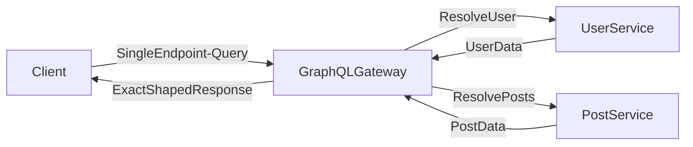

# 🧩 GraphQL

> [!abstract] TL;DR
> GraphQL is a query language letting clients specify exactly the data they need from a single endpoint, eliminating over-fetching and under-fetching issues common in REST APIs.

## 🧠 Core Idea

**GraphQL** is a **query language and runtime for APIs** that allows clients to request **exactly the data they need**.

> Goal: **Give clients control over data fetching while keeping APIs flexible and efficient.**

Unlike REST, where servers define fixed endpoints, GraphQL lets clients define the **shape of the response**.

---

## 📖 Definition

In GraphQL:

- The **client specifies** what data it needs  
- The **server returns only that data**  
- A **single endpoint** handles all queries  

```
Client → GraphQL Query → Server → Exact Data Response
```

---

## ⚙️ How GraphQL Works

### 🔹 Query Example

```graphql
query {
  user(id: 123) {
    name
    email
    posts {
      title
    }
  }
}
```

### 🔹 Response

```json
{
  "data": {
    "user": {
      "name": "Karan",
      "email": "karan@example.com",
      "posts": [
        { "title": "System Design Notes" }
      ]
    }
  }
}
```

The response **exactly matches** the query structure.

---

## 🎯 Why GraphQL Matters

- Eliminates **over-fetching** of data  
- Eliminates **under-fetching** of data  
- Reduces number of API calls  
- Single endpoint for entire API  
- Strongly typed schema  

---

## ⚖️ GraphQL vs REST

| Aspect | GraphQL | REST |
|--------|---------|------|
| Endpoints | Single | Multiple |
| Data Fetching | Client-defined | Server-defined |
| Over-fetching | No | Common |
| Under-fetching | No | Common |
| Versioning | Rarely needed | Often required |
| Caching | Harder | Easier with HTTP |

---

## 🧩 Core Components

### 🔹 Schema
Defines available types and relationships.

### 🔹 Resolvers
Functions that fetch actual data.

### 🔹 Queries
Read operations.

### 🔹 Mutations
Write operations (create/update/delete).

### 🔹 Subscriptions
Real-time data updates.

---

## 🚀 Common Use Cases

- Mobile apps with limited bandwidth  
- Frontend-heavy applications  
- Complex data relationships  
- Reducing API versioning overhead  

---

## ⚠️ Challenges

- Harder to cache at HTTP layer  
- Complex query performance control  
- Requires query depth limiting  
- More complex backend implementation  

---

## 🧠 Design Insight

```
Flexible frontend data needs → GraphQL
Public simple APIs → REST
Internal microservices → gRPC
```

---

## 📊 Architecture Diagram



---

## Related Concepts

- [[_MOC_Communication|↑ Section MOC]]
- [[REST]]
- [[RPC]]
- [[gRPC]]
- [[HTTP]]
- [[Communication]]
- [[Extraneous_Fetching]]

---

## Review Questions

1. How does GraphQL's single endpoint approach differ from REST's multiple resource endpoints and what problems does this solve?
2. What is a GraphQL resolver and how does it allow the server to fulfill a client's custom query?
3. Why is HTTP-layer caching harder with GraphQL than with REST, and what strategies exist to work around this?

---

## 🔗 Related Topics

[[REST]]  
[[RPC]]  
[[gRPC]]  
[[HTTP]]  
[[Microservices]]  
[[Communication]]

---

## 📚 Sources

- How to GraphQL — Big Picture  
  https://www.howtographql.com/basics/3-big-picture/  

- RedHat — What is GraphQL  
  https://www.redhat.com/en/topics/api/what-is-graphql  

---

## 🏷️ Tags

#SystemDesign #GraphQL #APIs #Communication #Microservices
