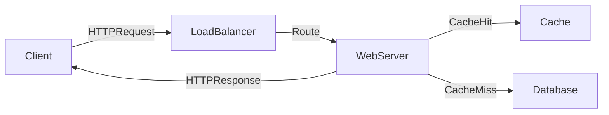

# 🌐 HTTP (HyperText Transfer Protocol)

> [!abstract] TL;DR
> HTTP is a stateless request/response protocol running over TCP that forms the foundation of web APIs, supporting load balancers, caches, and proxies through self-contained, self-describing messages.

## 🧠 Core Idea

**HTTP** is a protocol for encoding and transporting data between a **client** and a **server**.

> It follows a **request/response model**:  
> Clients send requests → Servers return responses.

HTTP is **self-contained**, allowing requests to travel through:
- Load balancers  
- Reverse proxies  
- Caches  
- Encryption layers  
- Compression gateways  

This makes it ideal for modern distributed systems.

---

## 📖 How HTTP Works

```
Client → HTTP Request → Server
Client ← HTTP Response ← Server
```

Each request is **stateless**, meaning:
- No session state stored on the server by default  
- Each request contains all required information  

---

## ⚙️ HTTP Request Components

- **Method (Verb)** – Action to perform  
- **Resource (Endpoint / URI)** – Target data  
- **Headers** – Metadata (auth, content type, caching rules)  
- **Body** – Optional payload (POST/PUT/PATCH)  

---

## 📥 HTTP Response Components

- **Status Code** (200, 404, 500, etc.)  
- **Headers**  
- **Body (response data)**  

---

## 🔨 Common HTTP Verbs

| Verb   | Description                    | Idempotent | Safe | Cacheable |
|--------|--------------------------------|-------------|------|------------|
| GET    | Reads a resource               | Yes         | Yes  | Yes |
| POST   | Creates resource / triggers action | No | No | Yes (if freshness info present) |
| PUT    | Creates or replaces resource   | Yes         | No   | No |
| PATCH  | Partially updates resource     | No          | No   | Yes (if freshness info present) |
| DELETE| Deletes a resource             | Yes         | No   | No |

---

## 🧠 Key Properties

### ✅ Idempotent
Repeating the same request produces the same result.

### ✅ Safe
Does not modify server state.

### ✅ Cacheable
Responses can be stored and reused.

---

## 🚀 Why HTTP Matters in System Design

- Foundation of REST APIs  
- Works seamlessly with load balancers and CDNs  
- Enables caching layers  
- Supports stateless scalable architectures  
- Universally supported across platforms  

---

## ⚖️ HTTP vs TCP

| Aspect | HTTP | TCP |
|--------|------|-----|
| Layer | Application Layer | Transport Layer |
| Purpose | Defines request/response communication | Ensures reliable data delivery |
| Relationship | Runs on top of TCP | Underlying transport for HTTP |
| Example | GET /users | Packet transmission |

---

## 📊 Architecture Diagram



---

## Related Concepts

- [[_MOC_Communication|↑ Section MOC]]
- [[Communication]]
- [[TCP]]
- [[REST]]
- [[gRPC]]
- [[GraphQL]]
- [[Caching]]
- [[Idempotent_Operations]]

---

## Review Questions

1. Why is HTTP described as stateless and how does this property benefit horizontal scaling?
2. What is the difference between a PUT and a PATCH request in terms of idempotency and partial updates?
3. How does HTTP leverage TCP underneath and why can HTTP work with load balancers and reverse proxies transparently?

---

## 🔗 Related Topics

[[Communication]]  
[[REST]]  
[[GraphQL]]  
[[gRPC]]  
[[Load Balancers]]  
[[CDN]]  
[[Caching]]  
[[Idempotent Operations]]

---

## 📚 Sources

- HTTP In Depth — cs.fyi  
  https://cs.fyi/guide/http-in-depth  

- F5 Glossary — HTTP  
  https://www.f5.com/glossary/hypertext-transfer-protocol-http  

- HTTP vs TCP (Quora)  
  https://www.quora.com/What-is-the-difference-between-HTTP-protocol-and-TCP-protocol  

---

## 🏷️ Tags

#SystemDesign #HTTP #Networking #APIs #Communication
