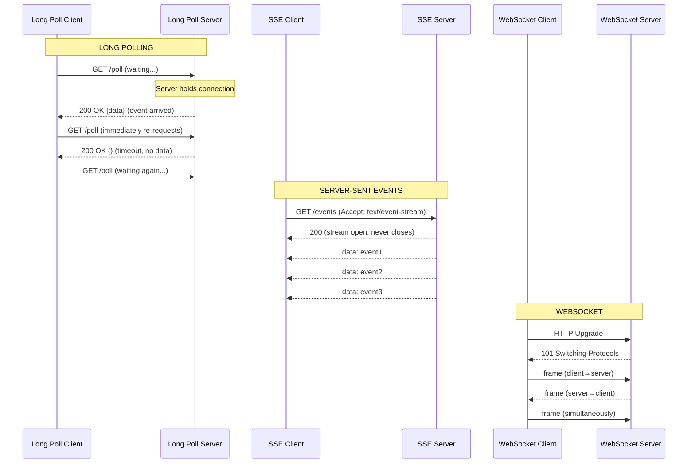

# 📡 Long Polling and Server-Sent Events (SSE)

> [!abstract] TL;DR
> Long Polling and SSE are two techniques for near-real-time server-to-client data delivery using plain HTTP — Long Polling holds a request open until data is ready, while SSE establishes a persistent one-directional stream with automatic reconnection.

## Intuition

Imagine you're waiting for a package. There are three ways to handle it:

1. **Regular polling** — you check your front door every 5 minutes whether or not a package has arrived. Wasteful; you do work even when nothing changed.
2. **Long polling** — you sit at the door and wait. When the package arrives, you grab it, then immediately sit back down again to wait for the next one. More efficient, but you do have to "stand up and sit down" repeatedly.
3. **Server-Sent Events** — you hire a dedicated delivery announcer who calls you the moment any package arrives. One persistent connection; the announcer handles all future deliveries. No sitting at the door.

WebSocket is the two-way radio — you and the announcer can have a full conversation. Long Polling and SSE only cover the "server tells client" direction, but they do so over pure HTTP, which is simpler to deploy and more widely compatible.

### Formal Definitions

- **Long Polling** — The client makes an HTTP request. The server holds the connection open until it has new data (or a timeout is reached), then responds. The client immediately sends a new request. Creates "fake real-time" over standard HTTP request/response.
- **Server-Sent Events (SSE)** — A persistent one-way HTTP connection where the server streams events to the client using the `text/event-stream` content type. The browser's `EventSource` API provides automatic reconnection and event ID tracking.

## How It Works

### Long Polling — Deep Dive

**Flow:**
1. Client sends `GET /messages?since=1753516800`.
2. Server receives the request. If no new messages exist, it **does not respond** — it holds the connection open (parks it in a waiting queue).
3. When a new message arrives (or after a max wait timeout, e.g., 30 seconds), the server responds with the data.
4. Client processes the response and **immediately sends a new request** to resume waiting.

**Timeout handling:** If no data arrives within the timeout window, the server responds with `200 OK` and an empty body (or `204 No Content`). The client re-requests. This prevents connections from hanging indefinitely.

**Failure handling:** If the network drops mid-wait, the client's next request (after reconnect) re-establishes the polling cycle. The `since` timestamp or cursor ensures no messages are missed.

**Server considerations:** Each waiting client holds an open HTTP connection. With thousands of concurrent users, this is thousands of open file descriptors. Use async/non-blocking servers (Node.js, Nginx with async workers, Tornado) — traditional synchronous thread-per-request servers run out of threads.

### Server-Sent Events (SSE) — Deep Dive

SSE uses a single, persistent HTTP response with `Content-Type: text/event-stream`. The server never closes the response — it keeps writing events as they occur.

**Event format (plain text):**
```
id: 42
event: message
data: {"user":"Alice","text":"Hello!"}

id: 43
event: notification
data: {"type":"mention","count":3}

: this is a comment line (ignored by client)

```
(Blank line separates events)

**Browser `EventSource` API:**
```javascript
const es = new EventSource('/events', { withCredentials: true });

es.addEventListener('message', (e) => {
  const data = JSON.parse(e.data);
  console.log(data);
});

es.addEventListener('notification', (e) => {
  showNotification(JSON.parse(e.data));
});

es.onerror = () => {
  console.log('Connection lost, EventSource will auto-reconnect...');
};
```

**Key SSE features:**
- **Automatic reconnection** — browser automatically reconnects after network failure.
- **Last-Event-ID** — on reconnect, the browser sends the `Last-Event-ID` header with the ID of the last received event; the server uses this to resume from where it left off, ensuring no events are lost.
- **Named events** — `event: notification` lets the client register specific handlers per event type.
- **One-directional** — server → client only. Client still uses separate HTTP requests (fetch/XHR) for anything it needs to send.

### Comparison of All Three Patterns



### Full Feature Comparison

| Feature | Long Polling | Server-Sent Events | WebSocket |
|---|---|---|---|
| Direction | Server → Client (via response) | Server → Client only | Full-duplex (both) |
| Protocol | HTTP | HTTP | WebSocket (RFC 6455) |
| Connection | New request per event | Single persistent stream | Single persistent connection |
| Auto-reconnect | Manual (client re-requests) | Built-in (EventSource) | Manual |
| Resume after disconnect | Via cursor/timestamp param | Via `Last-Event-ID` header | Manual sequence tracking |
| Browser support | Universal | All modern browsers (no IE) | All modern browsers (no IE) |
| Proxy/firewall compat | Excellent | Excellent (pure HTTP) | Good (wss://), some issues |
| Server scalability | Moderate (open connections) | Moderate (open connections) | Challenging (stateful) |
| Load balancing | Stateless (sticky not required) | Stateless (sticky not required) | Requires sticky or pub/sub |
| Client→Server | New HTTP request each time | New HTTP request each time | Same WebSocket connection |
| Best for | Fallback compatibility, simplicity | Notifications, feeds, dashboards | Chat, games, collaborative |

## Real-World Systems

- **Twitter/X** — Timeline updates delivered via SSE on the web interface; new tweets and engagement notifications appear without polling. Falls back to long polling in environments where SSE is blocked.
- **Facebook Notifications** — The notification bell historically used long polling for real-time updates; still uses long polling as a fallback in environments that don't support modern alternatives.
- **GitHub Actions** — Live log streaming during a workflow run uses SSE (`EventSource`); log lines stream in real-time to the browser as the job runs on the server.
- **HuggingFace / OpenAI API** — Streaming LLM token responses use SSE (`text/event-stream`); each token is an event pushed as it is generated.
- **Basecamp** — Uses long polling for their "Hey! You have a new message" notification system; chose long polling deliberately for its simplicity and universal compatibility.

## Trade-offs

### Long Polling

| Advantage | Disadvantage |
|-----------|-------------|
| Works everywhere — pure HTTP, no special client support needed | High connection churn — new TCP connection per event (latency of one round-trip per message) |
| No persistent connections at the load balancer | Each waiting request holds a server thread/connection until data arrives |
| Stateless — any server can handle any request | Thundering herd on reconnect — all clients reconnect simultaneously after a server restart |
| Simple to implement on the server | Higher latency than SSE or WebSocket; extra RTT per message |

### Server-Sent Events

| Advantage | Disadvantage |
|-----------|-------------|
| Persistent connection — no round-trip overhead per event | One-way only — client cannot send data over the same connection |
| Built-in reconnection and `Last-Event-ID` resume — no missed events | Not supported in Internet Explorer; limited support in some older proxy configs |
| HTTP-native — works through all HTTP infrastructure (CDN, reverse proxies) | Long-lived HTTP response can confuse some intermediate proxies/buffers that buffer until the response closes |
| Binary data not natively supported (text/event-stream is text-only) | High concurrent SSE connections still hold open file descriptors on server |
| Simpler than WebSocket — no protocol upgrade, no frame format | Requires async server (Node, async Python, Nginx) to handle many concurrent streams |

## When to Use vs Avoid

**Long Polling — Use when:**
- You need maximum compatibility (legacy browsers, corporate proxies that block persistent connections).
- Updates are infrequent (< 1 per minute) — the connection overhead is acceptable.
- You're implementing a simple fallback strategy alongside WebSocket or SSE.
- Server-side implementation complexity must be minimal.

**Long Polling — Avoid when:**
- Updates are frequent (multiple per second) — connection churn becomes expensive.
- Latency matters — each event incurs a full HTTP round-trip.

**SSE — Use when:**
- Data flows only server-to-client: notifications, dashboards, live feeds, log streaming, LLM token streaming.
- You want automatic reconnection and resume without client-side boilerplate.
- Your infrastructure is HTTP-only and WebSocket support is uncertain.
- Simplicity over bidirectionality.

**SSE — Avoid when:**
- Client needs to send data in real-time (use WebSocket instead).
- Messages are binary (SSE is text-only; base64 encoding works but is wasteful).
- You need request multiplexing (HTTP/2 SSE helps here, but WebSocket may be cleaner).

## Common Pitfalls

1. **Nginx response buffering with SSE** — by default Nginx buffers proxy responses until the upstream closes them. SSE never closes the response, so events never arrive at the client. Fix: `proxy_buffering off;` in the Nginx config for SSE endpoints.
2. **Long polling thundering herd** — after a server restart, all clients reconnect at once. Use jitter (random delay before reconnect) to spread the load.
3. **Not using `Last-Event-ID` on reconnect** — if the SSE client reconnects without resumption, events during the disconnection window are silently lost. Assign IDs to every event and handle `Last-Event-ID` on the server.
4. **Blocking servers with long polling** — using a synchronous thread-per-request server (Django WSGI, Flask dev server) for long polling blocks a thread per waiting client. Use async workers.
5. **Missing timeout on long poll hold** — if you hold connections indefinitely, load balancers and CDNs will terminate them silently. Set a max hold time (30–60 seconds) and respond empty; the client re-requests.

## Related Concepts

- [[_MOC_Communication|↑ Section MOC]]
- [[WebSockets]]
- [[HTTP]]
- [[Communication]]
- [[Message_Queues]]
- [[Load_Balancers]]

## Review Questions

1. Explain the difference between short polling, long polling, and SSE. When does each one close the HTTP connection?
2. A user's browser loses network for 10 seconds during an SSE stream. When connectivity is restored, how does the `EventSource` API ensure no events were missed?
3. Why does Nginx buffer SSE responses by default? What configuration change fixes this, and why does the fix work?
4. You are building a live dashboard that displays server metrics refreshed every 2 seconds. The dashboard only reads, never writes. Compare Long Polling, SSE, and WebSocket for this use case and make a recommendation.
5. OpenAI's API streams chat completion tokens to the browser using SSE. Why is SSE a better choice here than WebSocket?

## Sources

- [MDN — Server-Sent Events (EventSource)](https://developer.mozilla.org/en-US/docs/Web/API/Server-sent_events)
- [MDN — Using server-sent events](https://developer.mozilla.org/en-US/docs/Web/API/Server-sent_events/Using_server-sent_events)
- [RFC 6202 — Known Issues and Best Practices for the Use of Long Polling](https://datatracker.ietf.org/doc/html/rfc6202)
- [Ably — Long Polling vs SSE vs WebSockets](https://ably.com/blog/websockets-vs-long-polling)
- [GitHub Engineering — How GitHub Streams Actions Logs](https://github.blog/)
- [HTML Living Standard — Server-Sent Events spec](https://html.spec.whatwg.org/multipage/server-sent-events.html)

#SystemDesign #LongPolling #SSE #ServerSentEvents #RealTime #Communication #HTTP #EventSource
