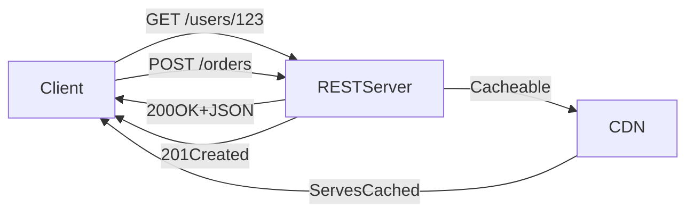

# 🌐 REST (Representational State Transfer)

> [!abstract] TL;DR
> REST is a stateless, resource-oriented architectural style using HTTP verbs on unique URIs, enabling scalable and cacheable public APIs with loose client-server coupling.

## 🧠 Core Idea

**REST** is an **architectural style** that enforces a **client-server model**, where the client interacts with **resources** managed by the server.

> Goal: **Expose data through a simple, stateless, and scalable interface.**

REST is the most widely used style for **public HTTP APIs**.

---

## 📖 Definition

In REST:

- The **server** manages resources  
- The **client** performs actions on those resources  
- Communication is **stateless**  
- Responses are **cacheable**  

```
Client → HTTP Request → Server (Resource)
Client ← Representation ← Server
```

---

## 🎯 Core Principles of REST

### 1️⃣ Identify Resources (URI)

Each resource has a unique URI.

```
/users/123
/products/987
/orders/555
```

The URI remains the same regardless of operation.

---

### 2️⃣ Change via Representations (HTTP Verbs)

Actions are performed using HTTP verbs:

| Verb | Action |
|------|--------|
| GET | Read resource |
| POST | Create resource |
| PUT | Replace resource |
| PATCH | Update resource |
| DELETE | Remove resource |

---

### 3️⃣ Self-descriptive Responses

REST uses standard HTTP status codes:

| Code | Meaning |
|------|---------|
| 200 | OK |
| 201 | Created |
| 400 | Bad Request |
| 401 | Unauthorized |
| 404 | Not Found |
| 500 | Server Error |

No need to reinvent error formats.

---

### 4️⃣ HATEOAS

**Hypermedia As The Engine Of Application State**

Responses include links to related actions:

```json
{
  "user": "Karan",
  "links": {
    "edit": "/users/123/edit",
    "delete": "/users/123"
  }
}
```

This allows APIs to be navigated via browsers.

---

## ⚙️ REST Characteristics

- Stateless communication  
- Uniform interface  
- Resource-oriented  
- Cacheable responses  
- Layered architecture  

---

## 🚀 Why REST Matters

- Low client-server coupling  
- Easy to consume  
- Works seamlessly with HTTP infrastructure  
- Excellent for horizontal scaling  
- Widely supported by tools & browsers  

---

## ⚖️ REST vs RPC

| Aspect | REST | RPC |
|--------|------|-----|
| Focus | Data / Resources | Actions / Methods |
| Coupling | Loose | Tight |
| Interface | Uniform | Custom per method |
| Cache Friendly | Yes | Harder |
| Public APIs | Ideal | Rare |

---

## ⚠️ Drawbacks of REST

- Over-fetching or under-fetching data  
- Multiple requests for complex data  
- Not ideal for high-performance internal calls  
- Hard to model complex workflows  

(GraphQL and gRPC often solve these)

---

## 🧠 Design Insight

```
Public APIs → REST
Internal microservices → gRPC / RPC
Complex client queries → GraphQL
```

---

## 📊 Architecture Diagram



---

## Related Concepts

- [[_MOC_Communication|↑ Section MOC]]
- [[HTTP]]
- [[Communication]]
- [[RPC]]
- [[gRPC]]
- [[GraphQL]]
- [[Microservices]]
- [[Idempotent_Operations]]

---

## Review Questions

1. What are the six guiding constraints of REST and why does statelessness matter for horizontal scaling?
2. How does HATEOAS make a REST API self-discoverable and what is a practical limitation of implementing it?
3. What problem does GraphQL solve that REST cannot easily address, and when would you still prefer REST?

---

## 🔗 Related Topics

[[HTTP]]  
[[Communication]]  
[[RPC]]  
[[gRPC]]  
[[GraphQL]]  
[[Microservices]]

---

## 📚 Sources

- System Design Primer — REST  
  https://github.com/donnemartin/system-design-primer#representational-state-transfer-rest  

- Drawbacks of REST — Quora  
  https://www.quora.com/What-are-the-drawbacks-of-using-RESTful-APIs  

---

## 🏷️ Tags

#SystemDesign #REST #APIs #Communication #Microservices
