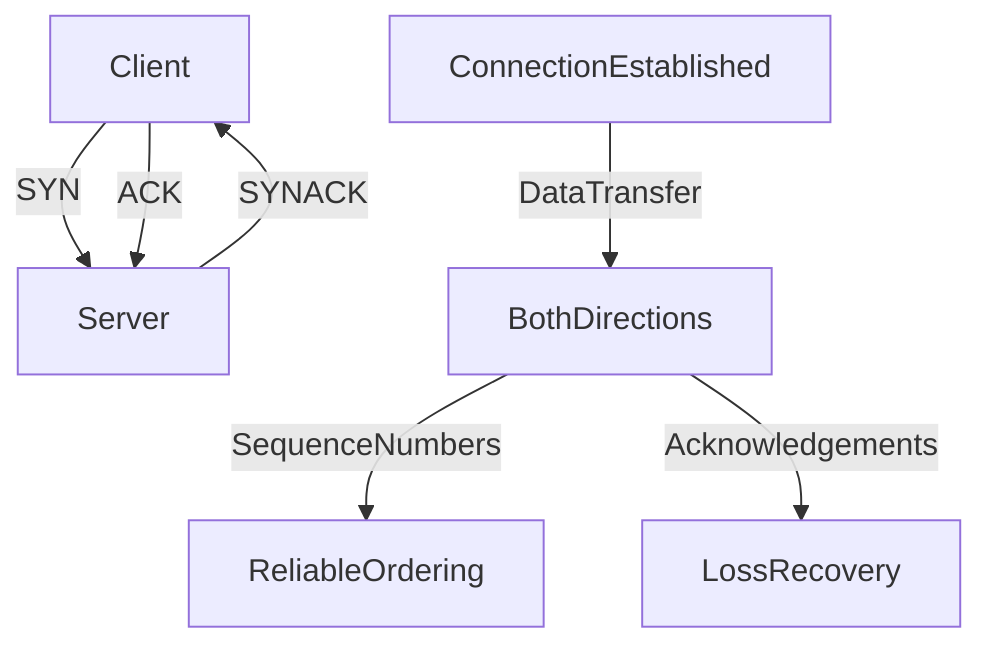

# 🔗 TCP (Transmission Control Protocol)

> [!abstract] TL;DR
> TCP is a connection-oriented transport protocol that guarantees reliable, ordered delivery through a three-way handshake, acknowledgements, and retransmission — at the cost of higher latency than UDP.

## 🧠 Core Idea

**TCP** is a **connection-oriented** protocol operating over IP networks that provides **reliable, ordered, and error-checked** delivery of data between systems.

> Goal: **Guarantee correct data transmission, even at the cost of extra latency and overhead.**

TCP is the foundation for most internet communication, including **HTTP, HTTPS, FTP, SMTP, and SSH**.

---

## 📖 How TCP Works

### 🔹 Connection Establishment (Handshake)

TCP establishes a connection before transmitting data using a **three-way handshake**:

```
Client → SYN → Server
Client ← SYN-ACK ← Server
Client → ACK → Server
Connection Established
```

Connection termination also uses a controlled handshake to close safely.

---

## ⚙️ Reliability Mechanisms

TCP guarantees delivery using:

- **Sequence Numbers** – Ensure packets arrive in order  
- **Checksums** – Detect corrupted packets  
- **Acknowledgements (ACKs)** – Confirm successful receipt  
- **Automatic Retransmission** – Resend lost packets  

If multiple retransmissions fail, the connection is dropped.

---

## 🚦 Flow & Congestion Control

TCP dynamically adjusts transmission speed to:

- Prevent overwhelming the receiver (**flow control**)  
- Avoid saturating the network (**congestion control**)  

This ensures optimal bandwidth usage but adds latency.

---

## ⚡ Performance Characteristics

| Feature | TCP |
|--------|-----|
| Connection | Required |
| Reliability | Guaranteed |
| Ordering | Guaranteed |
| Speed | Moderate |
| Overhead | Higher |
| Latency | Higher than UDP |

---

## 🧠 TCP vs UDP

| Aspect | TCP | UDP |
|--------|-----|-----|
| Connection | Connection-oriented | Connectionless |
| Delivery Guarantee | Yes | No |
| Packet Ordering | Yes | No |
| Error Checking | Yes | Basic |
| Speed | Slower | Faster |
| Use Case | Reliability-critical | Real-time systems |

---

## 🌍 When to Use TCP

Use TCP when:

- You need **all data to arrive intact**  
- Order of messages matters  
- Reliability is more important than latency  
- Automatic bandwidth adjustment is useful  

---

## 🚀 Common TCP-Based Applications

- Web Servers (HTTP/HTTPS)  
- Databases  
- Email (SMTP, IMAP)  
- File Transfer (FTP)  
- Secure Shell (SSH)  

---

## ⚠️ Scaling Challenges

Keeping many TCP connections open:

- Increases memory usage  
- Adds thread/connection management overhead  

### 🔹 Connection Pooling

To reduce cost:
- Reuse existing TCP connections  
- Limit total open connections  
- Improve throughput  

Used heavily between:
- Web servers ↔ Databases  
- Application servers ↔ Cache layers  

---

## 🧠 Design Insight

```
Need reliable delivery → Use TCP
Need low latency streaming → Use UDP
Large backend connection counts → Use connection pooling
```

---

## 📊 Architecture Diagram



---

## Related Concepts

- [[_MOC_Communication|↑ Section MOC]]
- [[UDP]]
- [[HTTP]]
- [[Communication]]
- [[gRPC]]

---

## Review Questions

1. What is the purpose of the three-way handshake in TCP and what problem does it solve?
2. How does TCP's flow control differ from congestion control and when does each apply?
3. Why is connection pooling necessary when using TCP for database connections under high load?

---

## 🔗 Related Topics

[[HTTP]]  
[[UDP]]  
[[Communication]]  
[[Load Balancers]]  
[[Connection Pooling]]  
[[Performance Optimization]]

---

## 📚 Sources

- System Design Primer — TCP  
  https://github.com/donnemartin/system-design-primer#transmission-control-protocol-tcp  

- TCP vs UDP — Cyberciti  
  https://www.cyberciti.biz/faq/key-differences-between-tcp-and-udp-protocols/  

- TCP vs UDP — StackOverflow  
  https://stackoverflow.com/questions/5970383/difference-between-tcp-and-udp  

- Wikipedia — TCP  
  https://en.wikipedia.org/wiki/Transmission_Control_Protocol  

- Facebook Memcache Paper  
  https://www.cs.bu.edu/~jappavoo/jappavoo.github.com/451/papers/memcache-fb.pdf  

---

## 🏷️ Tags

#SystemDesign #TCP #Networking #Communication #Reliability
