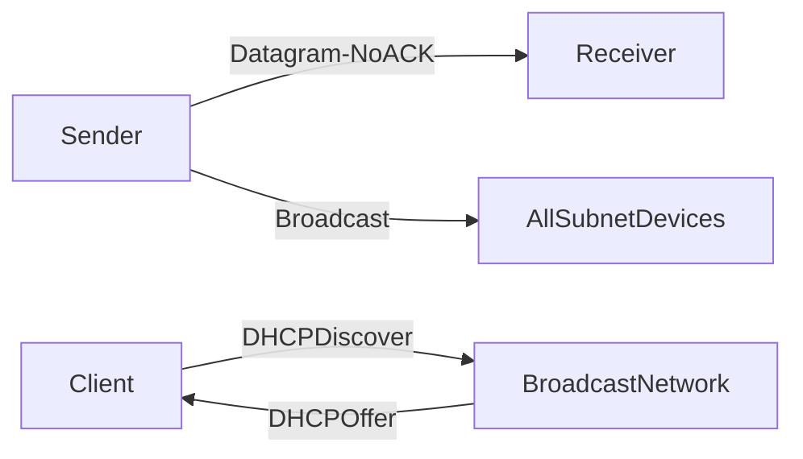

# 🚀 UDP (User Datagram Protocol)

> [!abstract] TL;DR
> UDP is a connectionless protocol that sends datagrams without guaranteed delivery or ordering, trading reliability for very low latency — ideal for real-time applications like video, VoIP, and gaming.

## 🧠 Core Idea

**UDP** is a **connectionless** protocol operating over IP networks that provides **fast but unreliable** data transmission.

> Goal: **Achieve the lowest possible latency by avoiding connection setup and reliability overhead.**

Unlike TCP, UDP does **not guarantee** delivery, ordering, or congestion control — making it faster and more efficient for real‑time communication.

---

## 📖 How UDP Works

```
Sender → Datagram → Receiver
```

- No handshake  
- No acknowledgment  
- No retransmission  
- No ordering guarantees  

Datagrams may:
- Arrive out of order  
- Arrive late  
- Never arrive at all  

---

## ⚙️ Key Characteristics

| Feature | UDP |
|--------|-----|
| Connection | Not required |
| Reliability | Not guaranteed |
| Ordering | Not guaranteed |
| Congestion Control | None |
| Speed | Very fast |
| Overhead | Minimal |
| Latency | Very low |

---

## 📡 Broadcasting Capability

UDP supports **broadcasting**, sending datagrams to **all devices on a subnet**.

### Example: DHCP  
A client without an IP address can:
```
Broadcast → DHCP Server → Receive IP Configuration
```
This is not possible with TCP, which requires a prior connection.

---

## 🎯 Why UDP Matters

- Eliminates connection overhead  
- Ideal for real-time data  
- Efficient for high-frequency small messages  
- Enables multicast & broadcast  

---

## 🚀 Common UDP Use Cases

- VoIP calls  
- Video conferencing  
- Live video/audio streaming  
- Online multiplayer games  
- DNS queries  
- DHCP  

---

## ⚖️ UDP vs TCP

| Aspect | UDP | TCP |
|--------|-----|-----|
| Connection Setup | None | Required |
| Delivery Guarantee | No | Yes |
| Ordering | No | Yes |
| Congestion Control | No | Yes |
| Latency | Very low | Higher |
| Overhead | Minimal | Higher |
| Use Case | Real-time apps | Reliability-critical apps |

---

## 🧠 When to Use UDP

Use UDP when:

- You need **lowest latency**
- **Late data is worse than lost data**
- You plan to implement **custom error correction**
- Real-time streaming is required

---

## ⚠️ Trade-offs

- Packet loss possible  
- Out-of-order delivery  
- No built-in congestion control  
- Application must handle reliability if needed  

---

## 🧠 Design Insight

```
Video / Voice / Gaming → UDP
Web / APIs / Databases → TCP
Custom reliability logic → UDP + Error Handling
```

---

## 📊 Architecture Diagram



---

## Related Concepts

- [[_MOC_Communication|↑ Section MOC]]
- [[TCP]]
- [[HTTP]]
- [[Communication]]

---

## Review Questions

1. Why is UDP preferred over TCP for real-time video streaming even though packets may be lost?
2. What does "connectionless" mean in the context of UDP and how does it differ from TCP's three-way handshake?
3. Give two examples of protocols that use UDP and explain why reliability guarantees would hurt their use case.

---

## 🔗 Related Topics

[[TCP]]  
[[HTTP]]  
[[Communication]]  
[[Performance vs Scalability]]  
[[Latency vs Throughput]]

---

## 📚 Sources

- Cyberciti — TCP vs UDP  
  https://www.cyberciti.biz/faq/key-differences-between-tcp-and-udp-protocols/  

- StackOverflow — Difference between TCP and UDP  
  https://stackoverflow.com/questions/5970383/difference-between-tcp-and-udp  

- Wikipedia — UDP  
  https://en.wikipedia.org/wiki/User_Datagram_Protocol  

- Facebook Memcache Paper  
  https://www.cs.bu.edu/~jappavoo/jappavoo.github.com/451/papers/memcache-fb.pdf  

---

## 🏷️ Tags

#SystemDesign #UDP #Networking #Communication #Performance
