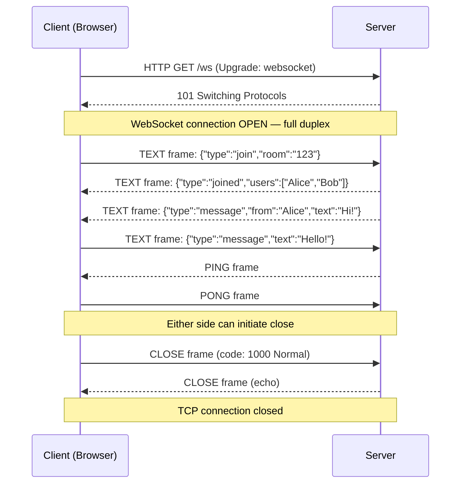

# 🔌 WebSockets

> [!abstract] TL;DR
> WebSockets provide a persistent, full-duplex TCP connection over a single HTTP upgrade, enabling both client and server to push messages to each other at any time with minimal overhead.

## Intuition

Think about **walkie-talkies** vs. a **phone call**. HTTP is like walkie-talkies — you press a button to transmit, say your message, release, and wait for a reply. Only one direction at a time; you have to initiate every exchange.

A WebSocket is like a phone call. Once connected, **both sides can talk at any time**, simultaneously, for as long as they want. You don't have to "call back" to hear the next sentence — the line stays open.

This makes WebSockets the natural fit for anything that needs a continuous, two-way conversation: a chat app, a multiplayer game, a live dashboard, or a collaborative document editor.

### Formal Definition

WebSocket is a **full-duplex, persistent communication protocol** built on a single TCP connection. It begins as an HTTP/1.1 handshake (the "upgrade") and then switches protocols — from HTTP to the WebSocket protocol (RFC 6455). Once established, either side can send **frames** (messages) at any time without the overhead of HTTP headers on every exchange.

**WebSocket vs HTTP:**

| Dimension | HTTP | WebSocket |
|---|---|---|
| Direction | Half-duplex (client initiates each request) | Full-duplex (either side sends anytime) |
| Connection | Short-lived (keep-alive is connection reuse, not persistent comms) | Persistent until closed |
| Overhead per message | Full HTTP headers (~500–800 bytes) | 2–14 byte frame header |
| Server push | Not native (requires SSE or polling) | Native — server sends freely |
| Protocol | Stateless (each request is independent) | Stateful (connection carries context) |
| Use case | REST APIs, page loads, CRUD | Real-time: chat, gaming, collaboration |

## How It Works

### 1. The Upgrade Handshake

WebSocket starts as an HTTP GET request with special headers:

**Client request:**
```
GET /chat HTTP/1.1
Host: api.example.com
Upgrade: websocket
Connection: Upgrade
Sec-WebSocket-Key: dGhlIHNhbXBsZSBub25jZQ==
Sec-WebSocket-Version: 13
```

**Server response (101 Switching Protocols):**
```
HTTP/1.1 101 Switching Protocols
Upgrade: websocket
Connection: Upgrade
Sec-WebSocket-Accept: s3pPLMBiTxaQ9kYGzzhZRbK+xOo=
```

After this exchange, the TCP connection is "upgraded" — HTTP is gone, and the WebSocket protocol takes over on the same socket.

### 2. Message Framing

WebSocket messages are broken into **frames**. Each frame has a minimal header:
- `FIN` bit (is this the last frame of the message?)
- Opcode (text, binary, ping, pong, close)
- Payload length
- Masking key (client→server frames are masked to prevent cache poisoning)

This 2–14 byte overhead per frame contrasts sharply with hundreds of bytes of HTTP headers per request.

### 3. Connection Lifecycle



### 4. ws:// vs wss://

- `ws://` — plain TCP, unencrypted. Should never be used in production.
- `wss://` — WebSocket over TLS (same as HTTPS). Required for security and for working through modern proxies/CDNs that often block or mangle unencrypted WebSocket traffic.

### 5. Scaling WebSockets

WebSockets are **stateful** — the client is connected to a specific server instance. This breaks stateless horizontal scaling:

**Problem:** Client A is connected to Server 1. Client B is connected to Server 2. Server 1 receives a message intended for Client B, but Client B's socket is on Server 2.

**Solutions:**
- **Sticky sessions (session affinity)** — Load balancer always routes a client to the same server instance using IP hash or cookie. Simple but skews load distribution.
- **Message broker fan-out (Redis Pub/Sub)** — Each server subscribes to a shared pub/sub channel. When Server 1 needs to message a client on Server 2, it publishes to Redis; Server 2 receives it and delivers to the connected client. Used by Slack, Discord.
- **Dedicated WebSocket layer** — A specialized stateful tier (e.g., Socket.io cluster, Pusher, Ably) handles connections; stateless API servers send through this tier.

## Real-World Systems

- **Slack** — Uses WebSockets for real-time messaging; every message, reaction, and presence update arrives via a persistent connection without polling. Uses Redis Pub/Sub for fan-out across server fleet.
- **Discord** — WebSocket-based gateway for all real-time events (messages, voice state, presence). Each connection shard handles thousands of users. Discord has publicly documented their WebSocket gateway architecture.
- **Google Docs** — Collaborative editing uses WebSockets to broadcast operational transforms (OT) or CRDTs between all active editors in near real-time.
- **Binance / crypto exchanges** — Live price feeds and order book updates pushed via WebSocket streams; market data subscription topics produce thousands of updates per second.
- **Figma** — Real-time multiplayer design tool uses WebSockets to synchronize canvas state across collaborators.

## Trade-offs

| Advantage | Disadvantage |
|-----------|-------------|
| True full-duplex — server pushes data without client polling | Stateful connections are harder to load balance (sticky sessions or pub/sub required) |
| Minimal per-message overhead (2–14 byte frame vs. hundreds of bytes HTTP headers) | Keep-alive overhead — idle connections consume file descriptors and memory on the server |
| Low latency — no new TCP handshake per message | Not all proxies, firewalls, and CDNs fully support WebSockets (wss:// mitigates most) |
| Server can push events immediately without client request | Cannot be cached by HTTP infrastructure (CDNs, reverse proxies) |
| Well-supported in all major browsers (EventSource API equivalent) | Harder to debug than HTTP — specialized tools needed (browser DevTools WS tab, Wireshark) |

## When to Use vs Avoid

**Use when:**
- The application needs true bidirectional communication: chat, collaborative editing, multiplayer games.
- The server needs to push data frequently and unpredictably (live sports scores, financial tickers, IoT sensor streams).
- Latency matters — avoiding the round-trip overhead of polling is critical.
- Messages flow in both directions, not just server-to-client.

**Avoid when:**
- Data only flows server-to-client (notifications, dashboards, live logs) — use Server-Sent Events (SSE) instead; simpler, HTTP-native, auto-reconnects.
- Infrequent updates (e.g., checking for new emails every 30 seconds) — simple polling or SSE is cheaper and easier to scale.
- Your infrastructure (corporate proxies, CDNs) doesn't reliably support WebSocket connections.
- The clients are microservices talking to each other — use gRPC bidirectional streaming or a message queue instead.

## Common Pitfalls

1. **Not handling disconnections and reconnects** — network flaps are inevitable. Implement exponential backoff reconnection logic on the client; track message sequence numbers to detect and recover missed messages.
2. **No heartbeat / ping-pong** — idle connections can be silently dropped by NAT devices, proxies, and load balancers after 60–90 seconds. Send WebSocket PING frames every 30 seconds to keep connections alive.
3. **Storing session state in server memory** — if the server crashes, all WebSocket state is lost. Store session-critical state in Redis or a database, not in process memory.
4. **Not authorizing the upgrade** — the HTTP upgrade handshake is the only opportunity to validate auth tokens (cookies or query params). Validate before upgrading to WebSocket, not after.
5. **Sending unbounded messages** — without size or rate limits on incoming frames, a malicious client can send enormous messages to exhaust server memory. Enforce max message size.

## Related Concepts

- [[_MOC_Communication|↑ Section MOC]]
- [[Long_Polling_and_SSE]]
- [[HTTP]]
- [[Communication]]
- [[Load_Balancers]]
- [[Message_Queues]]

## Review Questions

1. Walk through the WebSocket handshake. What HTTP status code does the server respond with, and what does it signal?
2. Why are WebSockets described as "stateful" and why does this create a load balancing challenge? Describe two solutions.
3. Compare WebSocket, Server-Sent Events, and Long Polling for the use case of a live notification bell (server pushes, client does not reply). Which would you choose and why?
4. A WebSocket connection is idle for 90 seconds. What might happen, and how do you prevent it?
5. Google Docs supports real-time collaborative editing with WebSockets. When two users edit the same character simultaneously, what problem arises and what techniques (OT, CRDT) resolve it?

## Sources

- [RFC 6455 — The WebSocket Protocol](https://datatracker.ietf.org/doc/html/rfc6455)
- [MDN — WebSocket API](https://developer.mozilla.org/en-US/docs/Web/API/WebSocket)
- [Discord Engineering Blog — How Discord Scaled WebSockets](https://discord.com/blog/how-discord-scaled-elixir-to-5-000-000-concurrent-users)
- [Slack Engineering — Real-time Messaging](https://slack.engineering/real-time-messaging/)
- [Ably — WebSocket vs SSE vs Long Polling](https://ably.com/blog/websockets-vs-long-polling)

#SystemDesign #WebSockets #RealTime #FullDuplex #Communication #Chat #Gaming
