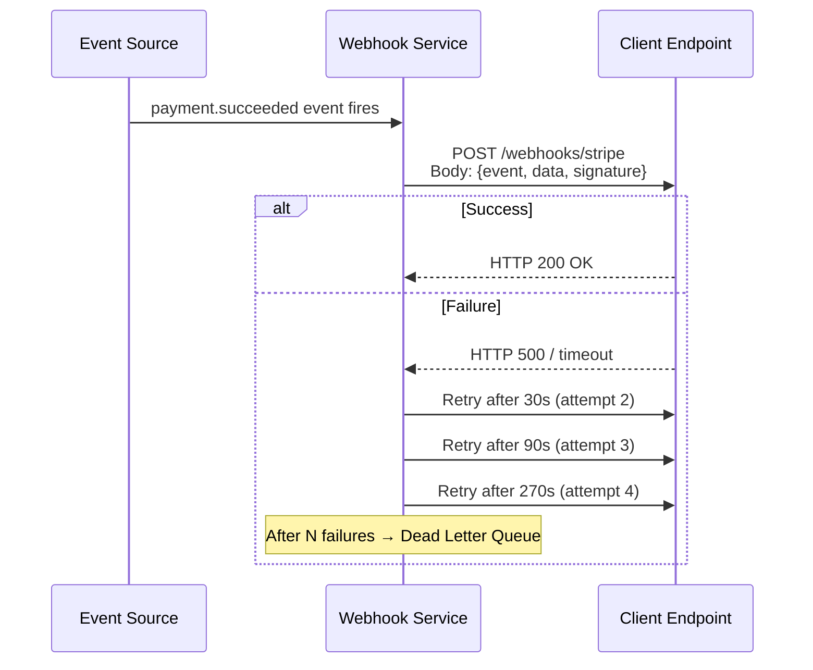

# 🪝 Webhooks

> [!abstract] TL;DR
> A webhook is a "reverse API call" — instead of your client polling the server asking "anything new?", the server POSTs to your URL the moment something happens. Event-driven, efficient, real-time. Security requires HMAC signature verification. Reliability requires idempotent handlers and retry-tolerant processing.

## Intuition — analogy FIRST

Regular API polling is like calling a restaurant every 5 minutes: "Is my table ready yet?" Webhooks are like giving the restaurant your phone number — they call *you* the moment your table is ready.

You only get one call, but the restaurant promises to try again if you don't pick up (retry logic). You should also verify caller ID so random people can't spoof a fake "table ready" message (HMAC verification).

## How It Works

### Core Flow



### Components

**1. Webhook endpoint** — A public HTTPS URL your application exposes:
```
POST https://yourapp.com/webhooks/stripe
```

**2. Event payload** — JSON body describing what happened:
```json
{
  "id": "evt_1MqqYQLkdIwHu7ix8kSMgGD",
  "type": "payment_intent.succeeded",
  "created": 1679090000,
  "data": {
    "object": {
      "id": "pi_3MqqYQLkdIwHu7ix80f7eApn",
      "amount": 2000,
      "currency": "usd"
    }
  }
}
```

**3. Signature verification (HMAC-SHA256)** — prevents spoofing:

The webhook provider signs the payload with a shared secret. You verify before processing:

```python
import hmac, hashlib

def verify_stripe_webhook(payload_body: bytes, sig_header: str, secret: str) -> bool:
    # sig_header = "t=1679090000,v1=abc123..."
    timestamp, signature = parse_sig_header(sig_header)
    signed_payload = f"{timestamp}.{payload_body.decode()}"
    expected = hmac.new(
        secret.encode(), signed_payload.encode(), hashlib.sha256
    ).hexdigest()
    return hmac.compare_digest(expected, signature)
```

Always use `hmac.compare_digest` (constant-time comparison) to prevent timing attacks.

**4. Retry logic with exponential backoff** — provider retries on non-2xx responses:

| Attempt | Delay |
|---|---|
| 1 | Immediate |
| 2 | 30 seconds |
| 3 | 5 minutes |
| 4 | 30 minutes |
| 5 | 2 hours |
| After N failures | Dead letter queue / alert |

**5. Idempotency** — retries mean you may receive the same event twice. Use the event `id` as an idempotency key:

```sql
INSERT INTO processed_events (event_id, processed_at)
VALUES ('evt_1MqqYQ...', NOW())
ON CONFLICT (event_id) DO NOTHING;
-- If already processed, skip handler logic
```

### Delivery Guarantee

Webhooks are **at-least-once** delivery. Your handler MUST be idempotent.

> [!warning] Never assume exactly-once
> Network timeouts mean the provider may retry even after your server processed the event. Always deduplicate on `event.id`.

## Real-World Systems

| Provider | Events | Use case |
|---|---|---|
| **Stripe** | `payment_intent.succeeded`, `charge.failed`, `invoice.paid` | Payment confirmation, subscription management |
| **GitHub** | `push`, `pull_request`, `workflow_run` | CI/CD triggers, deployment automation |
| **Twilio** | `message.received`, `call.completed` | Inbound SMS/voice processing |
| **Shopify** | `orders/create`, `products/update`, `checkouts/paid` | Inventory sync, fulfillment triggers |
| **Slack** | `message`, `app_mention`, `reaction_added` | Bot triggers, workflow automation |

## Trade-offs

| Dimension | Webhooks | Polling |
|---|---|---|
| Latency | Real-time (sub-second) | Interval-bound (5s – 5min) |
| Server load | Low (push on event) | High (constant requests) |
| Client complexity | Requires public endpoint, HMAC logic | Simpler (just GET on a schedule) |
| Reliability | At-least-once; retries needed | Stateless; easy to implement |
| Debugging | Harder (async, no direct response) | Easier (synchronous request/response) |
| Firewall-friendly | Requires inbound traffic | Only outbound traffic needed |

## When to Use vs Avoid

**Use webhooks when:**
- You need real-time event notification (payment processed, order shipped).
- You are integrating with a third-party system you don't control.
- Polling would be wasteful (events are infrequent relative to poll interval).
- Building a platform that notifies downstream integrations.

**Avoid / use polling instead when:**
- Your receiver is behind a firewall with no public endpoint (use polling or SSE instead).
- Events are so frequent that webhooks create more load than polling would.
- You need synchronous response/reply from the receiver.
- Building internal microservices — use a message queue ([[Kafka]], [[RabbitMQ]]) for durability and ordering guarantees.

## Common Pitfalls

1. **Skipping signature verification** — anyone can POST fake events to your endpoint.
2. **Synchronous processing in the handler** — don't do heavy work in the HTTP handler; return 200 fast, enqueue work asynchronously.
3. **Not handling retries** — if you return a non-200, the provider retries. Make sure your handler is idempotent.
4. **Hardcoded endpoints in dev** — use ngrok or a webhook relay service for local testing; never expose prod secrets in dev.
5. **No dead-letter handling** — if delivery permanently fails, you need alerting and a way to replay missed events.
6. **Tight coupling on payload schema** — webhook providers sometimes change payload format; treat it like an external API (version it).

## Related Concepts

- [[_MOC_Communication|↑ Section MOC]]
- [[REST]] — webhooks are HTTP-based but inverted (server calls client)
- [[API_Gateway]] — webhook registration and routing often lives in the API gateway
- [[Event_Driven_Architecture]] — webhooks are one delivery mechanism in event-driven systems
- [[Message_Queues]] — for internal systems, prefer a message queue over webhooks
- [[Dead_Letter_Queue]] — where permanently failed webhook deliveries end up

## Review Questions

1. A payment webhook handler is receiving the same `payment_intent.succeeded` event 3 times. Walk through exactly how you would make the handler safe to call multiple times without charging a customer twice.
2. Explain the security vulnerability if you accept webhook payloads without verifying the HMAC signature. Demonstrate the attack and the fix.
3. Your webhook handler does database writes and sends confirmation emails. Currently you do all of this synchronously before returning 200. What is the risk, and how would you restructure the handler?

## Sources

- [Stripe Webhooks Best Practices](https://stripe.com/docs/webhooks/best-practices)
- [GitHub Webhooks Documentation](https://docs.github.com/en/webhooks)
- [RFC 8030 — Generic Event Delivery Using HTTP Push](https://www.rfc-editor.org/rfc/rfc8030)
- [Webhook.site — testing tool](https://webhook.site)

#SystemDesign #Webhooks #API #EventDriven #HMAC #Security #AtLeastOnce
