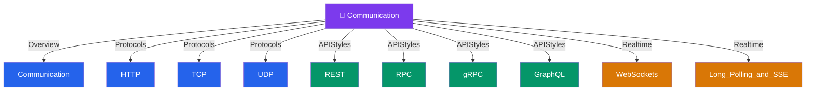

# 🔌 Communication — Map of Content

> [!abstract] What This Section Covers
> Every protocol and API style systems use to talk to each other: low-level transport protocols (TCP, UDP), application-layer protocols (HTTP), API paradigms (REST, RPC, gRPC, GraphQL), and real-time patterns (WebSockets, Long Polling, SSE). Choose the right communication style and you solve latency, bandwidth, and coupling problems simultaneously.

## Concept Map

## Learning Path

1. [[Communication]] — Overview of all communication patterns and when to apply each
2. [[TCP]] — Reliable, ordered transport — the foundation HTTP is built on
3. [[HTTP]] — The request-response protocol powering the web
4. [[REST]] — Resource-oriented API design using HTTP verbs and status codes
5. [[gRPC]] — High-performance RPC using Protocol Buffers and HTTP/2
6. [[GraphQL]] — Client-driven query language that eliminates over/under-fetching
7. [[WebSockets]] — Full-duplex persistent connections for real-time bidirectional communication
8. [[Long_Polling_and_SSE]] — Server-push patterns over HTTP for lower-complexity real-time
9. [[RPC]] — Remote Procedure Call abstraction and its trade-offs
10. [[UDP]] — Unreliable, low-latency transport for streaming and gaming

## All Notes at a Glance

| Note | Summary | Difficulty |
|------|---------|------------|
| [[Communication]] | High-level overview of synchronous vs asynchronous communication patterns | Beginner |
| [[HTTP]] | Stateless request-response protocol with methods, headers, and status codes | Beginner |
| [[TCP]] | Connection-oriented transport guaranteeing ordered, reliable delivery via handshake and ACKs | Beginner |
| [[UDP]] | Connectionless transport trading reliability for minimal latency — ideal for streaming and DNS | Beginner |
| [[REST]] | Stateless HTTP API style using resources, nouns as URLs, and standard verbs | Beginner |
| [[RPC]] — | Calls remote functions like local ones, hiding network complexity with generated stubs | Intermediate |
| [[gRPC]] | Google's high-performance RPC framework using Protobuf + HTTP/2 for low-latency service communication | Intermediate |
| [[GraphQL]] | Query language that lets clients specify exactly the data shape they need, eliminating over-fetching | Intermediate |
| [[WebSockets]] | Upgrades HTTP to a persistent full-duplex connection for real-time bidirectional messaging | Intermediate |
| [[Long_Polling_and_SSE]] | Server-push over plain HTTP: long polling holds requests open; SSE streams one-way events | Intermediate |

## Key Questions This Section Answers

- REST vs gRPC — when does each shine, and when is gRPC overkill?
- TCP vs UDP — which to choose for live video streaming vs file transfer?
- How does WebSocket differ from Server-Sent Events (SSE)?
- What problem does GraphQL solve that REST cannot elegantly handle?
- Why does gRPC use HTTP/2 and Protocol Buffers instead of JSON?
- When is long polling a better fit than WebSockets?

## Related Sections

- [[_MOC_SystemDesign_Master|↑ System Design Master MOC]]
- [[_MOC_API_Gateway]] — API gateways sit in front of all communication protocols
- [[_MOC_Asynchronism]] — Async messaging complements synchronous communication
- [[_MOC_LoadBalancers]] — Load balancers operate at Layer 4 (TCP) and Layer 7 (HTTP)

#MOC #SystemDesign
