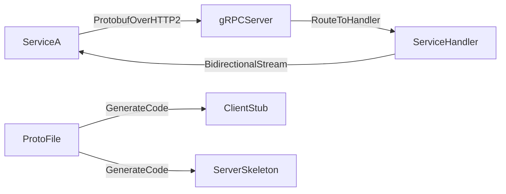

# ⚡ gRPC

> [!abstract] TL;DR
> gRPC is a high-performance RPC framework using Protocol Buffers over HTTP/2, enabling strongly-typed, low-latency, bidirectional streaming communication ideal for microservice-to-microservice calls.

## 🧠 Core Idea

**gRPC** is a **high-performance, open-source Remote Procedure Call (RPC) framework** developed by Google.

> Goal: **Enable fast, efficient, and strongly-typed communication between services in distributed systems.**

gRPC is designed primarily for **microservice-to-microservice communication**, where performance and reliability are critical.

---

## 📖 What Makes gRPC Different

gRPC is built on two key technologies:

### 🔹 Protocol Buffers (Protobuf)
- Compact binary serialization format  
- Faster and smaller than JSON/XML  
- Strongly-typed contracts  
- Automatic code generation  

### 🔹 HTTP/2 Transport
- Multiplexed streams  
- Header compression  
- Persistent connections  
- Bidirectional communication  

This combination makes gRPC **much faster than traditional REST APIs**.

---

## ⚙️ How gRPC Works

```
Client → gRPC Stub → HTTP/2 → Server → Execute Procedure → Response
```

Developers define service interfaces in a **.proto** file.  
gRPC automatically generates:
- Client stubs  
- Server skeletons  

Remote calls then feel like **local function calls**.

---

## 🔄 Communication Modes

gRPC supports multiple communication patterns:

| Mode | Description |
|------|------------|
| Unary | Standard request → response |
| Server Streaming | One request → stream of responses |
| Client Streaming | Stream of requests → one response |
| Bidirectional Streaming | Two-way data streams |

---

## 🎯 Why gRPC Matters

- Extremely low latency  
- High throughput  
- Strongly typed APIs  
- Efficient binary payloads  
- Built-in authentication & TLS  
- Cross-language support  

---

## 🌍 Language Support

- Java  
- C#  
- Python  
- Go  
- Node.js  
- C++  
- And more  

---

## ⚖️ gRPC vs REST

| Aspect | gRPC | REST |
|--------|------|------|
| Transport | HTTP/2 | HTTP/1.1 |
| Payload | Binary (Protobuf) | Text (JSON) |
| Speed | Very High | Moderate |
| Typing | Strongly typed | Loosely typed |
| Streaming | Native support | Limited |
| Browser Friendly | No (needs proxy) | Yes |

---

## ⚠️ Trade-offs

- Not human-readable  
- Requires Protobuf definitions  
- Browser support needs gRPC-Web proxy  
- Harder to test manually than REST  

---

## 🧠 Design Insight

```
Internal microservices → gRPC
Public external APIs → REST / GraphQL
Real-time streaming → gRPC streaming
```

---

## 📊 Architecture Diagram



---

## Related Concepts

- [[_MOC_Communication|↑ Section MOC]]
- [[RPC]]
- [[HTTP]]
- [[TCP]]
- [[REST]]
- [[Microservices]]
- [[Communication]]

---

## Review Questions

1. Why does gRPC use Protocol Buffers instead of JSON and what are the trade-offs of binary serialization?
2. What four communication modes does gRPC support beyond the standard unary request-response pattern?
3. Why is gRPC typically preferred for internal microservice calls but not for public browser-facing APIs?

---

## 🔗 Related Topics

[[RPC]]  
[[HTTP]]  
[[TCP]]  
[[Microservices]]  
[[Communication]]

---

## 📚 Source

- Wallarm — Concept of gRPC  
  https://www.wallarm.com/what/the-concept-of-grpc

---

## 🏷️ Tags

#SystemDesign #gRPC #RPC #Microservices #Communication #Performance
