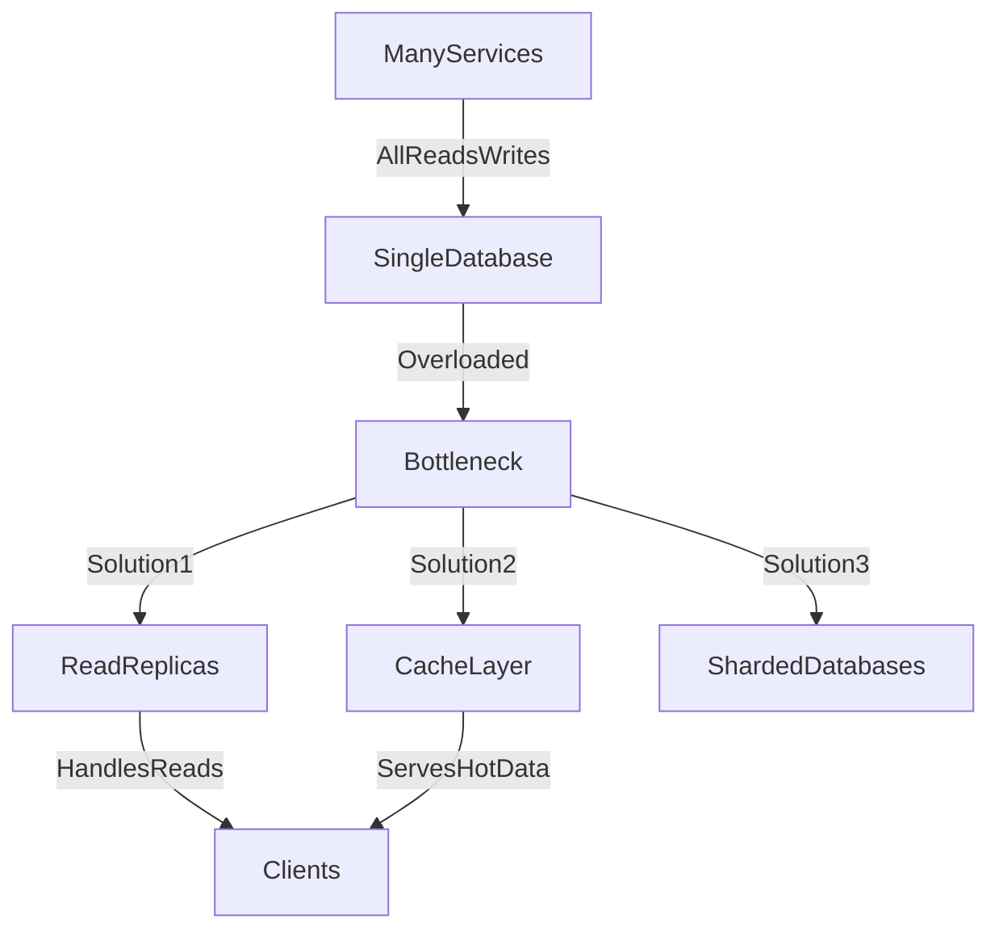

# ⚠️ Busy Database Antipattern

> [!abstract] TL;DR
> A busy database antipattern occurs when a single database becomes a throughput bottleneck due to high load, poor queries, or missing indexes — solved by caching, read replicas, and sharding.

## 🧠 Core Idea

A **busy database** occurs when a database handles **more requests or transactions than it can efficiently process**, becoming a system bottleneck.

> Goal: Prevent the database from becoming the limiting factor in system scalability.

This typically happens when traffic grows but database architecture or queries are not optimized.

---

## 📖 Definition

A database becomes busy when:

- Query load exceeds processing capacity
- Schema or queries are inefficient
- Database scaling strategy is missing
- Too many services rely on the same database

This results in slow response times and system instability.

---

## 🚨 Impact on Systems

A busy database can cause:

- Performance degradation
- Increased CPU and memory usage
- Lock contention and deadlocks
- Request timeouts
- Data inconsistencies
- Service outages under load

Since many systems depend on databases, failures cascade quickly.

---

## 🎯 Common Causes

### 1️⃣ High Traffic Growth
More users generate more read/write operations.

---

### 2️⃣ Poor Query Design
Unoptimized queries scan large datasets.

Example:
```
SELECT * FROM orders
```
without indexes or filters.

---

### 3️⃣ Missing Indexes
Queries perform full table scans.

---

### 4️⃣ Excessive Writes
Frequent updates cause lock contention.

---

### 5️⃣ Shared Database Across Services
Multiple services compete for the same resources.

---

## 🚀 Solutions

### ✅ Scale Out with Read Replicas
Distribute read traffic across replicas.

```
Primary DB → Writes
Read Replicas → Reads
```

---

### ✅ Optimize Queries & Schema
- Remove unnecessary joins
- Reduce query complexity
- Normalize or denormalize as needed

---

### ✅ Add Indexes
Improve lookup and filtering performance.

---

### ✅ Introduce Caching
Cache frequent reads using Redis or Memcached.

---

### ✅ Shard Databases
Split data across multiple databases.

---

### ✅ Separate Services
Use database-per-service patterns.

---

## 🧠 Design Insight

```
Reads heavy → Add replicas + caching
Writes heavy → Partition data
Growing workload → Shard early
```

---

## 📊 Architecture Diagram



---

## Related Concepts

- [[_MOC_PerformanceAntipatterns|↑ Section MOC]]
- [[Caching]]
- [[Monolithic_Persistence]]
- [[Databases]]
- [[Busy_Frontend]]
- [[Chatty_IO]]
- [[Extraneous_Fetching]]

---

## Review Questions

1. What are the most common root causes of the busy database antipattern and which is easiest to fix first?
2. How do read replicas help with a read-heavy busy database, and what consistency trade-off do they introduce?
3. When would you choose database sharding over adding a caching layer to address an overloaded database?

---

## 🔗 Related Topics

[[Database Sharding]]
[[Caching]]
[[SQL Tuning]]
[[Monolithic Persistence]]
[[Scalability]]

---

## 📚 Source

- Microsoft Azure Architecture Antipatterns — Busy Database  
  https://learn.microsoft.com/en-us/azure/architecture/antipatterns/busy-database/

---

## 🏷️ Tags

#SystemDesign #Database #Antipatterns #Performance #Scalability
