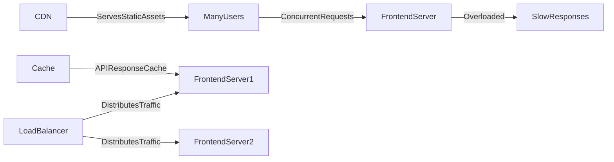

# ⚠️ Busy Frontend Antipattern

> [!abstract] TL;DR
> The busy frontend antipattern occurs when frontend servers are overwhelmed by traffic, large assets, or excessive API calls — resolved through CDNs, load balancing, and asset optimization.

## 🧠 Core Idea

A **busy frontend** occurs when the user-facing layer of a system — such as web servers, CDNs, or client applications — handles **more work than it can efficiently process**, leading to slow or failed user interactions.

> Goal: Keep the frontend responsive even under heavy traffic.

This problem often surfaces during traffic spikes or when frontend resources are poorly optimized.

---

## 📖 Definition

A frontend becomes overloaded when:

- Too many users access the system simultaneously
- Static assets are served inefficiently
- Client-side rendering is heavy
- Requests are not cached or balanced properly

This results in slow page loads and poor user experience.

---

## 🚨 Impact on Systems

A busy frontend can cause:

- Slow page loads
- Increased latency
- Request timeouts
- Higher server load
- Poor user experience
- Drop in user engagement

Frontend performance issues are often directly visible to users.

---

## 🎯 Common Causes

### 1️⃣ High Concurrent Traffic
Sudden traffic spikes overwhelm frontend servers.

---

### 2️⃣ Large Static Assets
Large images, scripts, or stylesheets increase load time.

---

### 3️⃣ Heavy Client-side Rendering
Complex frontend processing delays page interactivity.

---

### 4️⃣ Missing or Poor Caching
Repeatedly serving identical resources increases load.

---

### 5️⃣ Excessive API Calls
Frontend repeatedly requests data unnecessarily.

---

## 🚀 Solutions

### ✅ Use CDN Caching
Serve static content from locations closer to users.

---

### ✅ Optimize Assets
- Compress images
- Minify scripts
- Bundle files

---

### ✅ Lazy Load Resources
Load content only when needed.

---

### ✅ Load Balancing
Distribute requests across multiple frontend servers.

---

### ✅ Reduce API Calls
Batch or cache API responses.

---

## 🧠 Design Insight

```
Static content → Serve via CDN
Heavy scripts → Lazy load
Traffic spikes → Load balance servers
Repeated data → Cache responses
```

---

## 📊 Architecture Diagram



---

## Related Concepts

- [[_MOC_PerformanceAntipatterns|↑ Section MOC]]
- [[Caching]]
- [[Load_Balancers]]
- [[Busy_Database]]
- [[Chatty_IO]]
- [[Synchronous_IO_Antipattern]]

---

## Review Questions

1. What is the difference between a busy frontend and a busy backend, and how do their solutions differ?
2. How does a CDN reduce load on frontend servers and what types of content benefit most from CDN caching?
3. What causes "excessive API calls" from the frontend and what architectural patterns reduce them?

---

## 🔗 Related Topics

[[Content Delivery Networks]]
[[Caching]]
[[Load Balancers]]
[[Performance Antipatterns]]
[[Scalability]]

---

## 📚 Source

- Microsoft Azure Architecture Antipatterns — Busy Frontend  
  https://learn.microsoft.com/en-us/azure/architecture/antipatterns/busy-front-end/

---

## 🏷️ Tags

#SystemDesign #Antipatterns #Performance #Scalability #Frontend
