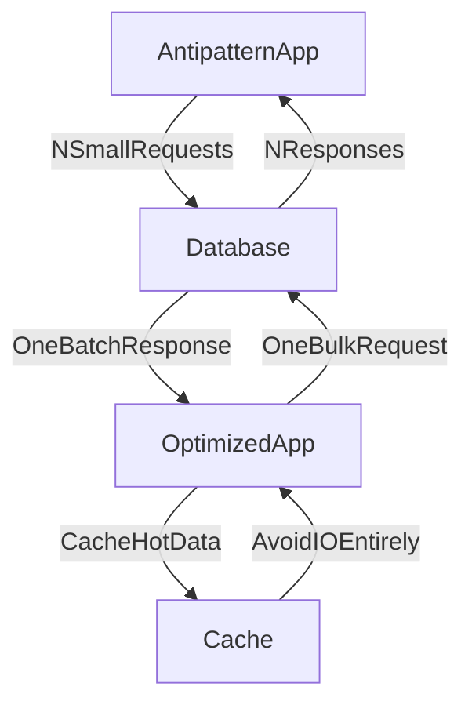

# ⚠️ Chatty I/O Antipattern

> [!abstract] TL;DR
> Chatty I/O is an antipattern where many small I/O operations replace batched requests, causing excessive network round trips, connection overhead, and degraded throughput.

## 🧠 Core Idea

**Chatty I/O** happens when a system performs **many small input/output operations** instead of grouping them into fewer, larger operations.

> Goal: Reduce excessive I/O interactions that slow down systems.

Because network and disk operations are significantly slower than in-memory computation, repeatedly performing small I/O operations creates unnecessary latency and overhead.

---

## 📖 Definition

Chatty I/O occurs when a logical operation is broken into multiple small I/O requests instead of being executed in bulk.

Each I/O request incurs overhead such as:

- Network latency
- Connection setup and teardown
- Serialization/deserialization cost
- Disk access delays

When these operations are repeated frequently, overall system responsiveness drops.

---

## 🚨 Impact on System Performance

Chatty I/O results in:

- Increased request latency
- Reduced throughput
- Higher CPU and network overhead
- Resource exhaustion under load
- Poor user experience

As system traffic increases, these inefficiencies multiply.

---

## 🎯 Common Causes

### 1️⃣ Repeated Database Calls

Instead of fetching data in batches:

```
Fetch record → Repeat N times
```

the system performs multiple database round trips.

Better approach:

```
Fetch records in bulk
```

---

### 2️⃣ Multiple Network Requests for One Operation

Example:

```
Client → API: multiple small requests
```
instead of:

```
Client → API: single aggregated request
```

Each request adds latency and load.

---

### 3️⃣ Frequent Small Disk Operations

Repeatedly reading or writing small data blocks to disk instead of batching operations leads to slow performance.

---

## 🚀 Solutions

### ✅ Batch I/O Operations
Combine multiple reads or writes into fewer operations.

### ✅ Bulk Database Queries
Retrieve or update multiple records in one request.

### ✅ API Aggregation
Provide endpoints that return combined data.

### ✅ Introduce Caching
Reduce repeated I/O calls for frequently accessed data.

### ✅ Reduce Network Round Trips
Design APIs to minimize request count.

---

## 🧠 Design Insight

```
Many small I/O calls → Batch operations
Repeated network calls → Aggregate requests
Frequent data access → Cache results
```

---

## 📊 Architecture Diagram



---

## Related Concepts

- [[_MOC_PerformanceAntipatterns|↑ Section MOC]]
- [[Busy_Database]]
- [[Extraneous_Fetching]]
- [[Caching]]
- [[Synchronous_IO_Antipattern]]

---

## Review Questions

1. Why does performing N individual database queries instead of one bulk query cause performance problems at scale?
2. What is the difference between chatty I/O and extraneous fetching — can a system suffer from both simultaneously?
3. How does API aggregation help reduce chatty I/O between a frontend and a microservices backend?

---

## 🔗 Related Topics

[[Performance Antipatterns]]
[[Caching]]
[[Busy Database]]
[[Extraneous Fetching]]
[[Scalability]]

---

## 📚 Source

- Microsoft Azure Architecture Antipatterns — Chatty I/O  
  https://learn.microsoft.com/en-us/azure/architecture/antipatterns/chatty-io/

---

## 🏷️ Tags

#SystemDesign #Antipatterns #Performance #Scalability #IO
