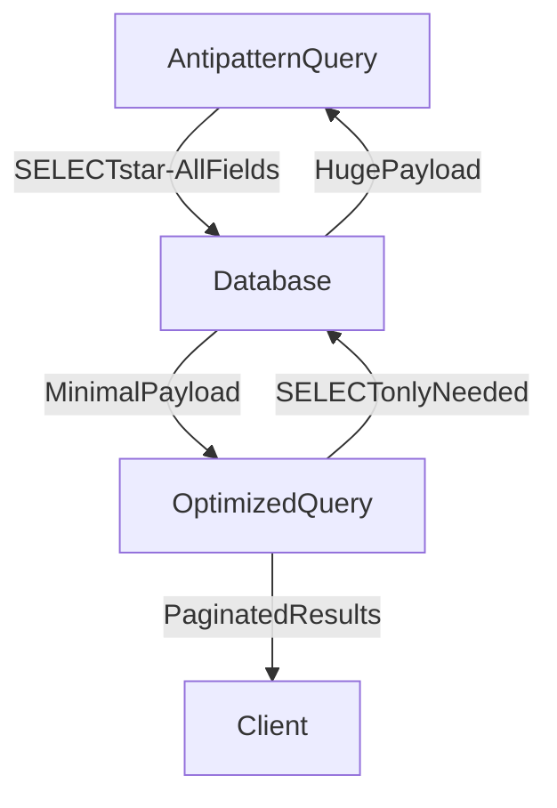

# ⚠️ Extraneous Fetching

> [!abstract] TL;DR
> Extraneous fetching is an antipattern where systems retrieve more data than needed, wasting compute, memory, and network resources — fixed by selecting only required fields and paginating results.

## 🧠 Core Idea

**Extraneous fetching** occurs when a system retrieves **more data than required** for a specific operation.

> Goal: Fetch only the data necessary for the current use case.

This antipattern wastes compute, memory, and network resources, reducing overall system performance.

---

## 📖 Definition

Extraneous fetching happens when:

- Entire objects are retrieved when only a few fields are needed
- Large datasets are fetched without filtering or limits
- APIs return unnecessary data
- Database queries are not optimized for actual usage

---

## 🚨 Impact on Systems

Fetching unnecessary data leads to:

- Performance degradation
- Increased memory and CPU usage
- Increased network traffic
- Slower responses
- Poor user experience
- Higher infrastructure costs

Problems worsen as data size and traffic grow.

---

## 🎯 Common Scenarios

### 1️⃣ Over-fetching Database Records

Example:

```
SELECT * FROM users
```
when only `name` and `email` are needed.

---

### 2️⃣ Large API Responses

Returning full objects even when clients need small subsets.

---

### 3️⃣ Loading Entire Collections

Fetching large lists when pagination or filtering should be used.

---

## 🚀 Solutions

### ✅ Fetch Only Required Fields
Select only necessary columns or attributes.

### ✅ Use Pagination and Filtering
Limit data volume per request.

### ✅ Use Projection Queries
Return minimal representations of data.

### ✅ Use GraphQL or Aggregation APIs
Allow clients to request only needed data.

---

## 🧠 Design Insight

```
Needed fields only → Fetch minimal data
Large datasets → Use pagination
API responses → Keep lightweight
```

---

## 📊 Architecture Diagram



---

## Related Concepts

- [[_MOC_PerformanceAntipatterns|↑ Section MOC]]
- [[Chatty_IO]]
- [[Busy_Database]]
- [[Caching]]
- [[GraphQL]]

---

## Review Questions

1. What SQL antipattern exemplifies extraneous fetching and how does column projection fix it?
2. How does GraphQL specifically address the extraneous fetching problem compared to a traditional REST API?
3. What is the performance impact of loading entire collections without pagination on memory and network usage?

---

## 🔗 Related Topics

[[Performance Antipatterns]]
[[Caching]]
[[GraphQL]]
[[SQL Tuning]]
[[Scalability]]

---

## 📚 Source

- Microsoft Azure Architecture Antipatterns — Extraneous Fetching  
  https://learn.microsoft.com/en-us/azure/architecture/antipatterns/extraneous-fetching/

---

## 🏷️ Tags

#SystemDesign #Antipatterns #Performance #Scalability #Optimization
