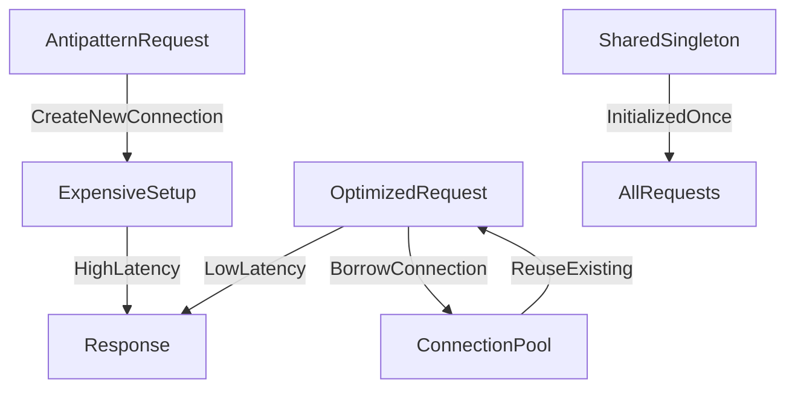

# ⚠️ Improper Instantiation

> [!abstract] TL;DR
> Improper instantiation is an antipattern where expensive objects or connections are repeatedly created per request instead of being pooled or reused, causing CPU waste and poor scalability.

## 🧠 Core Idea

**Improper instantiation** occurs when a system repeatedly creates **unnecessary instances of objects, services, or resources**, leading to performance and scalability problems.

> Goal: **Avoid repeated or wasteful creation of expensive objects or services.**

This antipattern often appears when systems are not optimized for reuse or when object lifecycle management is poorly designed.

---

## 📖 Definition

Improper instantiation happens when:

- Objects are repeatedly created instead of reused
- Services are initialized for every request
- Expensive resources are recreated unnecessarily
- Initialization overhead is ignored

This results in increased CPU usage, memory consumption, and slower response times.

---

## 🚨 Common Scenarios

### 1️⃣ Recreating Expensive Objects Per Request

Example:

```
For every request:
    Create database connection
    Execute query
    Close connection
```

Problem:
- Connection setup is expensive
- Increased latency
- Resource exhaustion under load

✅ Solution:
- Use connection pooling
- Reuse existing connections

---

### 2️⃣ Recreating Heavy Services

Example:
- Reinitializing ML models or caches per request
- Recreating HTTP clients repeatedly

Problem:
- High startup cost
- Memory and CPU waste

✅ Solution:
- Use singleton or shared service instances
- Initialize services once at startup

---

### 3️⃣ Repeated Object Creation in Loops

Example:

```
for item in items:
    serializer = new Serializer()
    serializer.serialize(item)
```

Problem:
- Repeated allocations increase GC pressure
- Reduced performance

✅ Solution:
- Reuse objects outside loops

---

## 🎯 Why It Matters

Improper instantiation causes:

- Increased latency
- Memory pressure
- CPU overhead
- Poor scalability
- Resource exhaustion

Problems become severe under high traffic.

---

## 🧠 Detection Strategies

- Monitor object allocation rates
- Profile memory usage
- Track connection creation frequency
- Measure startup or initialization costs

---

## 🚀 Best Practices

- Reuse heavy objects
- Apply singleton pattern where appropriate
- Use connection pooling
- Cache frequently used objects
- Manage lifecycle explicitly

---

## 🧠 Design Insight

```
Expensive resource → Reuse it
Frequently needed object → Pool or cache it
Per-request initialization → Avoid
```

---

## 📊 Architecture Diagram



---

## Related Concepts

- [[_MOC_PerformanceAntipatterns|↑ Section MOC]]
- [[Caching]]
- [[Busy_Database]]
- [[Synchronous_IO_Antipattern]]
- [[Chatty_IO]]

---

## Review Questions

1. Why is recreating a database connection on every request expensive and how does connection pooling solve this?
2. What design patterns (singleton, object pool, factory) are most applicable to solving improper instantiation?
3. How does repeated object creation inside a loop affect garbage collection pressure in managed runtimes?

---

## 🔗 Related Topics

[[Performance Antipatterns]]
[[Caching]]
[[Connection Pooling]]
[[Scalability]]
[[Performance Optimization]]

---

## 📚 Source

- Microsoft Azure Architecture Antipatterns — Improper Instantiation  
  https://learn.microsoft.com/en-us/azure/architecture/antipatterns/improper-instantiation/

---

## 🏷️ Tags

#SystemDesign #Performance #Antipatterns #Scalability #Optimization
