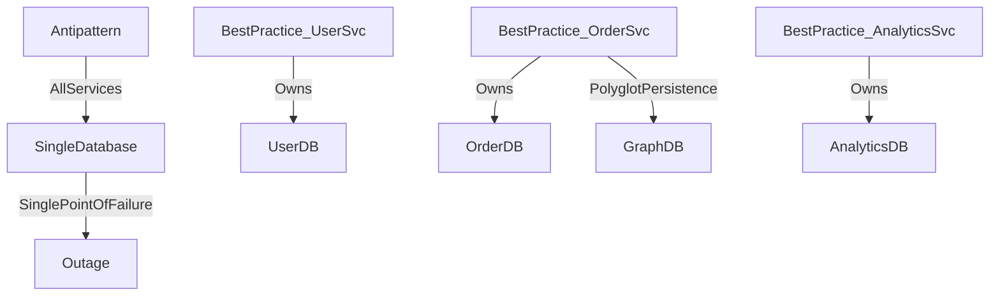

# ⚠️ Monolithic Persistence

> [!abstract] TL;DR
> Monolithic persistence stores all application data in a single database, creating tight coupling and scaling bottlenecks — resolved by database-per-service, sharding, and polyglot persistence strategies.

## 🧠 Core Idea

**Monolithic Persistence** refers to storing all application data in a **single, centralized database**.

> Goal to avoid: Prevent a single database from becoming a scalability and flexibility bottleneck.

While workable for small systems, this approach becomes problematic as applications grow in size and complexity.

---

## 📖 Definition

In monolithic persistence:

- All services share one database
- All data models live in one schema
- Every application component depends on the same storage layer

This creates tight coupling between services and the database.

---

## 🚨 Problems with Monolithic Persistence

### 1️⃣ Scalability Bottleneck

As system usage grows:

- Database load increases
- Scaling becomes expensive
- Vertical scaling reaches limits quickly

---

### 2️⃣ Tight Service Coupling

Multiple services depending on one schema cause:

- Hard-to-change schemas
- Deployment coordination problems
- Risky migrations

---

### 3️⃣ Reduced Flexibility

Different services may require different storage models:

- Relational data
- Document storage
- Graph relationships
- Time-series data

A single database cannot optimally handle all workloads.

---

### 4️⃣ Increased Operational Risk

A database failure affects the entire system:

```
Database failure → Entire application outage
```

This becomes a single point of failure.

---

## 🎯 Example Scenario

```
Users, Orders, Payments, Inventory
            ↓
        Single Database
```

Heavy load from one module impacts all others.

---

## 🚀 Solutions

### ✅ Database per Service (Microservices)

Each service owns its data store.

```
User Service → User DB
Order Service → Order DB
Payment Service → Payment DB
```

---

### ✅ Sharding

Distribute data across multiple databases.

Example:
```
Users 1–1M → Shard A
Users 1M–2M → Shard B
```

---

### ✅ Polyglot Persistence

Use different databases based on workload:

- SQL for transactions
- NoSQL for scalability
- Graph DB for relationships
- Cache for fast reads

---

## 🧠 Design Insight

```
Small system → Single DB acceptable
Growing system → Split persistence
Microservices → Database per service
```

---

## 📊 Architecture Diagram



---

## Related Concepts

- [[_MOC_PerformanceAntipatterns|↑ Section MOC]]
- [[Busy_Database]]
- [[Databases]]
- [[Microservices]]
- [[CAP_Theorem]]

---

## Review Questions

1. What are the three main problems caused by monolithic persistence in a growing microservices architecture?
2. What is polyglot persistence and when would a system benefit from using multiple different database types?
3. How does the database-per-service pattern address tight coupling, and what new challenges does it introduce (e.g., cross-service queries)?

---

## 🔗 Related Topics

[[Microservices]]
[[Database Sharding]]
[[Database Federation]]
[[SQL vs NoSQL]]
[[Scalability]]

---

## 📚 Source

- Microsoft Azure Architecture Antipatterns — Monolithic Persistence  
  https://learn.microsoft.com/en-us/azure/architecture/antipatterns/monolithic-persistence/

---

## 🏷️ Tags

#SystemDesign #Database #Antipatterns #Scalability #Persistence
