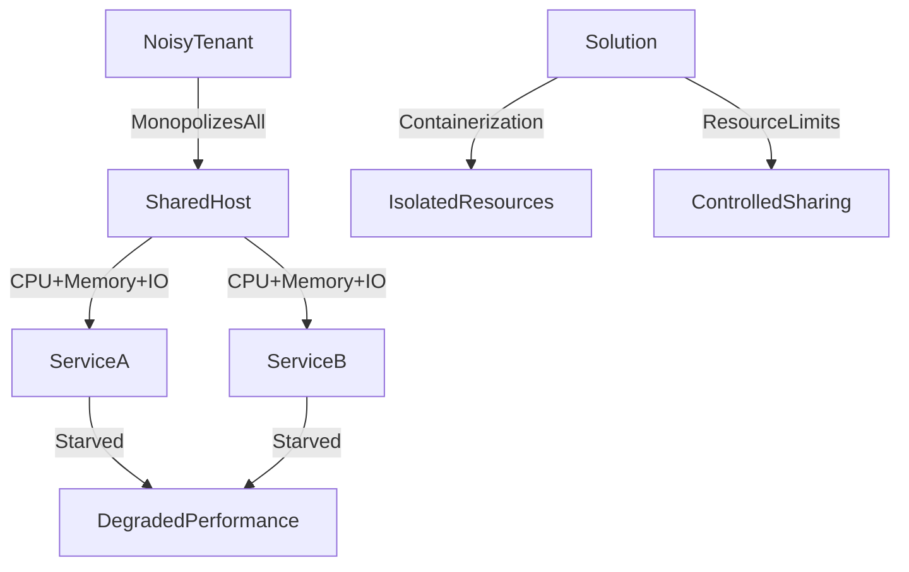

# ⚠️ Noisy Neighbor

> [!abstract] TL;DR
> The noisy neighbor problem occurs in shared environments when one workload monopolizes CPU, memory, or I/O resources, degrading performance for all co-located services.

## 🧠 Core Idea

The **Noisy Neighbor** problem occurs when one component or tenant in a shared environment consumes a disproportionate amount of resources, degrading performance for others.

> Goal: **Prevent one workload from starving others of shared resources.**

This issue commonly appears in cloud, containerized, and multi-tenant systems.

---

## 📖 Definition

A noisy neighbor arises when shared resources such as:

- CPU
- Memory
- Disk I/O
- Network bandwidth

are monopolized by one workload, causing contention and performance degradation for others.

---

## 🚨 Common Scenarios

### 1️⃣ CPU or Memory Contention

Example:
One user or application consumes excessive CPU or RAM on a shared machine.

Result:
Other services experience slow responses or failures.

---

### 2️⃣ Disk I/O Contention

Example:
One service performs heavy disk operations, slowing down access for others.

Result:
- Increased latency
- Slower database operations
- Timeout errors

---

### 3️⃣ Network Bandwidth Contention

Example:
A service transfers large volumes of data over the network.

Result:
Other services suffer lower throughput and higher latency.

---

## 🎯 Why It Matters

Noisy neighbor problems cause:

- Unpredictable performance
- Latency spikes
- Reduced system reliability
- Poor user experience
- Difficult troubleshooting

This is especially problematic in multi-tenant environments.

---

## 🚀 Solutions

### ✅ Resource Isolation

Limit resource usage per workload using:

- CPU limits
- Memory limits
- I/O quotas
- Network throttling

---

### ✅ Containerization & Virtualization

Use technologies such as:

- Containers
- Virtual machines

to isolate workloads.

---

### ✅ Autoscaling

Move or scale workloads when resource contention occurs.

---

### ✅ Workload Separation

Separate heavy workloads from latency-sensitive services.

---

## 🧠 Design Insight

```
Shared infrastructure → Enforce limits
Multi-tenant system → Use isolation
Performance critical service → Dedicated resources
```

---

## 📊 Architecture Diagram



---

## Related Concepts

- [[_MOC_PerformanceAntipatterns|↑ Section MOC]]
- [[Busy_Database]]
- [[Load_Balancers]]
- [[Microservices]]
- [[Monitoring]]

---

## Review Questions

1. In what shared infrastructure environments is the noisy neighbor problem most common and why?
2. How do container resource limits (CPU, memory) help prevent the noisy neighbor effect in Kubernetes?
3. What monitoring signals would alert you to a noisy neighbor problem before it causes a visible user-facing outage?

---

## 🔗 Related Topics

[[Performance Antipatterns]]
[[Scalability]]
[[Load Balancers]]
[[Horizontal Scaling]]
[[Microservices]]

---

## 📚 Source

- Microsoft Azure Architecture Antipatterns — Noisy Neighbor  
  https://learn.microsoft.com/en-us/azure/architecture/antipatterns/noisy-neighbor/noisy-neighbor

---

## 🏷️ Tags

#SystemDesign #Antipatterns #Performance #Scalability #ResourceIsolation
