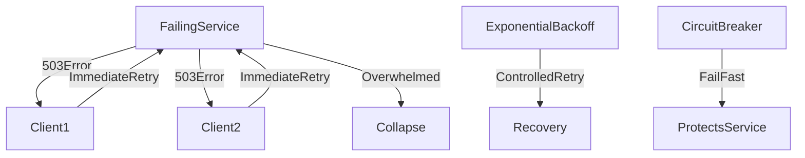

# ⚠️ Retry Storm

> [!abstract] TL;DR
> A retry storm occurs when aggressive retries after a failure overwhelm an already-stressed system — prevented with exponential backoff, jitter, circuit breakers, and rate limiting.

## 🧠 Core Idea

A **Retry Storm** occurs when a large number of retry attempts are triggered in a short period of time, overwhelming a system that is already under stress.

> Goal: Prevent retries from amplifying failures and causing cascading outages.

Retry storms are common in distributed systems where failures are handled by aggressive or poorly controlled retry mechanisms.

---

## 📖 Definition

A retry storm happens when:

- A service becomes slow or unavailable
- Clients or downstream services aggressively retry failed requests
- Retries pile up faster than the system can recover

Instead of helping recovery, retries **multiply the load**, making the failure worse.

---

## 🚨 Impact on Systems

Retry storms can cause:

- Severe performance degradation
- CPU, memory, and thread exhaustion
- Network congestion
- Cascading failures across services
- Poor user experience or full outages

---

## 🎯 Common Causes

### 1️⃣ Immediate Retries

Clients retry instantly after a failure without any delay.

---

### 2️⃣ Synchronized Retries

Many clients retry at the same time, creating traffic spikes.

---

### 3️⃣ Missing Failure Controls

- No rate limiting  
- No circuit breakers  
- No backoff strategy  

---

### 4️⃣ Partial Outages

A service is slow but not completely down, causing retries to stack up.

---

## 🚀 Solutions

### ✅ Exponential Backoff

Increase retry delay after each failure:

```
Retry after: 1s → 2s → 4s → 8s
```

Often combined with **jitter** to avoid synchronization.

---

### ✅ Circuit Breaker

Stop retries temporarily when failures exceed a threshold.

```
Too many failures → Open circuit → Fail fast
```

---

### ✅ Rate Limiting

Limit retry request rates to protect downstream services.

---

### ✅ Timeouts

Fail fast instead of waiting indefinitely.

---

### ✅ Monitoring & Alerting

Detect retry storms early using metrics such as:

- Retry count
- Error rate
- Latency spikes

---

## 🧠 Design Insight

```
Retries without control → System collapse
Retries with backoff + circuit breaker → System recovery
```

---

## 📊 Architecture Diagram



---

## Related Concepts

- [[_MOC_PerformanceAntipatterns|↑ Section MOC]]
- [[Back_Pressure]]
- [[Asynchronism]]
- [[Monitoring]]
- [[Health_Monitoring]]

---

## Review Questions

1. Why do synchronized retries across many clients make a failing service worse instead of helping recovery?
2. How does exponential backoff with jitter reduce the chance of a synchronized retry storm?
3. What is the difference between a circuit breaker pattern and simple retry logic, and when should you use each?

---

## 🔗 Related Topics

[[Back Pressure]]
[[Circuit Breaker]]
[[Performance Antipatterns]]
[[Scalability]]
[[Asynchronism]]

---

## 📚 Sources

- Microsoft Azure Architecture Antipatterns — Retry Storm  
  https://learn.microsoft.com/en-us/azure/architecture/antipatterns/retry-storm/

- FAUN — Avoid Retry Storms in Distributed Systems  
  https://faun.pub/how-to-avoid-retry-storms-in-distributed-systems-91bf34f43c7f

---

## 🏷️ Tags

#SystemDesign #Antipatterns #Reliability #Performance #Scalability
