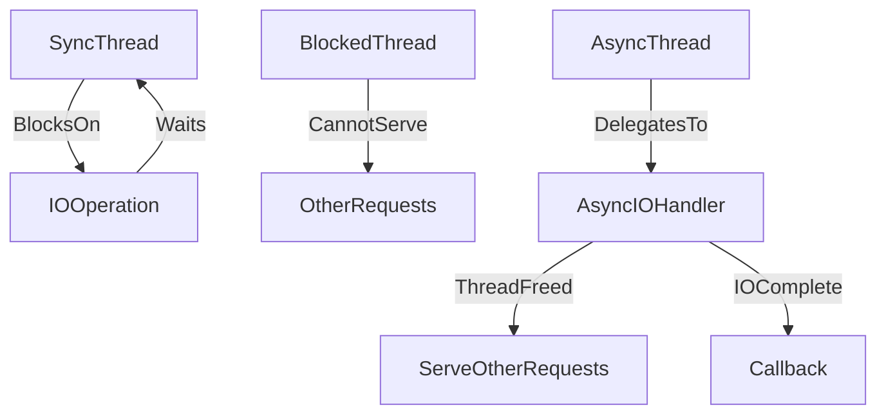

# ⚠️ Synchronous I/O Antipattern

> [!abstract] TL;DR
> Synchronous I/O blocks the calling thread until I/O completes, wasting resources and limiting concurrency — replaced by async I/O patterns, background jobs, and non-blocking libraries.

## 🧠 Core Idea

**Synchronous I/O** blocks the calling thread until an I/O operation completes.

> Goal: Avoid blocking threads during I/O, which wastes resources and limits scalability.

While simple to implement, synchronous I/O reduces performance and limits how many requests a system can handle concurrently.

---

## 📖 Definition

A synchronous I/O operation causes the calling thread to:

1. Send an I/O request
2. Enter a wait state
3. Resume only after completion

During this time, the thread cannot perform useful work.

---

## 📦 Common I/O Operations

Typical blocking operations include:

- Database reads/writes
- Calling external web services
- Sending/receiving queue messages
- File system reads/writes

A single blocking operation can stall an entire request chain.

---

## 🚨 Why It Happens

This antipattern appears when:

- Synchronous calls are easier to write
- The application immediately needs a response
- Libraries expose only synchronous APIs
- External libraries internally perform blocking I/O

---

## 🎯 Impact on Systems

Synchronous I/O leads to:

- Thread starvation
- Increased latency
- Reduced throughput
- Poor vertical scalability
- Higher infrastructure costs

Under load, blocked threads quickly exhaust server capacity.

---

## 🚀 Solutions

### ✅ Use Asynchronous I/O

Allow threads to continue working while I/O completes.

```
Request → Async I/O → Thread released → Response later
```

---

### ✅ Use Background Jobs

Offload long-running tasks to queues or workers.

---

### ✅ Non-blocking Libraries

Prefer async-capable frameworks and clients.

---

### ✅ Thread Pools Carefully

Avoid exhaustion by limiting blocking operations.

---

## 🧠 Design Insight

```
Network or disk calls → Async I/O
Long-running tasks → Background jobs
High concurrency systems → Avoid blocking threads
```

---

## 📊 Architecture Diagram



---

## Related Concepts

- [[_MOC_PerformanceAntipatterns|↑ Section MOC]]
- [[Asynchronism]]
- [[Message_Queues]]
- [[Task_Queues]]
- [[Chatty_IO]]

---

## Review Questions

1. What happens to server throughput when every request thread is blocked on a synchronous database call under high concurrency?
2. How does async I/O (e.g., async/await in Python or Node.js) allow a single thread to handle thousands of concurrent connections?
3. What is the risk of mixing synchronous blocking calls inside an otherwise async codebase?

---

## 🔗 Related Topics

[[Asynchronism]]
[[Message Queues]]
[[Task Queues]]
[[Performance Antipatterns]]
[[Scalability]]

---

## 📚 Source

- Microsoft Azure Architecture Antipatterns — Synchronous I/O  
  https://learn.microsoft.com/en-us/azure/architecture/antipatterns/synchronous-io/

---

## 🏷️ Tags

#SystemDesign #Antipatterns #Performance #Scalability #IO
