# ⚠️ Performance Antipatterns — Map of Content

> [!abstract] What This Section Covers
> Nine recurring patterns that silently kill production performance: antipatterns at the database layer, I/O layer, resource management layer, and resilience layer. Each note identifies the pattern, the root cause, and the corrective design — essential reading before any performance review or system design interview.

## Concept Map

```mermaid
graph TD
    Center["⚠️ Performance Antipatterns"]

    Center -->|DatabaseAntipatterns| Busy_Database["Busy_Database"]
    Center -->|DatabaseAntipatterns| Monolithic_Persistence["Monolithic_Persistence"]
    Center -->|IOAntipatterns| Chatty_IO["Chatty_IO"]
    Center -->|IOAntipatterns| Synchronous_IO["Synchronous_IO_Antipattern"]
    Center -->|ResourceAntipatterns| Busy_Frontend["Busy_Frontend"]
    Center -->|ResourceAntipatterns| Extraneous_Fetching["Extraneous_Fetching"]
    Center -->|ResourceAntipatterns| Improper_Instantiation["Improper_Instantiation"]
    Center -->|ResourceAntipatterns| Noisy_Neighbor["Noisy_Neighbor"]
    Center -->|ResilienceAntipatterns| Retry_Storm["Retry_Storm"]

    style Center fill:#7c3aed,color:#fff
    style Busy_Database fill:#dc2626,color:#fff
    style Monolithic_Persistence fill:#dc2626,color:#fff
    style Chatty_IO fill:#d97706,color:#fff
    style Synchronous_IO fill:#d97706,color:#fff
    style Busy_Frontend fill:#059669,color:#fff
    style Extraneous_Fetching fill:#059669,color:#fff
    style Improper_Instantiation fill:#059669,color:#fff
    style Noisy_Neighbor fill:#059669,color:#fff
    style Retry_Storm fill:#2563eb,color:#fff
```

## Learning Path

1. [[Synchronous_IO_Antipattern]] — Understand why blocking the thread on I/O destroys throughput at scale
2. [[Chatty_IO]] — Recognize the cost of many small I/O calls vs one batched call
3. [[Busy_Database]] — See how over-relying on the DB for logic creates a bottleneck
4. [[Monolithic_Persistence]] — Understand why one database for all workloads breaks under pressure
5. [[Extraneous_Fetching]] — Identify fetching more data than needed and its memory/bandwidth cost
6. [[Busy_Frontend]] — Learn why CPU-intensive work on front-end servers blocks request handling
7. [[Improper_Instantiation]] — See how re-creating expensive objects per-request wastes resources
8. [[Noisy_Neighbor]] — Understand shared-resource contention in multi-tenant environments
9. [[Retry_Storm]] — The most dangerous antipattern: how retries amplify a failure into a total outage

## All Notes at a Glance

| Note | Summary | Difficulty |
|------|---------|------------|
| [[Busy_Database]] | Pushing business logic into the DB (stored procs, heavy queries) creates a single hot bottleneck | Intermediate |
| [[Busy_Frontend]] | Running CPU-intensive tasks on web/API servers blocks I/O-bound request handling threads | Intermediate |
| [[Chatty_IO]] | Issuing many small I/O requests instead of one batched request multiplies latency and connection overhead | Intermediate |
| [[Extraneous_Fetching]] | Retrieving more data than the operation needs wastes bandwidth, memory, and serialization time | Intermediate |
| [[Improper_Instantiation]] | Creating expensive objects (DB connections, HTTP clients) inside request handlers instead of reusing shared instances | Intermediate |
| [[Monolithic_Persistence]] | Using a single database for OLTP, OLAP, blob storage, and search creates write/read contention | Intermediate |
| [[Noisy_Neighbor]] | One tenant's heavy workload degrades performance for all other tenants sharing the same compute or storage | Intermediate |
| [[Retry_Storm]] | Uncoordinated retries from many clients simultaneously amplify a partial failure into a total service outage | Intermediate |
| [[Synchronous_IO_Antipattern]] | Blocking a thread while waiting for I/O response prevents it from serving other requests, capping throughput | Intermediate |

## Key Questions This Section Answers

- What causes a retry storm and how do exponential backoff + jitter prevent it?
- Why is synchronous I/O an antipattern at scale and what replaces it?
- How does chatty I/O differ from extraneous fetching — they both waste I/O?
- When does moving logic into the database become a Busy Database antipattern?
- What is the Noisy Neighbor problem and how do resource quotas and isolation solve it?
- Why should HTTP clients and DB connection pools be singletons, not per-request objects?

## Related Sections

- [[_MOC_SystemDesign_Master|↑ System Design Master MOC]]
- [[_MOC_Monitoring]] — Monitoring is how you detect these antipatterns before they cause outages
- [[_MOC_Databases]] — Several antipatterns originate in database misuse
- [[_MOC_Caching]] — Caching is the primary fix for Busy Database and Extraneous Fetching

#MOC #SystemDesign
