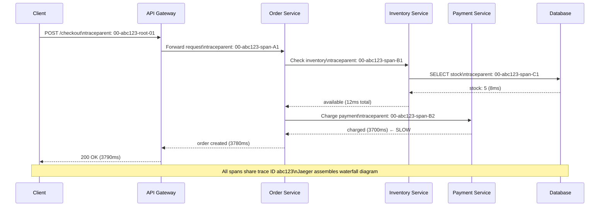

# Magnify Distributed Tracing

> [!abstract] TL;DR
> In microservices, a single user request touches dozens of services — when latency spikes or errors occur, how do you find the culprit? Distributed tracing propagates a unique trace ID through every service hop, records each service's work as a "span," and assembles them into a waterfall diagram showing exactly where time was spent. OpenTelemetry is now the standard API; Jaeger, Zipkin, Honeycomb, and Datadog APM are backends.

---

## Intuition — analogy FIRST

Think of tracking a package through a courier network. Each facility scans the package on arrival and departure, logging the timestamp, location, and any delays. At the end, you get a complete journey: "Package spent 2 hours at Cincinnati hub (waiting for truck), 45 minutes at local depot, 8 minutes on the delivery truck." You know exactly where the delay was.

Distributed tracing does the same for a network request. Instead of a package barcode, it's a trace ID. Instead of facilities, it's microservices. Instead of scan events, it's spans. When a user's checkout takes 4 seconds instead of 200ms, the trace shows: "inventory check: 40ms, payment processing: 3.7 seconds (← there's your problem), order creation: 60ms."

---

## How It Works + mermaid

### Trace Propagation Through Services



### Span Hierarchy (Waterfall View)

```mermaid
gantt
    title Trace abc123 — Checkout Request (3790ms total)
    dateFormat x
    axisFormat %Lms

    section API Gateway
    Span A - API Gateway        :0, 3790

    section Order Service
    Span B - Order Service      :5, 3785

    section Inventory
    Span C - Inventory Check    :10, 20

    section Database
    Span D - DB Query           :12, 8

    section Payment
    Span E - Payment Processing :30, 3700
```



---

## Core Concepts

### Trace
A **trace** represents the entire journey of a single request through the distributed system. It is identified by a globally unique `trace_id` (128-bit UUID). All spans belonging to the same request share this trace ID.

### Span
A **span** represents one unit of work — typically a single service processing a request. Each span has:
- `trace_id`: links it to the parent trace
- `span_id`: uniquely identifies this span
- `parent_span_id`: creates the parent-child hierarchy
- `operation_name`: e.g., "payment-service.charge"
- `start_timestamp` and `end_timestamp`
- **Tags / Attributes**: `http.method=POST`, `db.type=postgresql`, `error=true`
- **Events / Logs**: timestamped events within the span (e.g., "retry attempt 2")
- **Status**: OK / ERROR / UNSET

### Baggage
Key-value pairs that travel with the trace context — propagated through every service automatically. Used for metadata that every service needs: `tenant_id`, `user_id`, `request_priority`. Use sparingly: baggage adds overhead to every service call.

### Sampling
You cannot trace 100% of production traffic — the overhead would be prohibitive and the storage cost astronomical.

| Sampling Strategy | How | Use case |
|------------------|-----|----------|
| **Head sampling** (fixed rate) | Decided at trace start: sample 1% of requests | Simple, low overhead |
| **Head sampling** (rate limiting) | Sample 100 traces/sec regardless of total RPS | Prevents sample bias during traffic spikes |
| **Tail sampling** | Buffer all spans; decide after trace is complete based on result | Sample 100% of errors; 1% of successes |
| **Adaptive sampling** | Adjust rate dynamically based on traffic volume | Large-scale production |

**Tail sampling** is the gold standard: you never discard an errored or slow trace, but you aggressively sample successful fast traces. Requires a trace collector that can buffer and evaluate complete traces before sampling.

---

## W3C TraceContext Propagation Standard

HTTP headers (the standard way to propagate trace context across services):

```
traceparent: 00-4bf92f3577b34da6a3ce929d0e0e4736-00f067aa0ba902b7-01
              ^  ^                               ^               ^
              |  trace-id (128-bit hex)          span-id (64b)   flags
              version (00)
                                                                 01 = sampled
                                                                 00 = not sampled

tracestate: vendor1=value1,vendor2=value2
(vendor-specific state alongside the W3C fields)
```

**gRPC propagation:** Same values, passed as gRPC metadata headers.

**Message queues:** Embed trace context in message headers/attributes (Kafka record headers, SQS message attributes) so traces span across async boundaries.

---

## OpenTelemetry — The Standard

> [!info] OpenTelemetry (OTel) is the CNCF standard that replaced vendor-specific SDKs

**Problem it solved:** Before OTel, you'd instrument with Zipkin client libraries, then migrate to Jaeger, then to Datadog — and have to rewrite all your instrumentation each time.

**OTel architecture:**
```
Application Code
    ↓ (auto-instrumentation via agent, or manual SDK calls)
OTel SDK (language-specific: Python, Java, Go, Node.js, etc.)
    ↓
OTel Collector (receives, processes, exports)
    ↓
Backend (Jaeger / Zipkin / Honeycomb / Datadog / AWS X-Ray / etc.)
```

**Three pillars — Traces, Metrics, Logs (all unified):**
- Traces: request journey through services
- Metrics: numeric measurements (latency histograms, error rates)
- Logs: structured event records, correlatable via trace_id

**Auto-instrumentation:** Zero-code change for popular frameworks:
```bash
# Java — attach as JVM agent, instruments Spring, JDBC, HTTP clients automatically
java -javaagent:opentelemetry-javaagent.jar \
     -Dotel.service.name=order-service \
     -Dotel.exporter.otlp.endpoint=http://otel-collector:4317 \
     -jar app.jar
```

**Manual instrumentation:**
```python
from opentelemetry import trace

tracer = trace.get_tracer("order-service")

def process_order(order_id):
    with tracer.start_as_current_span("process_order") as span:
        span.set_attribute("order.id", order_id)
        span.set_attribute("order.amount", get_amount(order_id))

        with tracer.start_as_current_span("validate_inventory"):
            result = check_inventory(order_id)
            if not result:
                span.set_status(trace.StatusCode.ERROR, "Out of stock")
```

---

## Tracing Backends Comparison

| Backend | License | Strengths | Best for |
|---------|---------|-----------|----------|
| **Jaeger** | Open source (CNCF) | Battle-tested, Kubernetes-native, service graph | Self-hosted Kubernetes deployments |
| **Zipkin** | Open source | Simple, pioneered the B3 propagation format | Legacy systems, simple deployments |
| **Honeycomb** | Commercial | Exceptional query UX, high-cardinality analysis, tail sampling | Teams that live in traces |
| **Datadog APM** | Commercial | Unified with metrics/logs, ML-based anomaly detection | Existing Datadog shops |
| **AWS X-Ray** | Commercial (AWS) | Native Lambda/ECS integration, service map | AWS-native architectures |
| **Grafana Tempo** | Open source | Integrates with Grafana + Loki + Prometheus stack | Grafana shops |

---

## Real-World Systems

- **Uber (Jaeger, 2017):** Uber built Jaeger internally to debug latency in their microservices platform, then open-sourced it and donated it to the CNCF. Used for 5,000+ microservices.
- **Twitter (Zipkin, 2012):** Twitter open-sourced Zipkin, ported from Google's Dapper. The B3 propagation format (`X-B3-TraceId` etc.) is named after Zipkin.
- **Google (Dapper, 2010):** The original distributed tracing paper. Google processes billions of RPCs/day — Dapper samples ~0.01% to ~1% depending on service criticality. The paper is the foundational academic reference for all distributed tracing systems.
- **Shopify:** Uses distributed tracing to identify slow SQL queries and N+1 query problems at scale across their multi-tenant monolith + microservices.

---

## Trade-offs (table)

| Dimension | Benefit | Cost |
|-----------|---------|------|
| Debuggability | Pinpoint exact service causing latency | Instrumentation effort (though OTel auto-instr. helps) |
| Context propagation | Correlate logs → trace → metrics | Must propagate headers through all services + queues |
| Sampling | Controls overhead | Low sample rate = might miss rare bugs |
| Storage | Complete picture of request journey | High cardinality data is expensive to store |
| Performance overhead | ~1-5% CPU overhead for 1% sampling | Increases with sampling rate |
| Cross-team adoption | Works best when ALL services are instrumented | Partial instrumentation creates trace gaps |

---

## When to Use vs Avoid

**Use distributed tracing when:**
- More than 3-4 microservices (monoliths don't need it)
- Latency SLAs — need to identify p99 bottlenecks across service boundaries
- Debugging intermittent failures that span multiple services
- Investigating "why is this user's request slow?" questions

**Deprioritize when:**
- Monolith or 2-service architecture — structured logs are sufficient
- Simple request flows where APM metrics already give enough context

**Start with:** auto-instrumentation + tail sampling at 1% success rate + 100% error rate. This gives most of the value with minimal overhead.

---

## Common Pitfalls

> [!danger] Distributed tracing anti-patterns
> 1. **Partial instrumentation** — if Service A instruments traces but Service B doesn't propagate the `traceparent` header, the trace breaks. Every service in the call path must propagate context, even services that don't generate their own spans.
> 2. **100% sampling in production** — at 100K RPS with 10 spans/request, you're writing 1M spans/second. At 1 KB/span = 1 GB/second of trace data. Sample!
> 3. **Losing context across async boundaries** — forgetting to propagate trace context in Kafka message headers or SQS attributes creates broken traces that stop at the queue boundary.
> 4. **Not correlating traces with logs** — the real power is when a log line says `trace_id=abc123` and you can jump from the log to the full trace. Configure your logging framework to inject trace_id into every log line.
> 5. **High-cardinality span attributes without a capable backend** — setting `user_id` on every span is high-cardinality (millions of unique values). This is valuable but most backends struggle with it. Honeycomb is designed for it; Jaeger less so.
> 6. **Ignoring queue/async spans** — async processing often hides the real latency. A message queued for 10 minutes before processing shows up in the trace if you instrument the message consumer.

---

## Related Concepts

- [[_MOC_Monitoring|↑ Section MOC]]
- [[Monitoring]] — traces are one of the three pillars of observability (traces + metrics + logs)
- [[Microservices]] — the architecture that makes distributed tracing necessary
- [[Service_Mesh]] — Istio/Linkerd auto-generate trace spans at the proxy level without code changes
- [[Instrumentation]] — the practice of adding observability to code
- [[Load_Balancers]] — LB logs should include trace IDs for end-to-end correlation
- [[API_Gateway]] — the trace origin point — should generate the trace ID and attach it to all outbound calls

---

## Review Questions

1. A user complains that their checkout takes 8 seconds. You have distributed tracing in place. Walk through how you'd use the trace for this specific user (given their `trace_id`) to identify which service is slow, and what you'd look at in the span details.

2. Your microservices system sends requests through: API Gateway → Order Service → (Kafka message) → Fulfillment Service → (gRPC) → Shipping Service. Describe how you'd ensure trace context is preserved across both the Kafka async boundary and the gRPC call. What headers/fields carry the trace context in each case?

3. You're designing a sampling strategy for a service with 100K RPS. You want to catch all errors and slow requests (p99 > 2s) but keep storage costs manageable. Compare head sampling at 1% vs tail sampling. Which would you choose, and what infrastructure does tail sampling require that head sampling does not?

---

## Sources

- [Google Dapper Paper: Dapper, a Large-Scale Distributed Systems Tracing Infrastructure (2010)](https://research.google/pubs/pub36356/)
- [OpenTelemetry Documentation](https://opentelemetry.io/docs/)
- [Jaeger Architecture](https://www.jaegertracing.io/docs/1.35/architecture/)
- [W3C TraceContext Specification](https://www.w3.org/TR/trace-context/)
- [Uber Engineering: Evolving Distributed Tracing at Uber Engineering](https://www.uber.com/blog/distributed-tracing/)

#SystemDesign #Monitoring #Observability #DistributedTracing #OpenTelemetry #Jaeger #Intermediate
