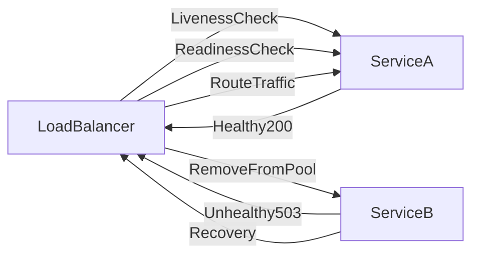

# 🩺 Health Monitoring

> [!abstract] TL;DR
> Health monitoring continuously checks whether services are running and ready to serve requests, enabling load balancers and orchestrators to automatically remove and recover unhealthy instances.

## 🧠 Core Idea

A system is considered **healthy** if it is running correctly and capable of processing requests as expected.

> Goal: Continuously verify that all system components are functioning and available.

Health monitoring provides a snapshot of system status so operators and automation systems can detect failures quickly.

---

## 📖 Definition

Health monitoring involves checking whether:

- Services are running
- Dependencies are reachable
- System resources are available
- Requests can be processed successfully

These checks help determine if the system can continue serving users.

---

## 🎯 Why Health Monitoring Matters

Health monitoring helps:

- Detect failing services quickly
- Trigger automatic recovery actions
- Prevent traffic from reaching unhealthy instances
- Reduce downtime and outages

Without health monitoring, failures may remain undetected until users report issues.

---

## 📦 Types of Health Checks

### 1️⃣ Liveness Checks
Verify whether a service is running.

If the check fails, the system may restart the service.

---

### 2️⃣ Readiness Checks
Verify whether a service is ready to handle requests.

Unready services should not receive traffic.

---

### 3️⃣ Dependency Checks
Ensure required dependencies are available, such as:

- Databases
- Caches
- Message queues
- External APIs

---

## 🚀 Best Practices

### ✅ Lightweight Checks
Health checks should be fast and inexpensive.

### ✅ Separate Liveness & Readiness
Avoid restarting services unnecessarily.

### ✅ Integrate with Load Balancers
Stop routing traffic to unhealthy nodes.

### ✅ Automated Recovery
Restart or replace failing services automatically.

---

## 🧠 Design Insight

```
Healthy service → Receives traffic
Unhealthy service → Removed from rotation
Recovered service → Reintroduced safely
```

---

## 📊 Architecture Diagram



---

## Related Concepts

- [[_MOC_Monitoring|↑ Section MOC]]
- [[Monitoring]]
- [[Instrumentation]]
- [[Performance_Monitoring]]
- [[Visualization_and_Alerts]]
- [[Load_Balancers]]

---

## Review Questions

1. What is the difference between a liveness check and a readiness check, and what actions are taken when each fails?
2. Why should health check endpoints be lightweight and not depend on downstream services?
3. How do load balancers use health check responses to provide zero-downtime deployments?

---

## 🔗 Related Topics

[[Monitoring]]
[[Load Balancers]]
[[Scalability]]
[[Reliability]]
[[Microservices]]

---

## 📚 Source

- Microsoft Azure Architecture Best Practices — Health Monitoring  
  https://learn.microsoft.com/en-us/azure/architecture/best-practices/monitoring#health-monitoring

---

## 🏷️ Tags

#SystemDesign #Monitoring #Reliability #Operations #HealthChecks
