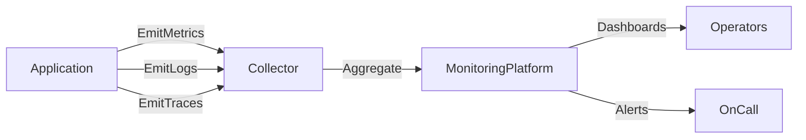

# 🔧 Instrumentation in Distributed Systems

> [!abstract] TL;DR
> Instrumentation embeds code in applications to collect metrics, logs, and traces, providing the raw observability data that monitoring systems need to detect issues and diagnose incidents.

## 🧠 Core Idea

**Instrumentation** is the practice of adding code or tools to an application to collect data about its behavior and performance.

> Goal: Capture enough operational data to monitor, diagnose, and improve systems without manual intervention.

Without instrumentation, monitoring systems have no reliable data source.

---

## 📖 Definition

Instrumentation involves embedding mechanisms in applications and infrastructure to record:

- Metrics
- Logs
- Traces
- Errors
- Performance data

This data allows operators to understand system behavior without logging directly into production systems.

---

## 🎯 Why Instrumentation Matters

Proper instrumentation enables teams to:

- Monitor system health and performance
- Diagnose production issues remotely
- Detect anomalies quickly
- Make informed scaling decisions
- Reduce downtime

Without instrumentation, troubleshooting becomes slow and reactive.

---

## 📦 Types of Instrumentation Data

### 1️⃣ Metrics
Numeric measurements over time, such as:

- Request latency
- Throughput
- Error rates
- Resource utilization

Metrics help identify trends and bottlenecks.

---

### 2️⃣ Logs
Structured or unstructured event records describing system behavior.

Examples:
- Request processing logs
- Authentication events
- Error logs

Logs are useful for debugging specific incidents.

---

### 3️⃣ Traces
Track the path of a request as it flows through multiple services.

Distributed tracing helps identify slow components and dependency failures.

---

## 🚀 Best Practices

### ✅ Instrument Early
Add instrumentation during development, not after deployment.

### ✅ Use Structured Logging
Logs should be machine-readable for easier analysis.

### ✅ Standardize Telemetry Collection
Use consistent formats and tools across services.

### ✅ Centralize Data Collection
Send telemetry to centralized monitoring platforms.

### ✅ Avoid Excessive Logging
Collect useful data without overwhelming storage systems.

---

## 🧠 OpenTelemetry

**OpenTelemetry** is an open-source standard for collecting metrics, logs, and traces from applications.

Benefits include:

- Vendor-neutral telemetry collection
- Cross-language support
- Unified instrumentation approach

It simplifies observability across distributed systems.

---

## 🧠 Design Insight

```
No instrumentation → No visibility
No visibility → Slow incident response
Instrumentation → Enables monitoring & observability
```

---

## 📊 Architecture Diagram



---

## Related Concepts

- [[_MOC_Monitoring|↑ Section MOC]]
- [[Monitoring]]
- [[Health_Monitoring]]
- [[Performance_Monitoring]]
- [[Visualization_and_Alerts]]
- [[Usage_Monitoring]]

---

## Review Questions

1. What are the three core signal types captured by instrumentation and what questions does each answer?
2. Why is structured logging preferred over unstructured logging in distributed systems at scale?
3. What is OpenTelemetry and how does it simplify instrumentation across a polyglot microservices architecture?

---

## 🔗 Related Topics

[[Monitoring]]
[[Performance Monitoring]]
[[Health Monitoring]]
[[Distributed Tracing]]
[[Observability]]

---

## 📚 Sources

- Microsoft Azure Architecture Best Practices — Instrumenting an Application  
  https://learn.microsoft.com/en-us/azure/architecture/best-practices/monitoring#instrumenting-an-application

- OpenTelemetry Documentation  
  https://opentelemetry.io/docs/what-is-opentelemetry/

---

## 🏷️ Tags

#SystemDesign #Monitoring #Instrumentation #Observability #Operations
