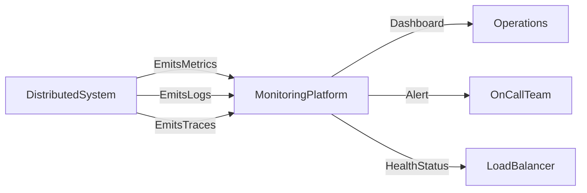

# 📊 Monitoring in Distributed Systems

> [!abstract] TL;DR
> Monitoring continuously collects metrics, logs, and traces from distributed systems to detect failures, diagnose issues, and track performance — enabling teams to operate production with confidence.

## 🧠 Core Idea

Modern distributed applications consist of many interconnected services and infrastructure components. **Monitoring** helps track system health, performance, and usage in production.

> Goal: Detect issues early, diagnose failures quickly, and prevent outages.

Monitoring is essential for maintaining reliability and ensuring a good user experience.

---

## 📖 Definition

Monitoring involves continuously collecting and analyzing information about:

- System health
- Application performance
- Resource utilization
- User behavior
- Failures and anomalies

This data helps operators understand how the system behaves in real environments.

---

## 🎯 Why Monitoring Matters

Monitoring enables teams to:

- Detect failures quickly
- Diagnose production issues
- Track performance degradation
- Understand usage patterns
- Prevent incidents before they escalate

Without monitoring, failures often remain invisible until users complain.

---

## 📦 What to Monitor

### 1️⃣ Infrastructure Metrics
- CPU usage
- Memory utilization
- Disk I/O
- Network traffic

---

### 2️⃣ Application Metrics
- Request rate
- Error rate
- Response latency
- Throughput

---

### 3️⃣ Dependency Health
- Database performance
- External API latency
- Queue processing delays

---

### 4️⃣ Business Metrics
- Active users
- Transactions processed
- Conversion rates

---

## 🚀 Monitoring Best Practices

### ✅ Centralized Logging
Collect logs from all services in one place.

### ✅ Metrics and Dashboards
Visualize system performance trends.

### ✅ Alerting
Notify teams when thresholds are crossed.

### ✅ Distributed Tracing
Track request flow across services.

### ✅ Health Checks
Continuously verify service availability.

---

## 🧠 Design Insight

```
If you can't observe it, you can't operate it.
Monitor systems before they fail, not after.
```

---

## 📊 Architecture Diagram



---

## Related Concepts

- [[_MOC_Monitoring|↑ Section MOC]]
- [[Health_Monitoring]]
- [[Instrumentation]]
- [[Performance_Monitoring]]
- [[Usage_Monitoring]]
- [[Visualization_and_Alerts]]

---

## Review Questions

1. What are the three pillars of observability in distributed systems and what does each one help diagnose?
2. Why is monitoring necessary even when no users have reported issues, and what categories of failure does it detect proactively?
3. How does distributed tracing differ from centralized logging and when is tracing more useful?

---

## 🔗 Related Topics

[[Scalability]]
[[Performance Antipatterns]]
[[Retry Storm]]
[[Back Pressure]]
[[Asynchronism]]

---

## 📚 Source

- Microsoft Azure Architecture Best Practices — Monitoring  
  https://learn.microsoft.com/en-us/azure/architecture/best-practices/monitoring

---

## 🏷️ Tags

#SystemDesign #Monitoring #Observability #Reliability #Operations
